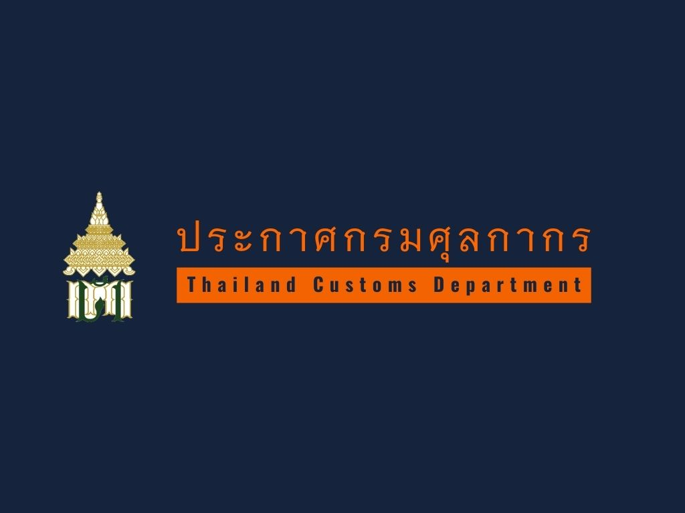

ประกาศกรมศุลกากรที่ 61/.2563 เรื่อง แก้ไขเพิ่มเติมประกาศกรมศุลกากรที่ 144/.2560 เรื่อง **หลักเกณฑ์และพิธีการสำหรับการลดอัตราอากรและยกเว้นอากรศุลกากรตามมาตรา 12 แห่งพระราชกำหนดพิกัดอัตราศุลกากร พ.ศ.2530** มีผลบังคับใช้ **_ตั้งแต่วันที่ 26 มีนาคม 2563 เป็นต้นไป_**
 

 


 

<a class="badge badge-danger" href="./2563-61.pdf" target="_blank" id="download_files_new">ดาวน์โหลดประกาศ</a> 
<a class="badge badge-danger" href="./2563-61.docx" target="_blank" id="download_files_new">ดาวน์โหลดเอกสารแนบท้าย</a> 

> ที่มา : [กรมศุลกากร](http://www.customs.go.th/cont_strc_slide_image.php?current_id=14232832414a505f46464a4e464b47)