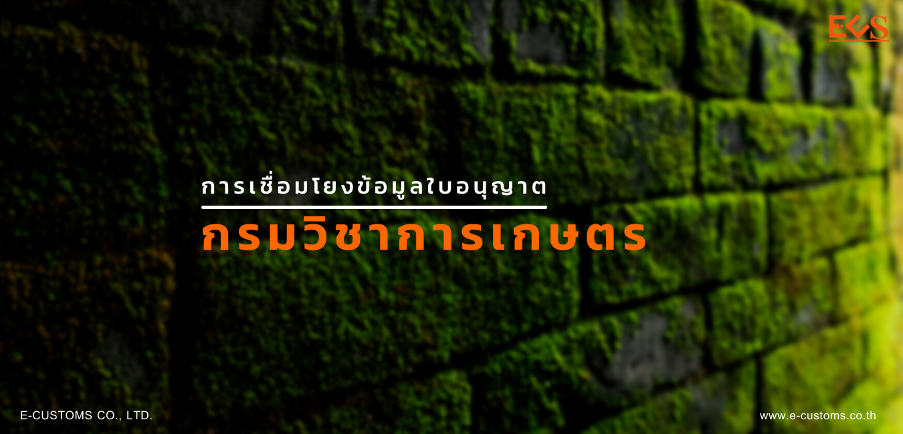
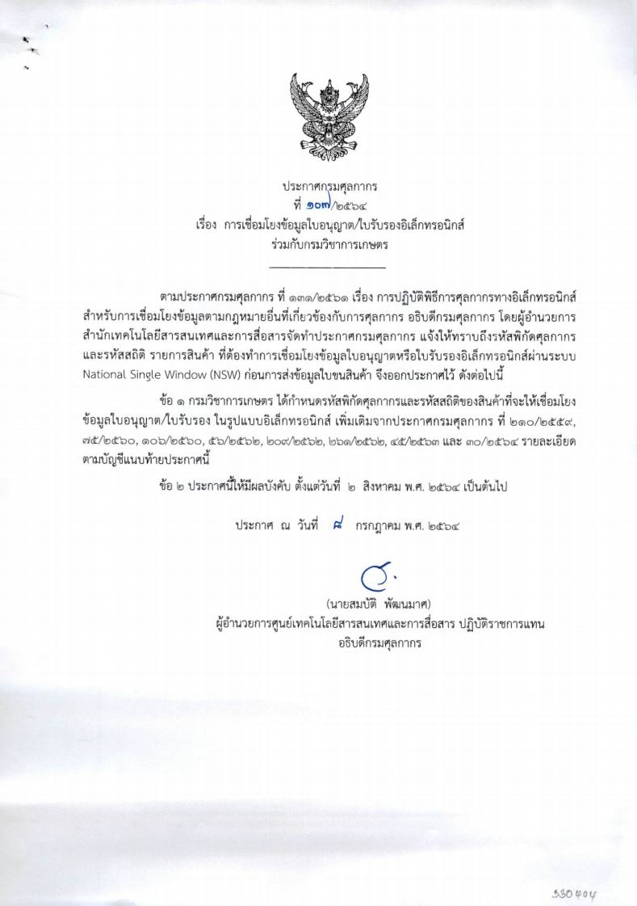
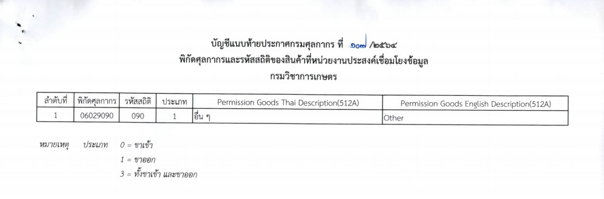

## ประกาศกรมศุลกากรที่ 107/.2564 เรื่อง การเชื่อมโยงข้อมูลใบอนุญาต/ใบรับรองอิเล็กทรอนิกส์ร่วมกับกรมวิชาการเกษตร


 

 

<a class="badge badge-danger" href="./docs.pdf" target="_blank" id="download_files_new">Download</a>

 



> ที่มา : [กรมศุลกากร](http://www.customs.go.th/cont_strc_download_with_docno_date.php?lang=th&top_menu=menu_homepage&current_id=14232932404e505f49464b4d464b47)
