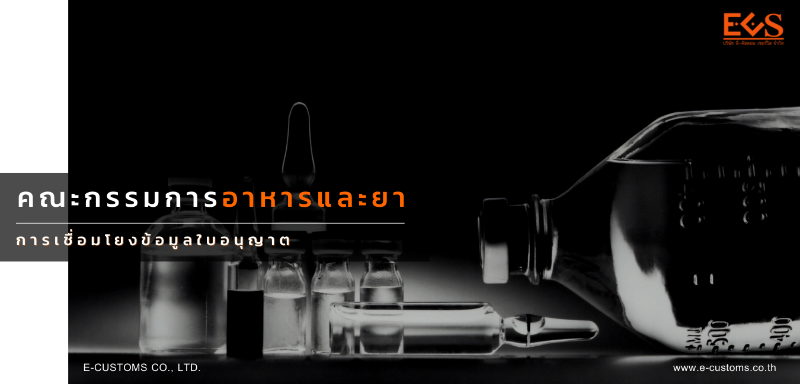
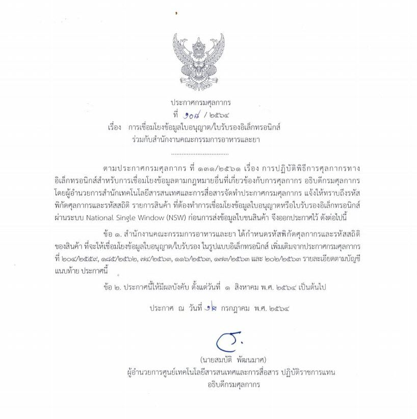

## ประกาศกรมศุลกากรที่ 108/.2564 เรื่อง การเชื่อมโยงข้อมูลใบอนุญาต/ใบรับรองอิเล็กทรอนิกส์ร่วมกับสำนักงานคณะกรรมการอาหารและยา




 

 

<a class="badge badge-danger" href="./docs.pdf" target="_blank" id="download_files_new">ดาวน์โหลดประกาศ</a> 
<a class="badge badge-danger" href="./attach_108-2564.pdf" target="_blank" id="download_files_new">เอกสารแนบท้าย</a> 

 



> ที่มา : [กรมศุลกากร](http://www.customs.go.th/cont_strc_download_with_docno_date.php?lang=th&top_menu=menu_homepage&current_id=14232932404e505f49464b4d464b47)
