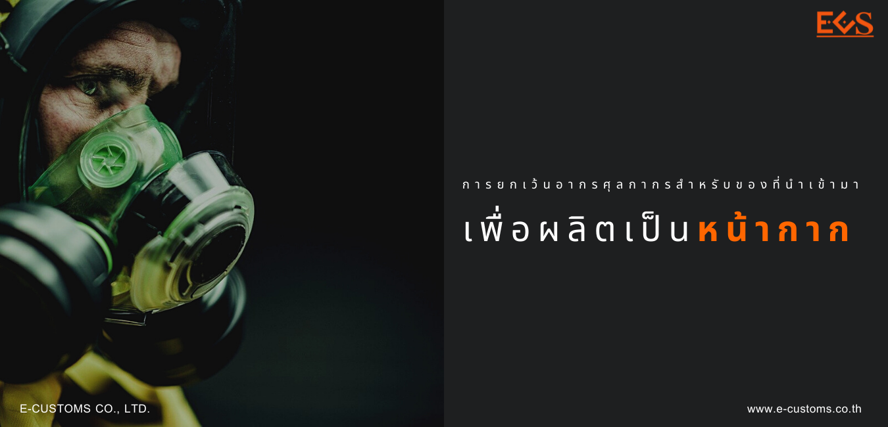

## ประกาศกรมศุลกากรที่ 109/.2564 เรื่อง หลักเกณฑ์ วิธีการ และเงื่อนไข การปฏิบัติพิธีการศุลกากรในการยกเว้นอากรศุลกากร สำหรับของที่นำเข้ามาเพื่อผลิตเป็นหน้ากาก


**มีการเพิ่มรหัสสิทธิพิเศษ (Privilege Code) =** *CV4*


> ข้อ 1 ประกาศกระทรวงการคลัง เรื่อง การยกเว้นอากรศุลกากรสําหรับของที่นําเข้ามาเพื่อผลิตเป็นหน้ากาก (ฉบับที่ 2)

ลงวันที่ 28 มิถุนายน พ.ศ. 2524 กําหนดให้ยกเว้นอากรสําหรับของไม่ว่าจะ จัดอยู่ในพิกัดประเภทใดที่นําเข้ามา เพื่อผลิตเป็นหน้ากากชนิดที่ใช้ในห้องผ่าตัดตามประเภทย่อย _6307.40.40_ หน้ากากกรองเชื้อโรค หน้ากากทางการแพทย์ นอกจากหน้ากากชนิดที่ใช้ในห้องผ่าตัด และหน้ากากกรองฝุ่น หมอกควัน หรือสารพิษ บรรดาที่เป็นอุปกรณ์เพื่อความปลอดภัยตามประเภทย่อย _6307.40.90_ การยกเว้นอากรและการกําหนดให้ของที่ได้รับการยกเว้นอากร ให้เป็นไปตามหลักเกณฑ์ และเงื่อนไข ดังต่อไปนี้

(ก) ของที่ได้รับการยกเว้นอากรจะต้องนําไปใช้ผลิตหน้ากากชนิดที่ใช้ในห้องผ่าตัด ตามประเภทย่อย 6307.40.40 หน้ากากกรองเชื้อโรค หน้ากากทางการแพทย์นอกจากหน้ากากชนิดที่ใช้ ในห้องผ่าตัด และหน้ากากกรองฝุ่น หมอกควัน หรือสารพิษ บรรดาที่เป็นอุปกรณ์เพื่อความปลอดภัย ตามประเภทย่อย _6307.40.40 ภายในกําหนดเวลาหนึ่งปี_ นับแต่วันที่นําของเข้า
หากปรากฏในภายหลังว่า ของที่ได้รับการยกเว้นอากรไม่สามารถหรือมิได้นําไปใช้ผลิต ภายในกําหนดเวลาหนึ่งปีนับแต่วันที่นําของเข้า ผู้นําของเข้าจะต้องชําระอากรตามปกติ หรือส่งของนั้นออกไป นอกราชอาณาจักร หากมีเหตุจําเป็นต้องขยายระยะเวลา ให้ขอต่ออธิบดีกรมศุลกากรก่อนครบกําหนดดังกล่าว อธิบดีกรมศุลกากรอาจอนุญาตให้ขยายเวลาได้ไม่เกินหกเดือน

(ข) ผู้ขอใช้สิทธิต้องได้รับอนุมัติจากอธิบดีกรมศุลกากร.

> ข้อ 2 การพิจารณาอนุมัติให้ยกเว้นอากรศุลกากรสําหรับของที่นําเข้ามาเพื่อผลิตเป็นหน้ากาก

2.1 การนําของเข้าตั้งแต่*วันที่ 14 กรกฎาคม พ.ศ. 2564 ถึงวันที่ 30 กันยายน พ.ศ. 2564*


**(ก) การปฏิบัติพิธีการศุลกากรเพื่อขอยกเว้นอากรศุลกากร ให้ผู้นําของเข้ายื่นคําร้องขอยกเว้นอากรพร้อมเอกสาร ดังต่อไปนี้.**
  

1. กรณีผู้นําของเข้าเป็นผู้ประกอบการอุตสาหกรรมผลิตหน้ากากชนิดที่ใช้ ในห้องผ่าตัดตามประเภทย่อย 6307.40.40 หน้ากากกรองเชื้อโรค หน้ากากทางการแพทย์นอกจากหน้ากาก ชนิดที่ใช้ในห้องผ่าตัด และหน้ากากกรองฝุ่น หมอกควัน หรือสารพิษ บรรดาที่เป็นอุปกรณ์เพื่อความปลอดภัย ตามประเภทย่อย 6307.40.40 ให้ใช้เอกสารหลักฐานเฉพาะในการนําเข้าครั้งแรก ดังนี้.  
   - แสดงหนังสือรับรองจากกระทรวงอุตสาหกรรม หรือใบรับแจ้ง การประกอบกิจการโรงงานจําพวกที่ 2 (ร.ง. 2) หรือใบอนุญาตประกอบกิจการโรงงาน (ร.ง. 4) หรือหนังสือ รับรองการประกอบกิจการโรงงานในเขตประกอบการอุตสาหกรรมตามมาตรา 30 แห่งพระราชบัญญัติโรงงาน พ.ศ. 2535 (แบบ ข.2) หรือใบแจ้งการประกอบอุตสาหกรรมในนิคมอุตสาหกรรม (กนอ.03/2) หรือหนังสือ รับแจ้งการประกอบอุตสาหกรรม หรือใบอนุญาตให้ใช้ที่ดินและประกอบกิจการในนิคมอุตสาหกรรม (ฉบับต่ออายุ) (กนอ.03/6) ของผู้นําของเข้า.
   - ยื่นเอกสารแสดงกําลังการผลิตเต็มที่ของโรงงานต่อปี.
   - ยื่นเอกสารแสดงการรับรองตนเองของผู้ประกอบอุตสาหกรรมผลิต หน้ากากตามแบบแนบท้ายประกาศนี้ ว่าของที่นําเข้ามาจะนําไปผลิตเป็นหน้ากากชนิดที่ใช้ในห้องผ่าตัด ตามประเภทย่อย 6307.40.40 หน้ากากกรองเชื้อโรค หน้ากากทางการแพทย์นอกจากหน้ากากชนิด ที่ใช้ในห้องผ่าตัด และหน้ากากกรองฝุ่น หมอกควัน หรือสารพิษ บรรดาที่เป็นอุปกรณ์เพื่อความปลอดภัย ตามประเภทย่อย 6307.40.40 เท่านั้น

2. กรณีผู้นําของเข้ามิใช่ผู้ประกอบอุตสาหกรรมตามข้อ 1 ให้ใช้เอกสารหลักฐานในการนําเข้าทุกครั้ง ดังนี้.  
   - ยื่นเอกสารแสดงรายชื่อและที่อยู่ของผู้ประกอบอุตสาหกรรมผลิต หน้ากาก ที่เป็นลูกค้าในการซื้อของที่ขอยกเว้นอากรศุลกากร.
   - ยื่นเอกสารแสดงการรับรองตนเองของผู้นําของเข้าตามแบบแนบท้าย ประกาศนี้ ว่าของที่นําเข้ามาจะนําไปผลิตเป็นหน้ากาก ชนิดที่ใช้ในห้องผ่าตัดตามประเภทย่อย 6307.90.40 หน้ากากกรองเชื้อโรค หน้ากากทางการแพทย์นอกจากหน้ากากชนิดที่ใช้ในห้องผ่าตัดและหน้ากากกรองฝุ่น หมอกควัน หรือสารพิษ บรรดาที่เป็นอุปกรณ์เพื่อความปลอดภัยตามประเภทย่อย 6307.40.40 เท่านั้น
   - แสดงหนังสือรับรองจากกระทรวงอุตสาหกรรม หรือใบรับแจ้ง การประกอบกิจการโรงงานจําพวกที่ 2 (ร.ง. 2) หรือใบอนุญาตประกอบกิจการโรงงาน (ร.ง. 4) หรือหนังสือ รับรองการประกอบกิจการโรงงานในเขตประกอบการอุตสาหกรรมตามมาตรา 30 แห่งพระราชบัญญัติโรงงาน พ.ศ. 2535 (แบบ ข.2) หรือใบแจ้งการประกอบอุตสาหกรรมในนิคมอุตสาหกรรม (กนอ.03/2) หรือหนังสือ รับแจ้งการประกอบอุตสาหกรรม หรือใบอนุญาตให้ใช้ที่ดินและประกอบกิจการในนิคมอุตสาหกรรม (ฉบับต่ออายุ) (กนอ.03/6) ของผู้ประกอบอุตสาหกรรมผลิตหน้ากาก
   - แสดงเอกสารสัญญาซื้อขายหรือเอกสารอื่นใดที่แสดงได้ว่าผู้นําของเข้า นําเข้ามาเพื่อส่งให้ผู้ประกอบอุตสาหกรรมผลิตหน้ากาก
  
  ให้ผู้นําของเข้าจัดทําข้อมูลใบขนสินค้าขาเข้าตามมาตรฐานที่กรมศุลกากรกําหนด โดยบันทึกในช่องสิทธิพิเศษของแต่ละรายการระบุเป็น *“CV4”*


**(ข) ผู้ขอใช้สิทธิในการขออนุมัติยกเว้นอากรศุลกากร.**


สําหรับของที่นําเข้ามาเพื่อผลิตเป็นหน้ากากให้นําพิธีการทั่วไปเกี่ยวกับการขออนุมัติให้ลดอัตราอากรและยกเว้นอากรศุลกากร มาใช้บังคับกับการยกเว้นอากรศุลกากรสําหรับของที่นําเข้ามาเพื่อผลิตเป็นหน้ากาก.

1. ให้ผู้นําของเข้ายื่นคําร้องพร้อมเอกสารประกอบตามที่กําหนดไว้ เพื่อขอใช้สิทธิต่อสํานักงานศุลกากร หรือด่านศุลกากร ณ ท่า ที่ หรือสนามบิน ที่นําของเข้าเพื่อประกอบ การพิจารณาอนุมัติให้ได้สิทธิยกเว้นอากรศุลกากร กรณีผู้ขอใช้สิทธิยื่นคําร้อง หรือเอกสารไม่ถูกต้อง หรือไม่ครบถ้วน กรมศุลกากรจะมีหนังสือแจ้งให้ผู้ขอใช้สิทธิ ทราบภายในเจ็ดวันนับแต่วันที่ได้รับคําร้อง และให้ผู้นําของเข้า ยื่นหนังสือหรือเอกสารเพิ่มเติม ให้ถูกต้องครบถ้วนภายในเจ็ดวันนับแต่วันที่ได้รับหนังสือแจ้ง

2. กรมศุลกากรจะมีหนังสือแจ้งเลขที่อนุมัติหลักการ (Permit Number) ให้ผู้ขอใช้สิทธิทราบพร้อมแนบสําเนาเอกสารการอนุมัติหลักการ ซึ่งพิมพ์จากระบบฐานข้อมูลการลดอัตราอากร และยกเว้นอากรศุลกากรตามมาตรา 12 ภายในสิบห้าวันทําการ นับแต่วันที่ได้รับคําร้องพร้อมเอกสารถูกต้อง ครบถ้วน หากไม่อนุมัติหลักการ กรมศุลกากรจะมีหนังสือแจ้งเหตุผลการไม่อนุมัติให้ทราบ

3. กรณีผู้ได้รับอนุมัติหลักการยื่นคําร้องขอแก้ไขเพิ่มเติม หรือยกเลิก การได้รับอนุมัติหลักการเดิม ให้ยื่นคําร้องพร้อมเอกสารประกอบตามที่กําหนดไว้ในเรื่องนั้น เพื่อประกอบ การพิจารณาให้ครบถ้วน กรณีเป็นการเปลี่ยนแปลงเกี่ยวกับชนิดสินค้าที่นําเข้า ให้ยื่นคําร้องล่วงหน้าก่อนการนําเข้า ที่สํานักงานศุลกากร หรือด่านศุลกากร ณ ท่า ที่ หรือสนามบินแห่งหนึ่งแห่งใดก็ได้ หากยังไม่ได้รับอนุมัติ ให้แก้ไขเปลี่ยนแปลงต้องดําเนินการตาม (ง) ไปก่อน  กรณียื่นคําร้องหรือเอกสารไม่ถูกต้องหรือไม่ครบถ้วน กรมศุลกากร จะมีหนังสือแจ้งให้ผู้ได้รับอนุมัติหลักการทราบ ภายในเจ็ดวันนับแต่วันที่ได้รับคําร้อง และให้ผู้ได้รับอนุมัติหลักการยื่นหนังสือ หรือเอกสารเพิ่มเติมให้ถูกต้องครบถ้วน ภายในเจ็ดวันนับแต่วันที่ได้รับหนังสือแจ้ง.

4. กรมศุลกากรจะมีหนังสือแจ้งผลการพิจารณาการขอแก้ไขเพิ่มเติมหลักการ ที่ได้รับอนุมัติไว้เดิม ให้แก่ผู้ยื่นคําร้องทราบภายในสามสิบวันนับแต่วันที่ได้รับคําร้องและเอกสารถูกต้องครบถ้วน โดยการขอแก้ไขเพิ่มเติมดังกล่าว จะออกเลขที่อนุมัติหลักการใหม่พร้อมแนบสําเนาเอกสารการอนุมัติหลักการ ซึ่งพิมพ์จากระบบฐานข้อมูลการลดอัตราอากรและยกเว้นอากรตามมาตรา 12 หากเป็นการยื่นขอแก้ไขเพิ่มเติม การคลาดเคลื่อนเกี่ยวกับข้อมูลอนุมัติ วันเริ่มต้นการได้รับสิทธิและวันหมดอายุการใช้สิทธิ จะใช้เลขที่อนุมัติหลักการเดิม โดยมีการแก้ไขข้อมูล วันเริ่มต้นการได้รับสิทธิและวันหมดอายุให้ถูกต้องเท่านั้น. 


**(ค) ให้ผู้นําของเข้าบันทึกข้อมูล (Import Declaration Detail (Permit) ดังนี้.**


1. ระบุเลขที่อนุมัติหลักการยกเว้นอากรในช่องเลขที่ใบอนุญาต/หนังสือ รับรอง (Permit No.)
2. ระบุวันที่ได้รับอนุมัติหลักการ ในช่องวันที่ออกใบอนุญาต/หนังสือรับรอง (Issue Date)
3. ระบุเลขประจําตัวผู้เสียภาษีอากรของกรมศุลกากร (_0994000163011_) ในช่องเลขประจําตัวผู้เสียภาษีอากรของหน่วยงานผู้ออกใบอนุญาต/หนังสือรับรอง (Permit Issue Authority).  


**(ง) การขอรับของออกไปก่อนที่จะได้รับอนุมัติให้ยกเว้นอากร ให้ผู้นําของเข้าดําเนินการ ดังนี้.**


1. ให้ชําระอากรในอัตราปกติ โดยในแต่ละรายการของข้อมูลใบขนสินค้าขาเข้า ในช่องสิทธิพิเศษให้ระบุเป็น _“000”_ หรือ _“999”_ แล้วแต่กรณี
2. ระบุการใช้สิทธิ โดยบันทึกข้อมูลในส่วนรายการของใบขนสินค้าขาเข้า (Import Declaration Detail (Detail) ในช่อง Argumentative Reason Code เป็น _“P12”_ (หมายถึง การยืน ขอใช้สิทธิลดอัตราอากรและยกเว้นอากรศุลกากรตามมาตรา 12 แห่งพระราชกําหนดพิกัดอัตราศุลกากร พ.ศ. 2530 แต่ยังไม่ได้รับอนุมัติ) และในช่อง Argumentative Privilege Code ที่ขอใช้สิทธิ เป็น _“CV4”_.
3. ให้แจ้งความประสงค์ขอตรวจสอบพิกัดและ/หรือราคา ในขณะส่งข้อมูล ใบขนสินค้าขาเข้า เข้าสู่ระบบคอมพิวเตอร์ของศุลกากร
4. ต้องยื่นคําร้องในการขอคืนเงินอากรภายในระยะเวลาที่กฎหมายกําหนด




 

 

<a class="badge badge-danger" href="./docs.pdf" target="_blank" id="download_files_new">Download</a>

 



> ที่มา : [กรมศุลกากร](http://www.customs.go.th/cont_strc_download_with_docno_date.php?lang=th&top_menu=menu_homepage&current_id=14232932404e505f49464b4d464b47)
