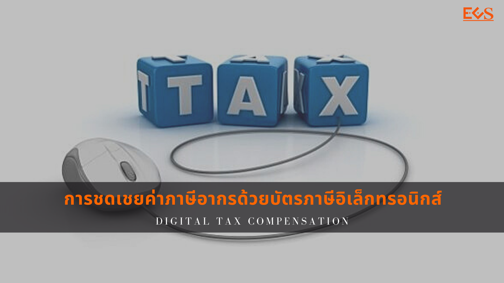

ประกาศกรมศุลกากรที่ 16/.2564 เรื่อง คู่มือการดำเนินธุรกรรมทางอิเล็กทรอนิกส์สำหรับการชดเชยค่าภาษีอากรด้วยบัตรภาษีอิเล็กทรอนิกส์ (Digital Tax Compensation)

 

## ประกาศกรมศุลกากรที่ 16/.2564



 

## คู่มือการดำเนินธุรกรรมทางอิเล็กทรอนิกส์สำหรับการชดเชยค่าภาษีอากรด้วยบัตรภาษีอิเล็กทรอนิกส์ (Digital Tax Compensation)



<a class="badge badge-danger" href="./digital-tax-compensation.pdf" target="_blank" id="download_files_new">Download </a>

 

> **สอบถามข้อมูลเพิ่มเติม** : ส่วนชดเชยค่าภาษีอากร กองสิทธิประโยชน์ทางภาษีอากร (กสอ.)  
หมายเลขโทรศัพท์ : 02-667-7000 ต่อ 5799 หรือ 7661

> ที่มา : [กรมศุลกากร](http://www.customs.go.th/list_multi_tab.php?link=list_xdownload.php&ini_menu=menu_tax_incentive&left_menu=menu_tax_incentive_160928_06_02&ini_tab=menu_tax_incentive_160928_06&ini_content=tax_incentive_170821_01_01&tab=menu_tax_incentive_160928_06_02&order_by=co_priority&sort_type=1&lang=th&root_left_menu=menu_tax_incentive_160928_06&left_menu=menu_tax_incentive_160928_06_02)

