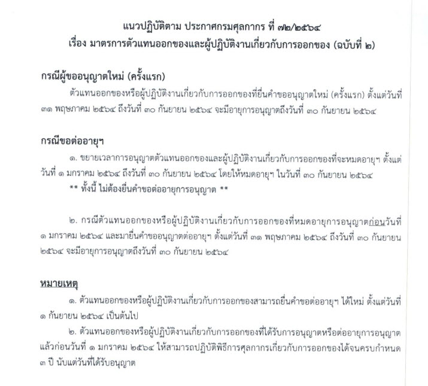

## ประกาศกรมศุลกากรที่ 72/.2564 เรื่อง มาตรการตัวแทนออกของและผู้ปฏิบัติงานเกี่ยวกับการออกของ (ฉบับที่ 2)

ประกาศนี้มีผลบังคับ*ตั้งแต่วันที่ 31 พฤษภาคม 2564 เป็นต้นไป* ให้ขยายเวลาการอนุญาตตัวแทนออกของ หรือผู้ปฏิบัติงานเกี่ยวกับการออกของที่จะ**หมดอายุการอนุญาต** *ตั้งแต่วันที่ 1 มกราคม พ.ศ.2564 ถึงวันที่ 30 กันยายน พ.ศ.2564* **โดยให้หมดอายุการอนุญาตในวันที่ 30 กันยายน พ.ศ.2564** ทั้งนี้ *ไม่ต้องยื่นคำขอต่ออายุการอนุญาต*
 
ตัวแทนออกของหรือผู้ปฏิบัติงานเกี่ยวกับการออกของที่จะหมดอายุการอนุญาตตามประกาศนี้ **สามารถยื่นคำขอต่ออายุการอนุญาตได้ใหม่** *ตั้งแต่วันที่ 1 กันยายน พ.ศ.2564 เป็นต้นไป*

 

 



 

<a class="badge badge-danger" href="./2564-72.pdf" target="_blank" id="download_files_new">Download</a> 

 

> ที่มา : [กรมศุลกากร](https://www.customs.go.th/cont_strc_simple_with_date.php?current_id=14232932404e505f47464b48464b49)
