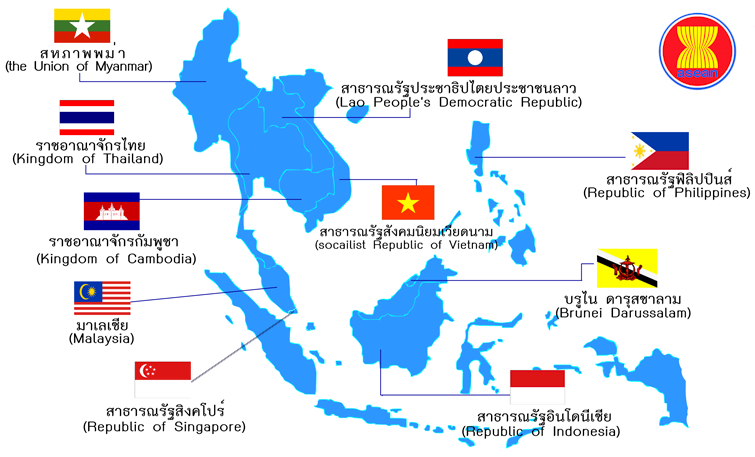
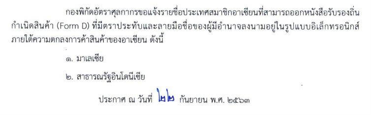

**ประกาศกองพิกัดอัตราศุลกากรที่ 8/.2563 เรื่อง รายชื่อประเทศสมาชิกอาเซียนที่สามารถออกหนังสือรับรองถิ่นกำเนิดสินค้า (Form D) ที่มีตราประทับและลายมือชื่อของผู้มีอำนาจลงนามอยู่ในรูปแบบอิเล็กทรอนิกส์ ภายใต้ความตกลงการค้าสินค้าของอาเซียน**

มีผลบังคับตั้งแต่*วันที่ 22 กันยายน 2563* เป็นต้นไป

 


 

 <a href="./2563-08.pdf" target="_blank" id="download_files">ดาวน์โหลดประกาศ 
                <i class=" fas fa-file-pdf" style="font-size:30px; color: red;" id="icon_download"></i>
            </a>

ที่มา : [กรมศุลกากร](http://www.customs.go.th/cont_strc_simple_with_date.php?current_id=14232832414c505e4e464b4b464b4c)

