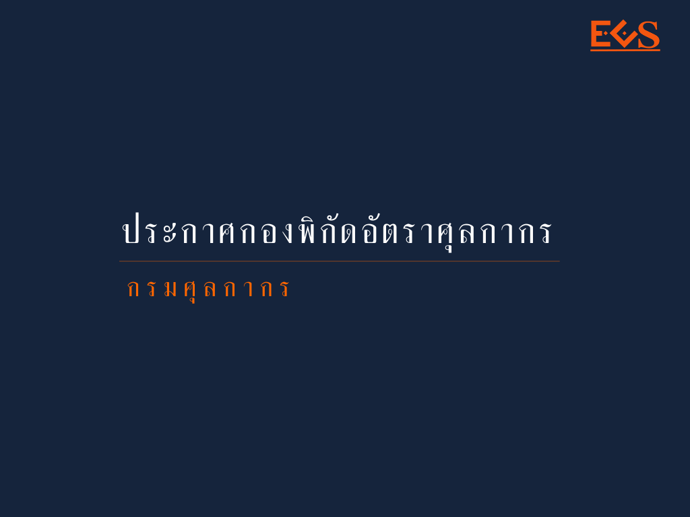
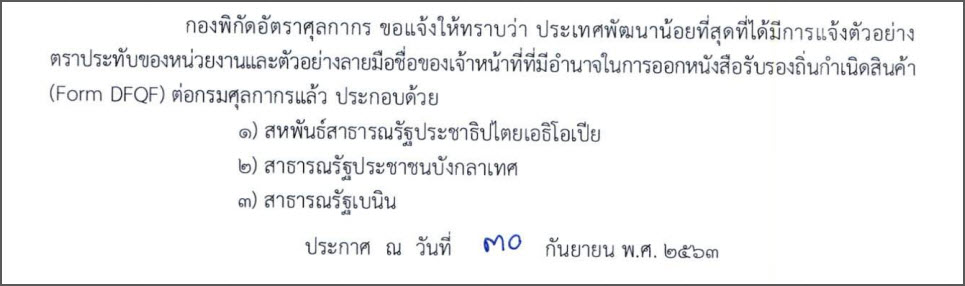

ประกาศกองพิกัดอัตราศุลากากรที่ 9/.2563 เรื่อง *รายชื่อประเทศพัฒนาน้อยที่สุด* ที่ได้มีการแจ้งตัวอย่างตราประทับของหน่วยงาน และตัวอย่างลายมือชื่อของเจ้าหน้าที่ต่อกรมศุลกากร (รายละเอียดตามเอกสารแนบ) ประกาศ ณ *วันที่ 30 กันยายน พ.ศ. 2563* 

ตามโครงการให้สิทธิพิเศษแก่ประเทศพัฒนาน้อยที่สุด (Least Developed Countries : LDCs) โดยการยกเลิกภาษีนำเข้าและโควต้า (Duty Free Quota Free : DFQF) ซึ่งกำหนดให้หนังสือรับรองถิ่นกำเนิดสินค้า (Form DFQF) ต้องมีตราประทับพร้อมกับลงลายมือชื่อด้วยตนเองหรือโดยการพิมพ์แบบอิเล็กทรอนิกส์โดยผู้มีอำนาจซึ่งได้มีการแจ้งตัวอย่างตราประทับและลายมือชื่อไว้ต่อกรมศุลกากรแล้ว

 


 

 <a href="./2563-09.pdf" target="_blank" id="download_files">ดาวน์โหลดประกาศ 
                <i class=" fas fa-file-pdf" ></i>
            </a>
 

> ที่มา : [กรมศุลกากร](http://www.customs.go.th/cont_strc_simple_with_date.php?current_id=14232832414c505e4f464a4f464b4b)