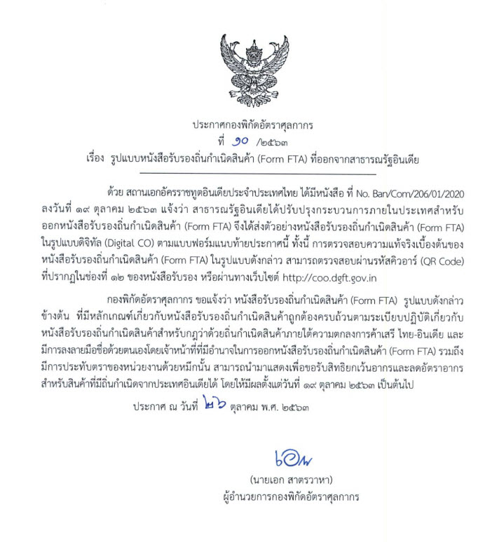

## ประกาศกองพิกัดอัตราศุลากากรที่ 10/.2563 เรื่อง รูปแบบหนังสือรับรองถิ่นกำเนิดสินค้า (Form FTA) ที่ออกจากสาธารณรัฐอินเดีย 
 

 


 

<a class="badge badge-danger" href="./2563-10.pdf" target="_blank" id="download_files_new">Download </a> <i id="files" class=" fas fa-file-pdf"></i>

 

 

> ที่มา : [กรมศุลกากร](http://www.customs.go.th/cont_strc_simple_with_date.php?current_id=14232832414c505f47464b4a464a4e)