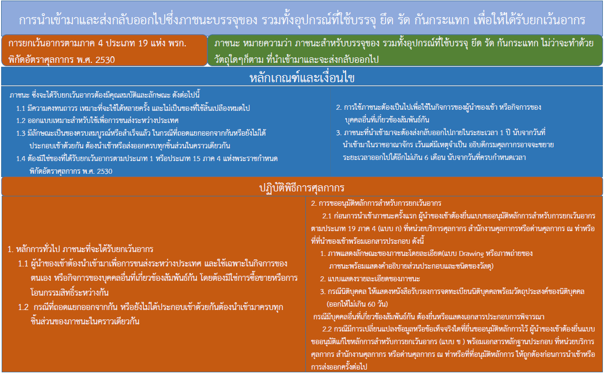
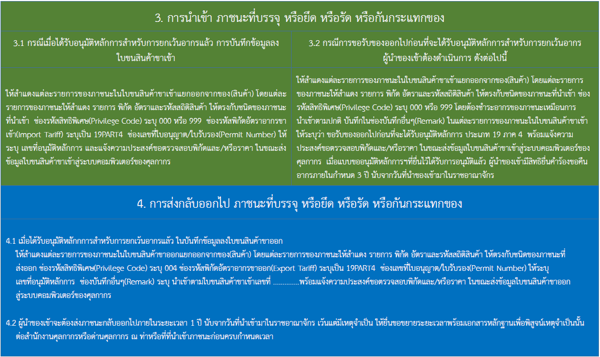
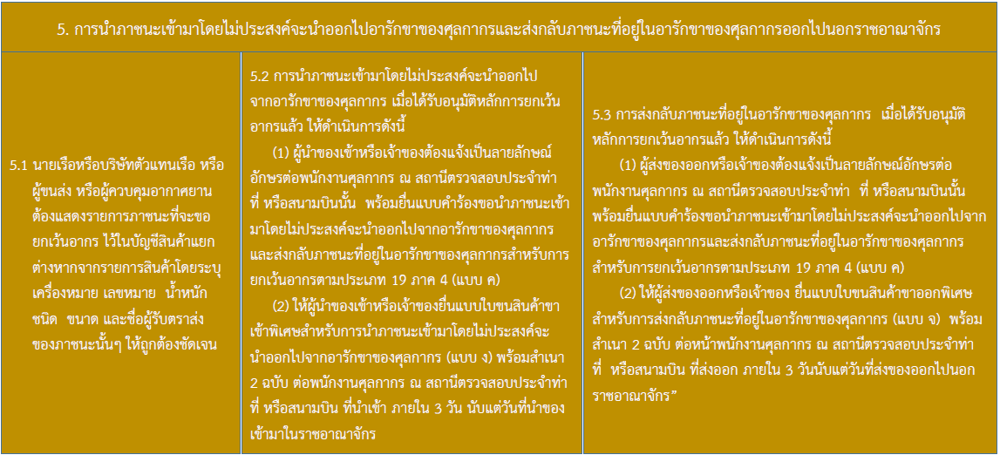

ภาพโดย <a href="https://pixabay.com/th/users/wasi1370-8259843/?utm_source=link-attribution&amp;utm_medium=referral&amp;utm_campaign=image&amp;utm_content=3566820">wasi1370</a> จาก <a href="https://pixabay.com/th/?utm_source=link-attribution&amp;utm_medium=referral&amp;utm_campaign=image&amp;utm_content=3566820">Pixabay</a>

## การนำเข้ามาและส่งกลับออกไปซึ่งภาชนะบรรจุของ รวมทั้งอุปกรณ์ที่ใช้บรรจุ ยึด รัด กันกระแทก เพื่อให้ได้รับยกเว้นอากร

 

## Reference data:
- ประกาศกรมศุลกากรที่ 154/.2561 เรื่อง **[หลักเกณฑ์ วิธีการ และเงื่อนไขเกี่ยวกับการยกเว้นอากรของตามประเภท 19 ภาค 4](http://www.customs.go.th/cont_strc_download_with_docno_date.php?lang=th&top_menu=menu_homepage&current_id=14232832404e505e4f464a4e464b4d "http://www.customs.go.th/cont_strc_download_with_docno_date.php?lang=th&top_menu=menu_homepage&current_id=14232832404e505e4f464a4e464b4d")**
- ประกาศกรมศุลกากรที่ 162/.2563 เรื่อง **[แก้ไขเพิ่มเติมประกาศกรมศุลกากร ที่ 154/.2561](http://www.customs.go.th/cont_strc_download_with_docno_date.php?lang=th&top_menu=menu_homepage&current_id=14232832414c505f47464a4f464b46 "http://www.customs.go.th/cont_strc_download_with_docno_date.php?lang=th&top_menu=menu_homepage&current_id=14232832414c505f47464a4f464b46")**

> - ที่มา : [กรมศุลกากร](http://ccc.customs.go.th/cont_strc_faq.php?current_id=14232a32414b505f48&left_menu=interesting_article)
> - วันที่ปรับปรุงล่าสุด : 22 ธันวาคม 2563