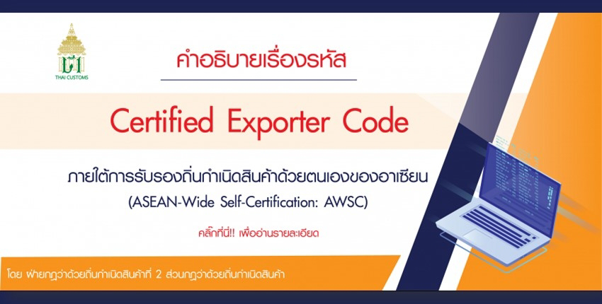
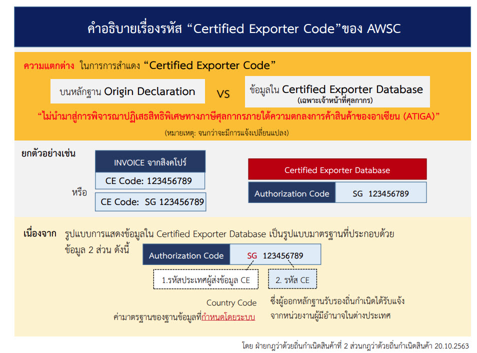

----

## คำอธิบายรหัส Certified Exporter Code ภายใต้การรับรองถิ่นกำเนิดสินค้าด้วยตนเองของอาเซียน (ASEAN-Wide Self-Certification - AWSC)

> ที่มา : [กรมศุลกากร](http://www.customs.go.th/cont_strc_simple_with_date.php?current_id=14232832414c505f47464b46464b48)