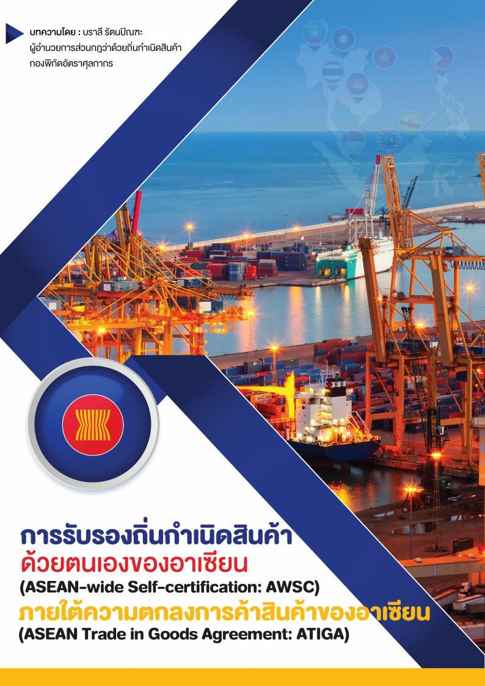
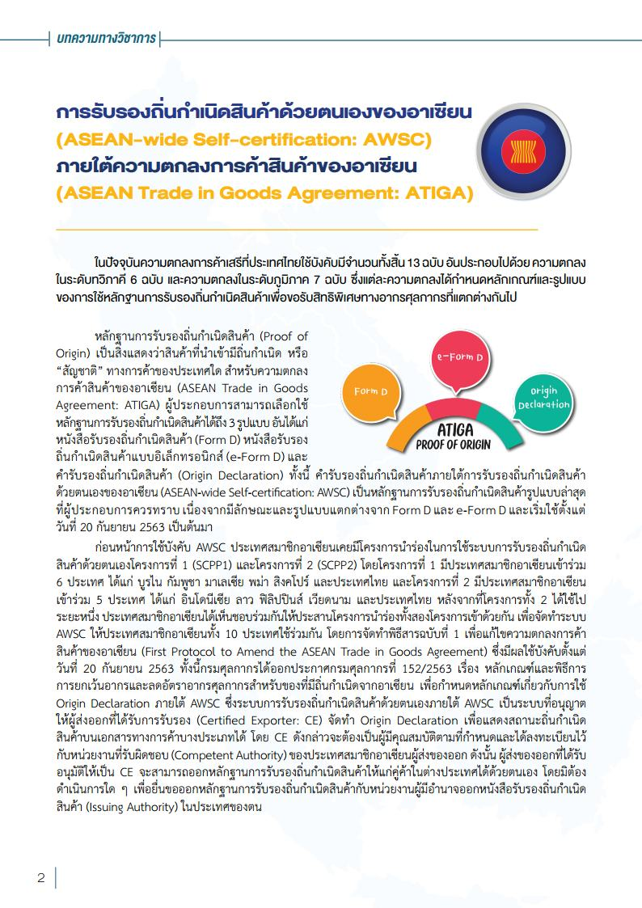
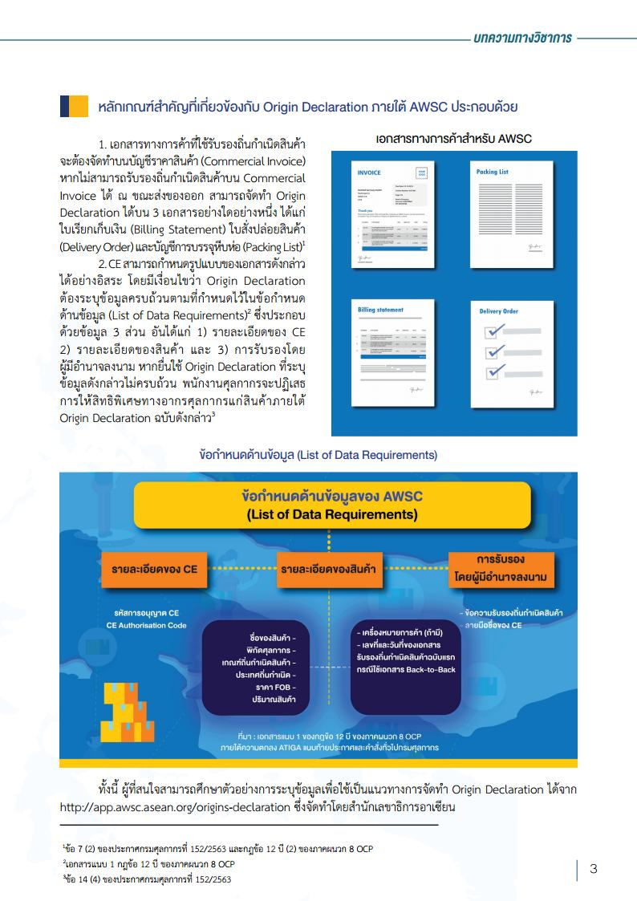
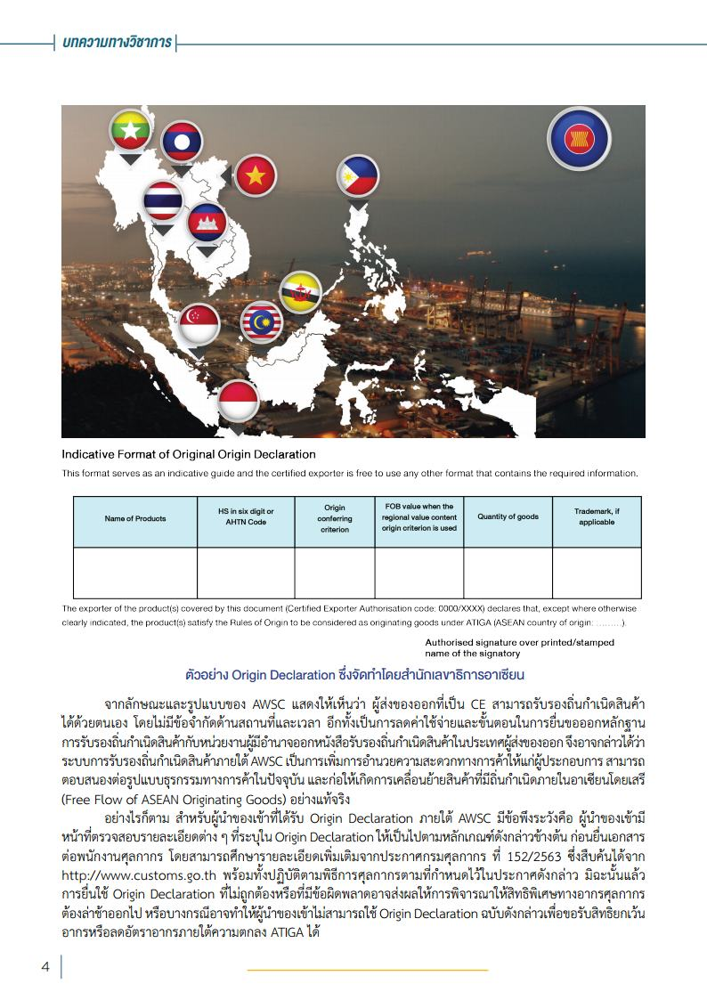

ในปัจจุบันความตกลงการค้าเสรีที่ประเทศไทยใช้บังคับมีจำนวนทั้งสิ้น 13 ฉบับอันประกอบไปด้วยความตกลงในระดับทวิภาคี 6 ฉบับ และความตกลงในระดับภูมิภาค 7 ฉบับ ซึ่งแต่ละความตกลงได้กำหนดหลักเกณฑ์ และรูปแบบของการใช้หลักฐาน การรับรองถิ่นกำเนิดสินค้าเพื่อขอรับสิทธิพิเศษทางอากรศุลกากรที่แตกต่างกันไป
 
หลักฐานการรับรองถิ่นกำเนิดสินค้า (Proof of Origin) เป็นสิ่งแสดงว่าสินค้าที่นำเข้ามีถิ่นกำเนิด หรือ “สัญชาติ” ทางการค้าของประเทศใด สำหรับความตกลงการค้าสินค้าของอาเซียน (ASEAN Trade in Goods Agreement: ATIGA) ผู้ประกอบการสามารถเลือกใช้
หลักฐานการรับรองถิ่นกำเนิดสินค้าได้ถึง 3 รูปแบบอันได้แก่ หนังสือรับรองถิ่นกำเนิดสินค้า (Form D) หนังสือรับรองถิ่นกำเนิดสินค้าแบบอิเล็กทรอนิกส์ (e-Form D) และคำรับรองถิ่นกำเนิดสินค้า (Origin Declaration) ทั้งนี้ คำรับรองถิ่นกำเนิดสินค้าภายใต้การรับรองถิ่นกำเนิดสินค้าด้วยตนเองของอาเซียน (ASEAN-wide Self-certifiation: AWSC) เป็นหลักฐานการรับรองถิ่นกำเนิดสินค้ารูปแบบล่าสุด ที่ผู้ประกอบการควรทราบ เนื่องจากมีลักษณะและรูปแบบแตกต่างจาก Form D และ e-Form D และเริ่มใช้ตั้งแต่ วันที่ 20 กันยายน 2563 เป็นต้นมา
 

 

 

<a class="badge badge-danger" href="doc.pdf" target="_blank" id="download_files_new">Download</a>

> ที่มา : [กรมศุลกากร](http://www.customs.go.th/cont_strc_simple_with_date.php?current_id=14232832414d505f4a464b4a464b47)