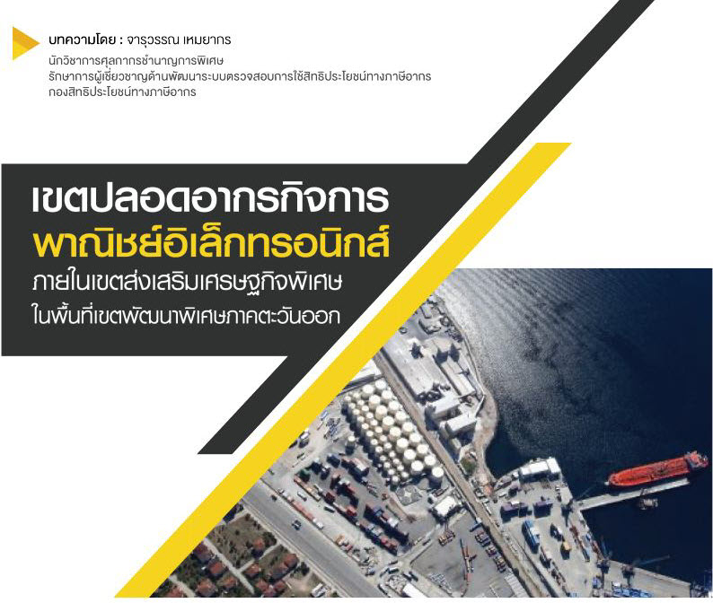
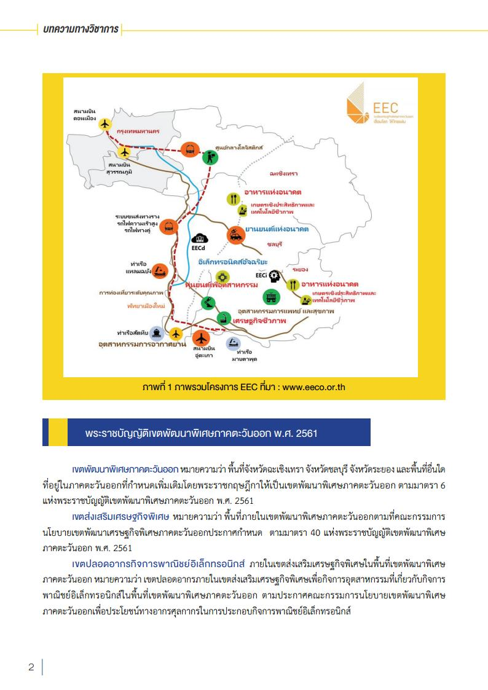
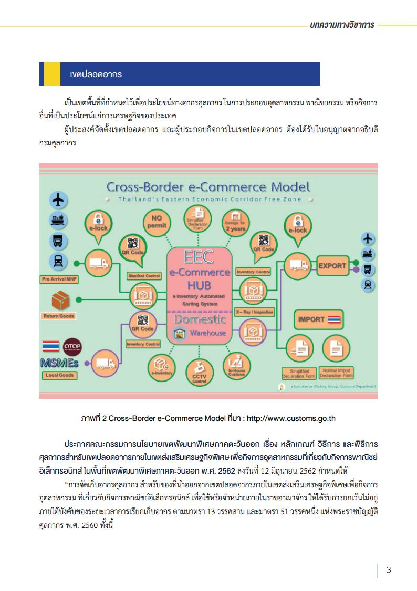
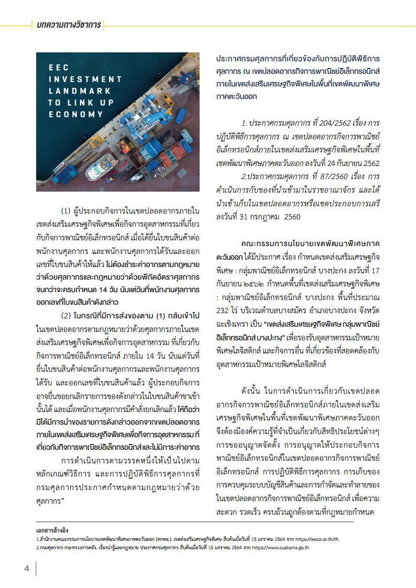

## บทความทางวิชาการ - เขตปลอดอากรกิจการพาณิชย์อิเล็กทรอนิกส์ ภายในเขตส่งเสริมเศรษฐกิจพิเศษในพื้นที่เขตพัฒนาพิเศษภาคตะวันออก

โครงการเขตพัฒนาพิเศษภาคตะวันออก (Eastern Economic Corridor : EEC) เป็นการลงทุนขนาดใหญ่
เพื่อยกระดับการพัฒนาประเทศไปสู่ยุค “ไทยแลนด์ 4.0” ได้มีการกำหนดพื้นที่เป้าหมายนำร่อง 3 จังหวัดในพื้นที่ภาค
ตะวันออก ได้แก่ ฉะเชิงเทรา ชลบุรี และระยอง อีกทั้งยังได้กำหนดอุตสาหกรรมเป้าหมายที่ได้รับการส่งเสริมเพื่อให้เกิด
การลงทุนอย่างเป็นรูปธรรม โดยมีการลงทุนโครงสร้างพื้นฐานและระบบสาธารณูปโภค เพื่อเพิ่มศักยภาพรองรับการลงทุน
และการพัฒนากิจกรรมทางเศรษฐกิจและการอำนวยความสะดวกต่างๆ ในพื้นที่ รวมทั้งการพัฒนาทรัพยากรมนุษย์และ
การจัดระบบการสะสมเทคโนโลยี เพื่ออนาคตที่ยั่งยืนของประเทศไทย
EEC ประกาศเขตส่งเสริมเพื่อรองรับอุตสาหกรรมเป้าหมาย โดยนักลงทุนจะได้รับสิทธิประโยชน์ทางภาษี
และสิทธิประโยชน์ด้านอื่นๆ รวมถึงการอำนวยความสะดวกในการประกอบธุรกิจอีกด้วย โดยได้มีการประกาศรายชื่อ
เขตส่งเสริมเพื่อกิจการพิเศษที่ประกาศแล้ว ได้แก่ เขตส่งเสริมรูปแบบนิคมอุตสาหกรรม จำนวน 21 แห่ง เขตส่งเสริม
รูปแบบอุตสาหกรรมเป้าหมายพิเศษเฉพาะด้าน (Cluster) จำนวน 2 แห่ง
 

 

 

<a class="badge badge-danger" href="doc.pdf" target="_blank" id="download_files_new">Download</a>

> ที่มา : [กรมศุลกากร](http://www.customs.go.th/cont_strc_simple_with_date.php?current_id=14232832414d505f4a464b4b464a4e)