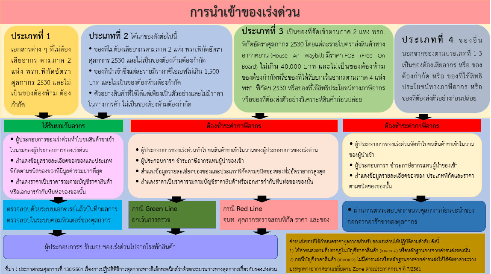

  
ที่มา : [กรมศุลกากร](http://ccc.customs.go.th/cont_strc_faq.php?current_id=14232a32414d505f48&left_menu=interesting_article)  
วันที่ปรับปรุงล่าสุด : 5 พฤษภาคม 2564  
สอบถามข้อมูลเพิ่มเติมได้ที่ : ศูนย์บริการศุลกากร อาคารเฉลิมพระเกียรติ 7 รอบพระชนมพรรษา ชั้น 1  
หมายเลขโทรศัพท์ : 1164  
อีเมล์ : 1164@customs.go.th  

