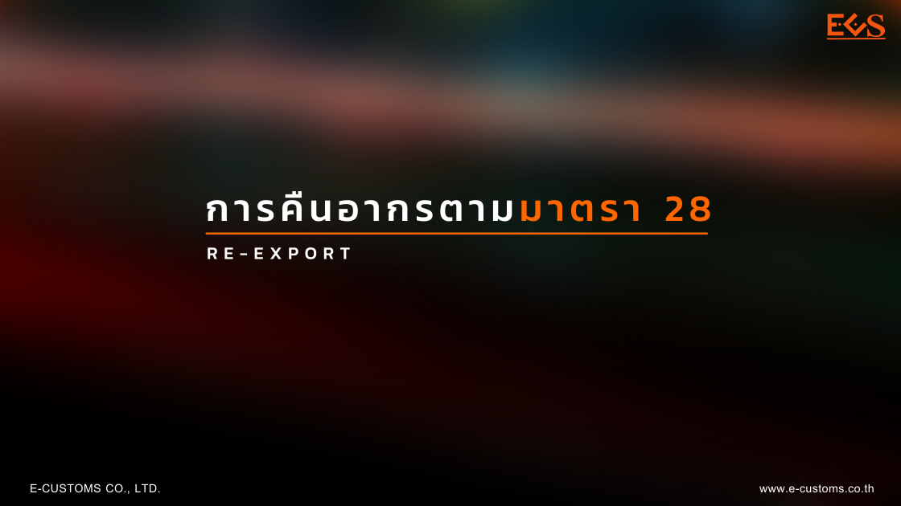
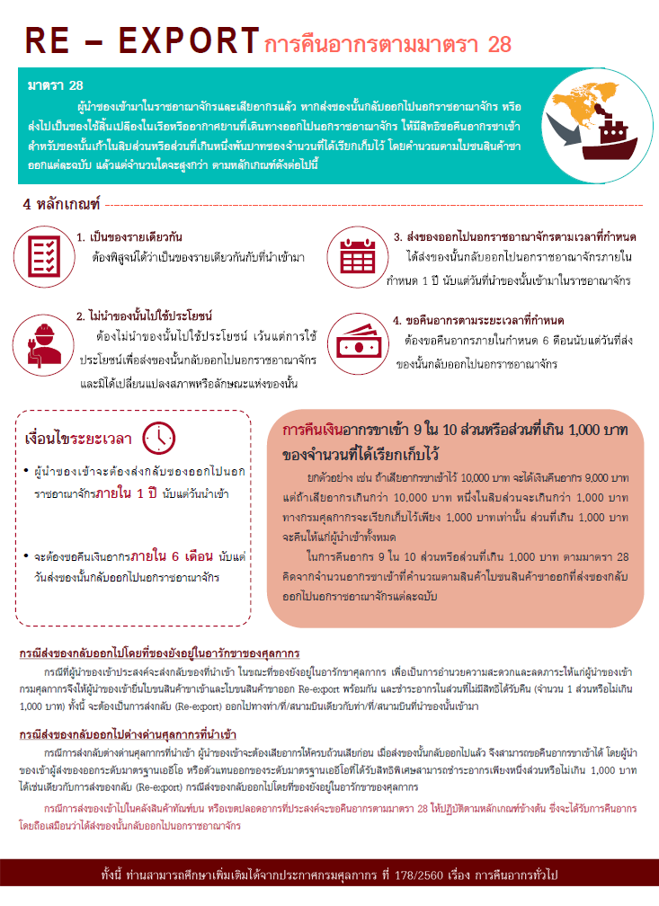

## **มาตรา 28**

ผู้นําของเข้ามาในราชอาณาจักรและเสียอากรแล้ว หากส่งของนั้นกลับออกไปนอกราชอาณาจักร หรือ ส่งไปเป็นของใช้สิ้นเปลืองในเรือ หรืออากาศยานที่เดินทางออกไปนอกราชอาณาจักร ให้มีสิทธิขอคืนอากรขาเข้า สําหรับของนั้นเก้าในสิบส่วน หรือส่วนที่เกินหนึ่งพันบาทของจํานวนที่ได้เรียกเก็บไว้ โดยคํานวณตามใบขนสินค้าขาออกแต่ละฉบับ แล้วแต่จํานวนใดจะสูงกว่า ตามหลักเกณฑ์ดังต่อไปนี้

## **หลักเกณฑ์**

1. **เป็นของรายเดียวกัน** ต้องพิสูจน์ได้ว่าเป็นของรายเดียวกันกับที่นําเข้ามา
2. **ไม่นำของนั้นไปใช้ประโยชน์** ต้องไม่นําของนั้นไปใช้ประโยชน์ เว้นแต่การใช้ประโยชน์เพื่อส่งของนั้นกลับออกไปนอกราชอาณาจักร และมิได้เปลี่ยนแปลงสภาพหรือลักษณะแห่งของนั้น
3. **ส่งของออกไปนอกราชอาณาจักรตามเวลาที่กําหนด** ได้ส่งของนั้นกลับออกไปนอกราชอาณาจักรภายในกําหนด 1 ปี นับแต่วันที่นําของนั้นเข้ามาในราชอาณาจักร
4. **ขอคืนอากรตามระยะเวลาที่กําหนด** ต้องขอคืนอากรภายในกําหนด 6 เดือนนับแต่วันที่ส่งของนั้นกลับออกไปนอกราชอาณาจักร
   เงื่อนไขระยะเวลาต้องพิสูจน์ได้ว่าเป็นของรายเดียวกันกับที่นําเข้ามา

## **เงื่อนไขระยะเวลา**

- ผู้นําของเข้าจะต้องส่งกลับของออกไปนอกราชอาณาจักรภายใน **1 ปี นับแต่วันนําเข้า**
- จะต้องขอคืนเงินอากรภายใน **6 เดือน นับแต่วันส่งของนั้นกลับออกไปนอกราชอาณาจักร**

## **การคืนเงินอากร**

- การคืนเงินอากรขาเข้า 9 ใน 10 ส่วนหรือส่วนที่เกิน 1,000 บาท ของจํานวนที่ได้เรียกเก็บไว้ ยกตัวอย่าง เช่น ถ้าเสียอากรขาเข้าไว้ 10,000 บาท จะได้เงินคืนอากร 9,000 บาท แต่ถ้าเสียอากรเกินกว่า 10,000 บาท หนึ่งในสิบส่วนจะเกินกว่า 1,000 บาท ทางกรมศุลกากรจะเรียกเก็บไว้เพียง 1,000 บาทเท่านั้น ส่วนที่เกิน 1,000 บาท จะคืนให้แก่ผู้นําเข้าทั้งหมด
- ในการคืนอากร 9 ใน 10 ส่วนหรือส่วนที่เกิน 1,000 บาท ตามมาตรา 28 คิดจากจํานวนอากรขาเข้าที่คํานวณตามสินค้าใบซนสินค้าขาออกที่ส่งของกลับ ออกไปนอกราชอาณาจักรแต่ละฉบับ

---



- **กรณีส่งของกลับออกไปโดยที่ของยังอยู่ในอารักขาของศุลกากร** กรณีที่ผู้นําของเข้าประสงค์จะส่งกลับของที่นําเข้า ในขณะที่ของยังอยู่ในอารักขาศุลกากร เพื่อเป็นการอํานวยความสะดวกและลดภาระให้แก่ผู้นําของเข้า กรมศุลกากรจึงให้ผู้นําของเข้ายื่นใบขนสินค้าขาเข้าและใบขนสินค้าขาออก Re-export พร้อมกัน และชําระอากรในส่วนที่ไม่มีสิทธิได้รับคืน (จํานวน 1 ส่วนหรือไม่เกิน 1,000 บาท) ทั้งนี้ จะต้องเป็นการส่งกลับ (Re-export) ออกไปทางท่านที่สนามบินเดียวกับท่า/ที่/สนามบินที่นําของนั้นเข้ามา
- **กรณีส่งของกลับออกไปต่างด่านศุลกากรที่นําเข้า** กรณีการส่งกลับต่างต่านศุลกากรที่นําเข้า ผู้นําของเข้าจะต้องเสียอากรให้ครบถ้วนเสียก่อน เมื่อสั่งของนั้นกลับออกไปแล้ว จึงสามารถขอคืนอากรขาเข้าได้ โดยผู้นํา ของเข้าผู้ส่งของออกระดับมาตรฐานเออีโอ หรือตัวแทนออกของระดับมาตรฐานเออีโอที่ได้รับสิทธิพิเศษสามารถชําระอากรเพียงหนึ่งส่วนหรือไม่เกิน 1,000 บาท ได้เช่นเดียวกับการส่งของกลับ (Re-export) กรณีส่งของกลับออกไปโดยที่ของยังอยู่ในอารักขาของศุลกากร





- **กรณีการส่งของเข้าไปในคลังสินค้าทัณฑ์บน หรือเขตปลอดอากรที่ประสงค์จะขอคืนอากรตามมาตรา 28** ให้ปฏิบัติตามหลักเกณฑ์ข้างต้น ซึ่งจะได้รับการคืนอากร โดยถือเสมือนว่าได้ส่งของนั้นกลับออกไปนอกราชอาณาจักรทั้งนี้ ท่านสามารถศึกษาเพิ่มเติมได้จาก [ประกาศกรมศุลกากร ที่ 178/.2560 เรื่อง การคืนอากรทั่วไป](./00178.pdf)



 

  
ที่มา : [กรมศุลกากร](http://ccc.customs.go.th/cont_strc_faq.php?current_id=14232a32414d505f4a&left_menu=interesting_article)  
วันที่ปรับปรุงล่าสุด : 2 มิถุนายน 2564  
สอบถามข้อมูลเพิ่มเติมได้ที่ : ศูนย์บริการศุลกากร  
หมายเลขโทรศัพท์ : 1164  
อีเมล์ : 1164@customs.go.th  

