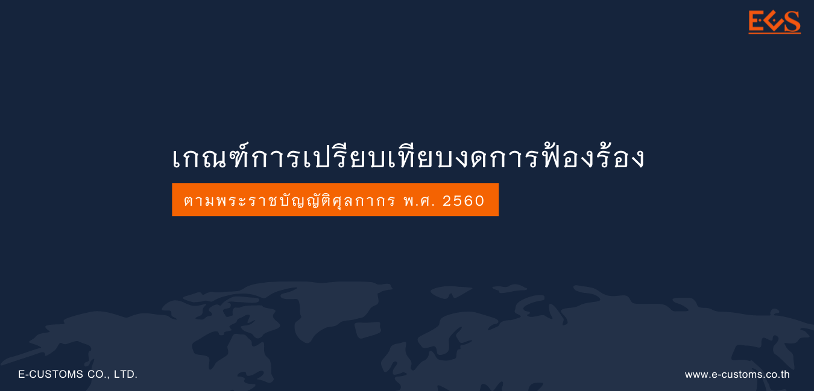



 กฎหมายศุลกากรเป็นกฎหมายที่มีลักษณะพิเศษ คือ เมื่อกระทำความความผิดเกิดขึ้น ผู้กระทำความผิดนั้นสามารถระงับคดีในชั้นศุลกากรได้ โดยไม่ต้องส่งฟ้องศาล เว้นแต่ท่านไม่ปฏิบัติตาม เช่น กรมศุลกากรพิจารณาความผิดแล้วท่านไม่มาดำเนินการตามขั้นตอนของศุลกากร ไม่นำเงินมาเสียค่าปรับเพื่อระงับคดี กรมศุลกากรจึงจะส่งเรื่องให้หน่วยงานที่มีหน้าที่สืบสวนจับกุมหรือดำเนินการใดๆ ที่ให้ผู้กระทำความผิดมาชำระอากรให้ครบถ้วนได้ ได้แก่ กองบังคับการปราบปรามการกระทำความผิดเกี่ยวกับอาชญากรรมทางเศรษฐกิจ (ECONOMIC CRIME SUPPRESSION DIVISION) เพื่อติดตามเรียกผู้กระทำความผิดมารับทราบข้อกล่าวหา ถ้ายังไม่ยอมปฏิบัติตาม จะดำเนินการส่งฟ้องร้องต่อศาล  อาจสรุปได้ว่าขั้นตอนการดำเนินการทางศุลกากร ถ้ามีความผิดแล้ว ถ้าระงับคดีในชั้นศุลกากรเรื่องจะจบได้ง่าย ถ้าไม่ยอมเรื่องก็จะจบยากขึ้น 







ดาวน์โหลดเอกสาร

> ที่มา : [กรมศุลกากร](http://www.customs.go.th/data_files/d0ea27da266b967620e8f4e62b433643.pdf)