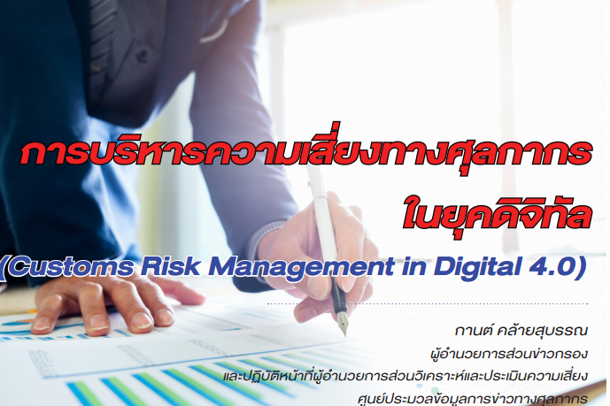

โลกปัจจุบัน คือ ยุคแห่งการเปลี่ยนแปลงที่มาก รุนแรง ผันผวนและฉับพลันรวดเร็ว หรือที่นิยมเรียกว่า **“VUCA”** ซึ่ง ย่อมาจาก 

1.	V-Volatility หมายถึง ภาวะที่มีความผันผวนสูง ยากจะคาดเดา 
2.	U-Uncertainty หมายถึง ภาวะที่มีความไม่ แน่นอนสูง สามารถเปลี่ยนแปลงได้มาก 
3.	C-Complexity หมายถึง ภาวะที่มีความซับซ้อนสูง มีปัจจัยที่ต้องนํามาพิจารณา ประกอบการตัดสินใจจำนวนมาก และ 
4.	A-Ambiguity หมายถึง ภาวะที่มีความคลุมเครือสูง ไม่ชัดเจน ยากจะคาดเดาผลลัพธ์ ได้ ลักษณะประการหนึ่งของ VUCA ที่สามารถสังเกตได้ชัดเจน คือ การเปลี่ยนแปลงด้านเทคโนโลยีสารสนเทศไปสู่ยุคดิจิทัลเต็ม รูปแบบ (Digitization) เป็นยุคของการใช้ประโยชน์จากข้อมูลที่ถูกจัดเก็บในแหล่งต่าง ๆ ทั้งภายในองค์กร และภายนอกองค์กร ทั้งข้อมูลที่มีโครงสร้าง (Structured Data) และข้อมูลที่มีโครงสร้างไม่ชัดเจน (Unstructured Data) ซึ่งรวมเรียกเป็นฐานข้อมูล ขนาดใหญ่ (Big Data)

นอกจากการเปลี่ยนแปลงดังกล่าวจะเป็นไปตามพัฒนาการทางประวัติศาสตร์ของโลกแล้วสถานการณ์การแพร่ระบาดของเชื้อไวรัสโควิด-19 ยังเป็นปัจจัยกระตุ้นให้ทั่วโลกต่างก้าวเข้าสู่สังคมดิจิทัลรวดเร็วมากยิ่งขึ้น มาตรการป้องกันการแพร่ระบาด ทำให้การสั่งซื้อสินค้า การประชุมหารือ และการดำเนินการต่าง ๆ เปลี่ยนมาเป็นกิจกรรมทางอิเล็กทรอนิกส์ผ่านระบบเครือข่าย อินเตอร์เน็ตอย่างเต็มรูปแบบ สิ่งต่าง ๆ เหล่านี้ ทำให้ปริมาณข้อมูลที่เกิดขึ้นผ่านกระบวนการต่าง ๆ ยิ่งเพิ่มมากขึ้นหลายเท่าตัว ในทุกวงการรวมถึงศุลกากรด้วย  

ที่ผ่านมาพลวัตของกระบวนการทางศุลกากรก็มีแนวทางสอดคล้องกับทิศทางของสังคมโลกและสังคมไทยที่เปลี่ยนไป การปฏิบัติพิธีการศุลกากรผ่านระบบอิเล็กทรอนิกส์ การส่งข้อมูลใบขนสินค้า ใบอนุญาต/ใบรับรองต่าง ๆ แทนการยื่นเอกสาร แบบกระดาษ เป็นกระบวนการที่พบเห็นโดยทั่วไป ไม่ว่าจะเป็นการนําเข้า-ส่งออก ที่ท่าเรือ ท่าอากาศยาน หรือตามด่านพรมแดน ล้วนเป็นผลมาจากการปรับตัวและการพัฒนาอย่างต่อเนื่องของกรมศุลกากร







ดาวน์โหลดเอกสาร

> ที่มา : กรมศุลกากร
