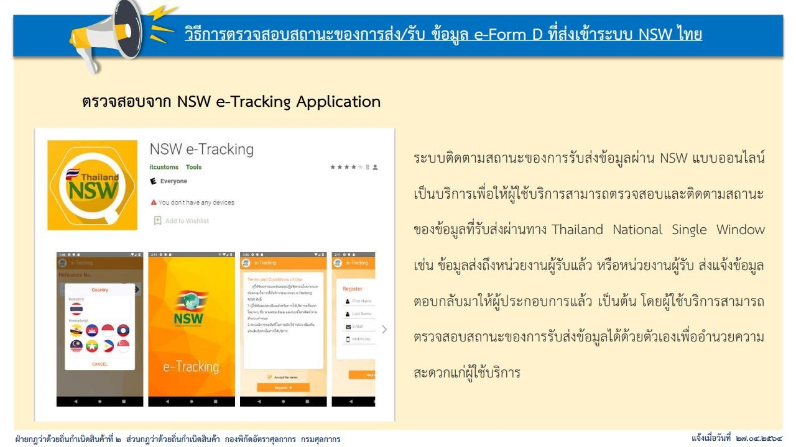
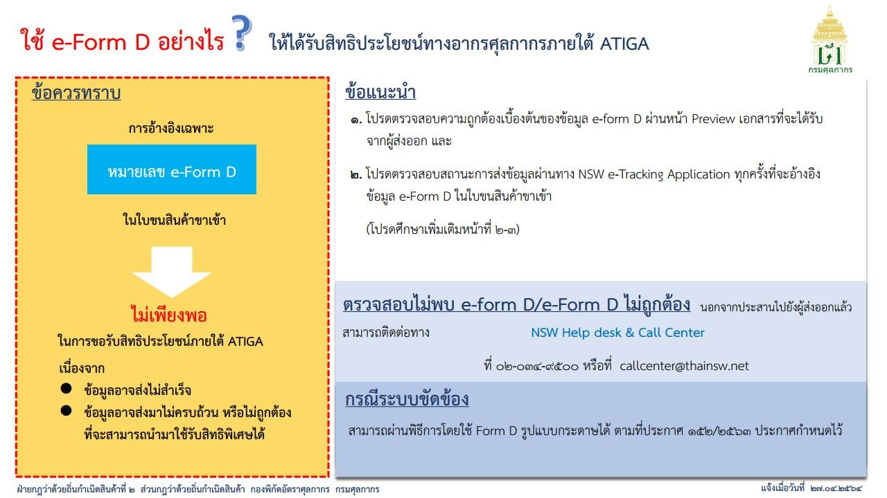
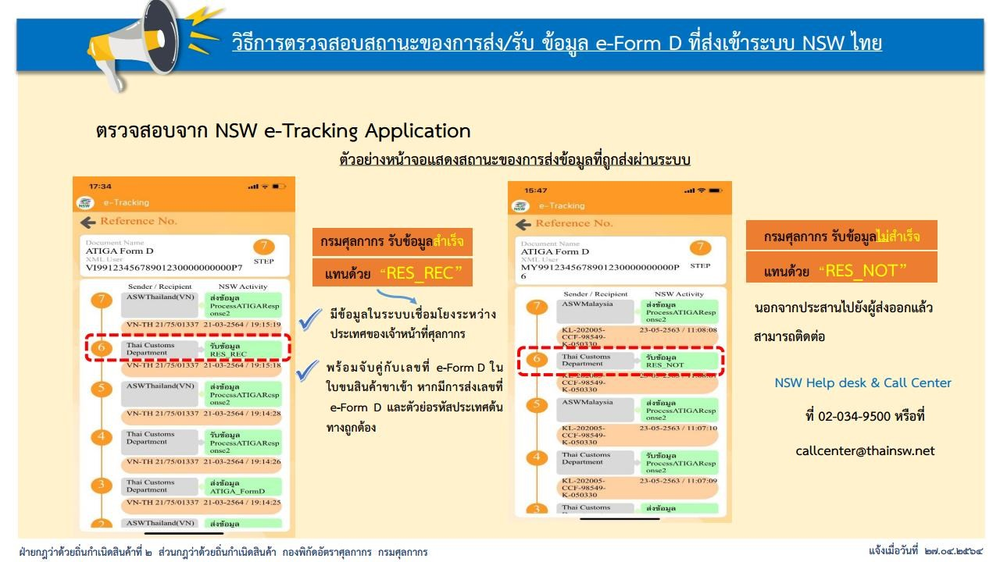

   

     

       




 

 

<a class="badge badge-danger" href="./docs.pdf" target="_blank" id="download_files_new">Download</a>

 



> ที่มา : [กรมศุลกากร](https://www.customs.go.th/data_files/444f1d09ff5d54d9e4f086c00fc524ff.pdf)
