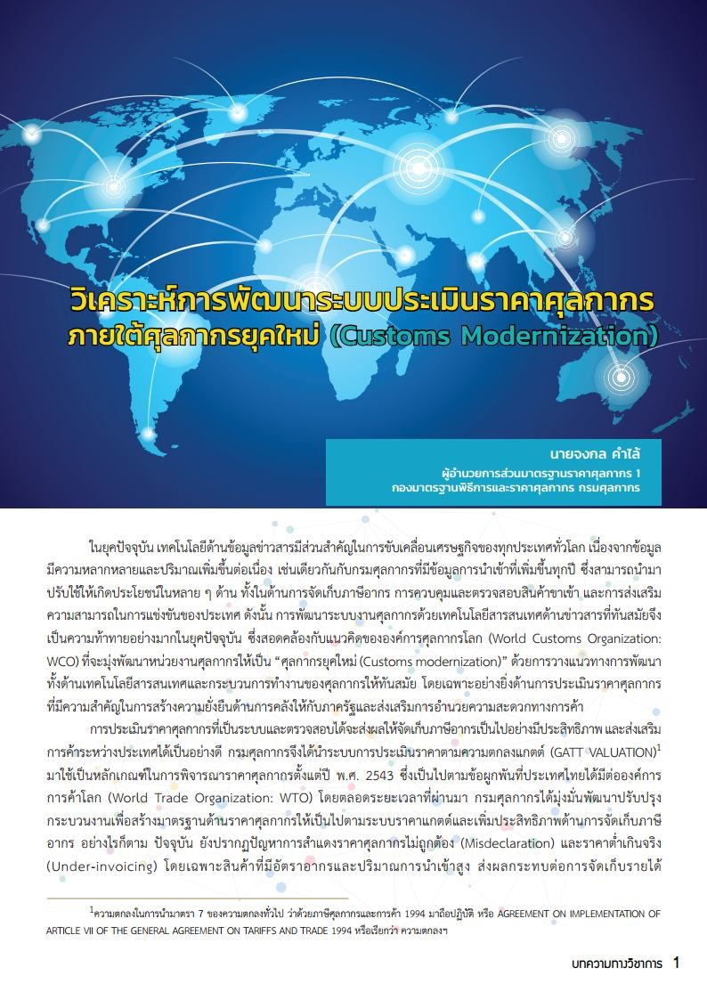
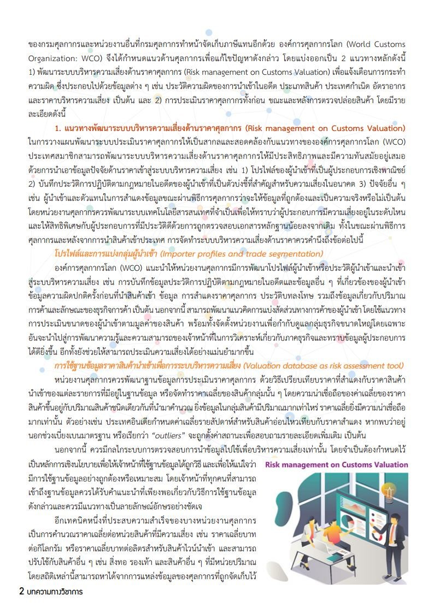
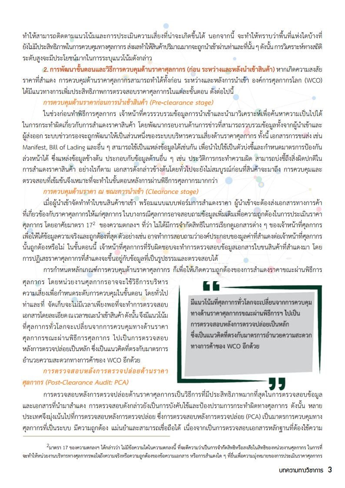
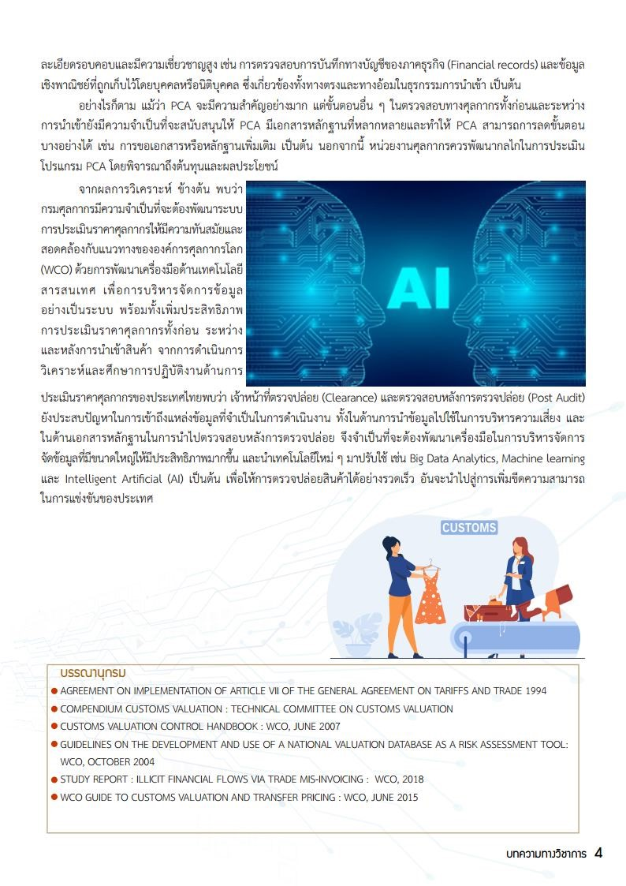

   

     

     

     


 

 

<a class="badge badge-danger" href="./docs.pdf" target="_blank" id="download_files_new">Download</a>

 



> ที่มา : [กรมศุลกากร](https://www.customs.go.th/cont_strc_simple_with_date.php?current_id=142329324146505f49464b4b464b4b)