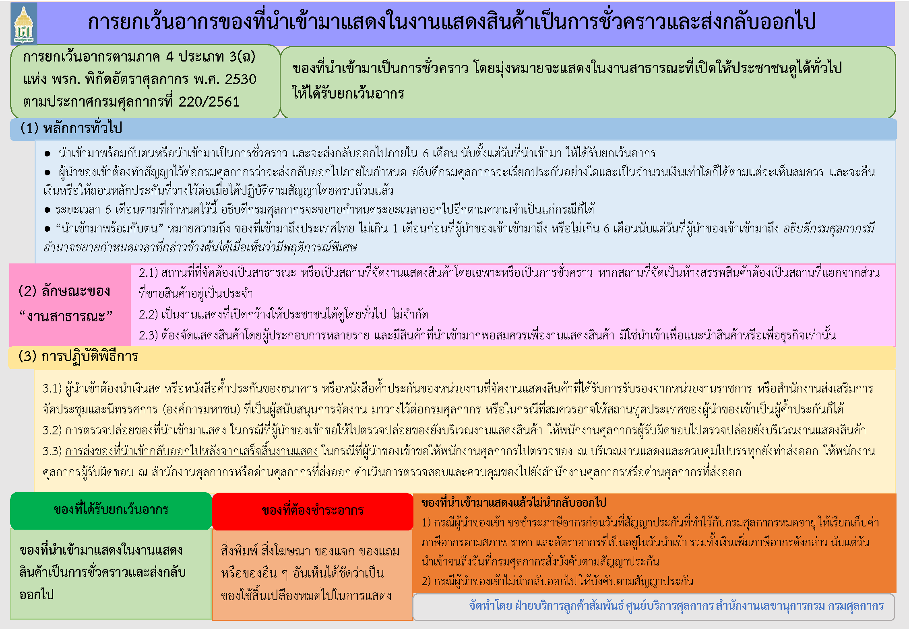

## ประเภท 3 ภาค 4 สิทธิทัณฑ์บนนำเข้าชั่วคราว (การยกเว้นอากรของที่นำเข้ามาแสดงในงานแสดงสินค้าเป็นการชั่วคราวและส่งกลับออกไป)





> ที่มา : [กรมศุลกากร](http://ccc.customs.go.th/cont_strc_faq.php?current_id=14232b324146505e4e&left_menu=interesting_article)
