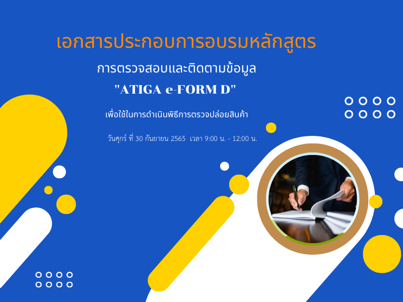

**เอกสารประกอบการอบรมหลักสูตร "การตรวจสอบและติดตามข้อมูล ATIGA e-Form D เพื่อใช้ในการดำเนินพิธีการตรวจปล่อยสินค้า"**

ตามที่กองบริหารจัดการและพัฒนาระบบเชื่อมโยงข้อมูลการนำเข้า ส่องออกและโลจิสติกส์ (กบช.) ได้จัดอบรมหลักสูตร “การตรวจสอบและติดตามข้อมูล ATIGA e-Form D เพื่อใช้ในการดำเนินพิธีการตรวจปล่อยสินค้า” ให้กับผู้ประกอบการเมื่อวันศุกร์ที่ 30 กันยายน 2565 ที่ผ่านมานั้น ทาง ThaiNSW ได้เผยแพร่เอกสารอบรมให้กับผู้สนใจ ซึ่งรายละเอียดตามเอกสารแนบ







ดาวน์โหลดเอกสาร

> ที่มา : [ThaiNSW](https://www.thainsw.net/INSW/Ent/DisplayDocumentDetailServlet)
