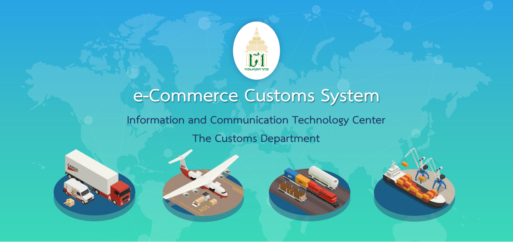



ตามที่กรมศุลกากรได้จัดสัมมนาหลักสูตร **"โครงการพัฒนาระบบพิธีการศุลกากรอิเล็กทรอนิกส์ (e-Commerce Customs System)"** ให้กับผู้ประกอบการเมื่อ*วันศุกร์ที่ 25 พฤศจิกายน 2565* ณ ห้องมัฆวานรังสรรค์ ชั้น 3 สโมสรทหารบก ที่ผ่านมานั้น  ขณะนี้ศุลกากรได้มีการเผยแพร่เอกสารในการสัมมนาดังกล่าว ซึ่งมีรายละเอียดดังนี้

## การบรรยายในหัวข้อ "ประกาศกรมศุลกากรที่ 204/.2562 เรื่อง การปฏิบัติพิธีการศุลกากร ณ เขตปลอดอากรกิจการพาณิชย์อิเล็กทรอนิกส์ ภายในเขตส่งเสริมเศรษฐกิจพิเศษในพื้นที่เขตพัฒนาพิเศษภาคตะวันออก"

> โดย นายคลี่เอก มาสมาน  นักวิชาการศุลกากรชํานาญการ สํานักงานศุลกากรตรวจสินค้าท่าอากาศยานสุวรรณภูมิ 




 

 

<a class="badge badge-danger" href="./docs_01.pdf" target="_blank" id="download_files_new">Download</a>

 


## การบรรยายในหัวข้อ "การจัดตั้งเขตปลอดอากรพาณิชย์อิเล็กทรอนิกส์"

> โดย นายธีร์ จิตรพิทักษ์เลิศ ส่วนตรวจสอบคลังสินค้าทัณฑ์บน กองสิทธิประโยชน์ทางภาษีอากร




 

 

<a class="badge badge-danger" href="./docs_02.pdf" target="_blank" id="download_files_new">Download</a>

 


## การบรรยายในหัวข้อ "การลงทะเบียนเป็นผู้รับส่งข้อมูลอิเล็กทรอนิกส์ผ่านระบบ NSW"

> โดย นายไกรษร สมนึก  นักวิชาการคอมพิวเตอร์ชํานาญการ ศูนย์เทคโนโลยีสารสนเทศและการสื่อสาร




 

 

<a class="badge badge-danger" href="./docs_03.pdf" target="_blank" id="download_files_new">Download</a>

 


## การบรรยายในหัวข้อ "ระบบพิธีการศุลกากรพาณิชย์อิเล็กทรอนิกส์"

> โดย นางกรรณิกา ปกรณ์ประเสริฐ  ผู้อํานวยการส่วนพัฒนาระบบส่งออกและสิทธิประโยชน์ ศูนย์เทคโนโลยีสารสนเทศและการสื่อสาร




 

 

<a class="badge badge-danger" href="./docs_04.pdf" target="_blank" id="download_files_new">Download</a>

 



> ที่มา : กรมศุลกากร
