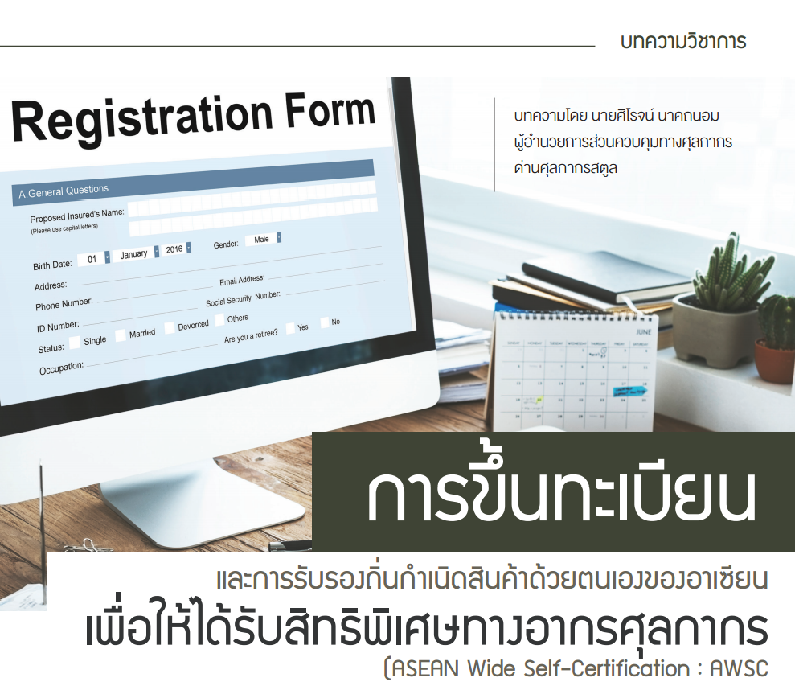

## [บทความวิชาการ] การขึ้นทะเบียนและการรับรองถิ่นกำเนิดสินค้าด้วยตนเองของอาเซียน เพื่อให้ได้รับสิทธิพิเศษทางอากรศุลกากร (ASEAN Wide Self-Certification: AWSC)

ภายใต้ความตกลงการค้าสินค้าของอาเซียน (ASEAN Trade in Goods Agreement : ATIGA) การรับรองถิ่นกำเนิด สินค้าด้วยตนเอง (Self-Certification) เป็นระบบความไว้วางใจให้ผู้ส่งออกตรวจสอบคุณสมบัติของตน ในบัญชีราคาสินค้า (Invoice) หรือในเอกสารทางการค้าอื่น ๆ (กรณีไม่สามารถแสดง Invoice) ในการใช้สิทธิยกเว้นหรือลดอัตราอากรศุลกากร ตามความตกลงการค้าสินค้าของอาเซียน (ASEAN Trade in Goods Agreement : ATIGA) แทนการใช้หนังสือรับรอง ถิ่นกำเนิดสินค้า Form D ซึ่งในระบบการรับรองถิ่นกำเนิดสินค้าด้วยตนเอง (Self-Certification) ประเทศสมาชิกอาเซียน 10 ประเทศได้แก่ ประเทศไทย สิงคโปร์ มาเลเซีย ฟิลิปปินส์ อินโดนีเซีย บรูไน กัมพูชา ลาว เมียนมาร์ และเวียดนาม ได้มี โครงการนําร่องการใช้ระบบรับรองถิ่นกำเนิดสินค้าด้วยตนเองโครงการที่ 1 (Self-Certification Pilot Project 1 : SCPP1) และโครงการที่ 2 (Self-Certification Pilot Project 2 : SCPP2) โดยโครงการที่ 1 (SCPP1) มีประเทศเข้าร่วมจำนวน 6 ประเทศ ได้แก่ บรูไน กัมพูชา มาเลเซีย เมียนมาร์ สิงคโปร์ และประเทศไทย และโครงการที่ 2 (SCPP2) มี 5 ประเทศเข้าร่วม ได้แก่ อินโดนีเซีย ลาว ฟิลิปปินส์ เวียดนาม และประเทศไทย

ปัจจุบันได้มีการปรับเปลี่ยนระบบการรับรองถิ่นกำเนิดสินค้าด้วยตนเอง (Self-Certification) โครงการที่ 1 (SCPP1) และโครงการที่ 2 (SCPP2) มาเป็นระบบการรับรองถิ่นกำเนิดสินค้าด้วยตนเองของอาเซียน (ASEAN Wide Self-Certification : AWSC) โดยผู้ส่งออกที่ได้รับการรับรอง หมายความว่า ผู้ส่งออกที่ได้รับสิทธิรับรองถิ่นกำเนิดสินค้าด้วยตนเอง (Certified Exporter : CE) ตามความตกลงการค้าสินค้าของอาเซียน 




 

 

<a class="badge badge-danger" href="./docs.pdf" target="_blank" id="download_files_new">Download</a>

 



> **เอกสารอ้างอิง :** ประกาศกรมศุลกากรที่ 229/2564 เรื่อง หลักเกณฑ์และพิธีการการยกเว้นอากรและลดอัตราอากรศุลกากรสำหรับของที่มีถิ่นกำเนิดจากอาเซียน ([ดาวน์โหลด](https://www.customs.go.th/cont_strc_download_with_docno_date.php?lang=th&top_menu=menu_homepage&current_id=142329324146505f46464b48464b46)).  
> **บทความโดย :** นายศิโรจน์ นาคถนอม ผู้อํานวยการส่วนควบคุมทางศุลกากร ด่านศุลกากรสตูล

> **ที่มา :** [กรมศุลกากร](https://www.customs.go.th/cont_strc_simple_with_date.php?current_id=142329324149505f49464b4a464b47)