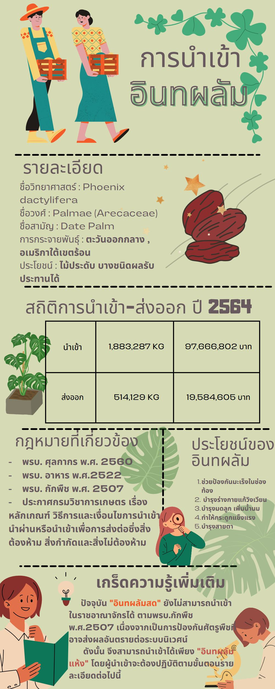
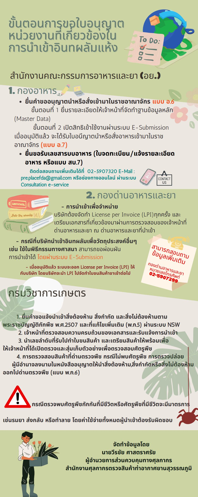

## [บทความวิชาการ] การนําเข้าอินทผลัม

### รายละเอียด

**ชื่อวิทยาศาสตร์:**  Phoenix dactylifera  
**ชื่อวงศ์ :**  Palmae (Arecaceae)  
**ชื่อสามัญ :**  Date Palm  
**การกระจายพันธุ์ :** ตะวันออกกลาง, อเมริกาใต้เขตร้อน  
**ประโยชน์ :** ไม้ประดับ บางชนิดผลรับประทานได้  

ปัจจุบัน **"อินทผลัมสด"** ยังไม่สามารถนําเข้า ในราชอาณาจักรได้ ตาม พรบ.กักพืช พ.ศ.2507 เนื่องจากเป็นการป้องกันศัตรูพืชที่อาจส่งผลอันตรายต่อระบบนิเวศน์ ดังนั้น จึงสามารถนําเข้าได้เพียง **"อินทผลัมแห้ง"** โดยผู้นําเข้าจะต้องปฏิบัติตามขั้นตอนรายละเอียดตามเอกสารแนบ.  

กรณีตรวจพบศัตรูพืชกักกันที่มีชีวิตหรือศัตรูพืชที่มีชีวิตจะมีมาตรการ เช่น รมยา ส่งกลับ หรือทำลาย **โดยค่าใช้จ่ายทั้งหมดผู้นําเข้าต้องรับผิดชอบ**



### ขั้นตอนการขอใบอนุญาต หน่วยงานที่เกี่ยวข้องใน การนําเข้าอินทผลัมแห้ง


 

 

<a class="badge badge-danger" href="./docs.pdf" target="_blank" id="download_files_new">Download</a>

 



> **จัดทำข้อมูลโดย** **:** นายวีรชัย ศาสตราศรัย ผู้อํานวยการส่วนควบคุมทางศุลกากร   สำนักงานศุลกากรตรวจสินค้าท่าอากาศยานสุวรรณภูมิ   
> **ที่มาบทความ** **:** [กรมศุลกากร](https://www.customs.go.th/cont_strc_simple_with_date.php?current_id=142329324149505f49464b4c464b46)  