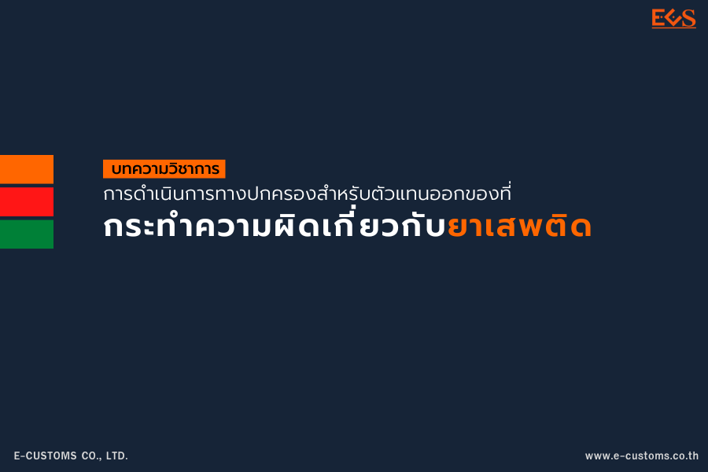

## [บทความวิชาการ] การดำเนินการทางปกครองสำหรับตัวแทนออกของและผู้ปฏิบัติงานเกี่ยวกับการออกของ ที่กระทำความผิดเกี่ยวกับยาเสพติด

การผลิตยาเสพติดในปัจจุบันมีแนวโน้มเพิ่มขึ้น มีการเปลี่ยนแปลงจากเดิมที่ใช้เครื่องมือในการผลิตแบบที่กำลังการผลิตไม่มาก เริ่มเปลี่ยนมาเป็นการผลิตในระดับอุตสาหกรรมขนาดใหญ่ที่ดำเนินการโดยองค์กรอาชญากรรมข้ามชาติที่มีโครงสร้างการค้าที่สลับซับซ้อน เพื่อรองรับตลาดยาเสพติดภายนอกประเทศ โดยพื้นที่ที่เป็นแหล่งผลิตยาเสพติดส่วนใหญ่อยู่ในเขตประเทศเพื่อนบ้าน แม้ในช่วงแรกของการระบาดของเชื้อไวรัสโคโรนา 2019 มีการหยุดชะงัก ของตลาดการค้ายาเสพติดเนื่องจากการปิดพรมแดนของประเทศต่าง ๆ แต่ขบวนการค้ายาเสพติดมีการปรับตัวให้เข้ากับสถานการณ์ได้อย่างรวดเร็ว และมีความพยายามที่จะลักลอบ ลําเลียงยาเสพติดผ่านประเทศไทยเพื่อส่งต่อไปยังประเทศที่สามมากขึ้น ซึ่งการลักลอบส่งออกยาเสพติดจากประเทศไทยมีหลายช่องทาง ไม่ว่าจะเป็นการลักลอบส่งออกทางบก ทางอากาศ ทางทะเล และทางไปรษณีย์ โดยเฉพาะอย่างยิ่งการลักลอบส่งออกยาเสพติดทางทะเล พบว่าในปัจจุบันมีการลักลอบส่งยาเสพติดออกไป นอกราชอาณาจักรโดยวิธีการซุกซ่อนยาเสพติด ไว้ในสินค้าที่จะส่งออกไปนอกราชอาณาจักรโดยทางทะเล เนื่องจากตู้บรรจุสินค้าจะสามารถซุกซ่อนยาเสพติดได้ปริมาณมาก

การลักลอบนําเข้าหรือส่งยาเสพติดออกไปนอกราชอาณาจักรโดยการซุกซ่อนในตู้บรรจุสินค้าที่จะส่งออก ไปต่างประเทศ มักเกี่ยวข้องกับการปฏิบัติพิธีการศุลกากรของผู้นําของเข้าและผู้ส่งของออก ตัวแทนออกของ และผู้ปฏิบัติงานเกี่ยวกับการออกของ โดยบุคคลต่าง ๆ เหล่านี้ เป็นบุคคลที่ต้องลงทะเบียนต่อกรมศุลกากร และต้องปฏิบัติพิธีการศุลกากรกับกรมศุลกากร โดยเฉพาะอย่างยิ่งตัวแทนออกของและผู้ปฏิบัติงานเกี่ยวกับ การออกของ ซึ่งมีบทบาทสำคัญในการนําเข้า - ส่งออกสินค้าของประเทศ เพราะเป็นผู้ที่ดำเนินการผ่านพิธีการ ศุลกากรแทนผู้นําของเข้าและผู้ส่งของออก

กรมศุลกากรในฐานะหน่วยงานที่ควบคุม กำกับดูแล การดำเนินพิธีการศุลกากรหรือการให้บริการใด ๆ ในทางศุลกากร ย่อมต้องมีมาตรการป้องกันและมาตรการทางปกครองในการดำเนินการกับผู้นําของเข้าและ ผู้ส่งของออก ตัวแทนออกของ และผู้ปฏิบัติงานเกี่ยวกับการออกของที่มีการกระทำความผิดเกี่ยวกับการลักลอบ ส่งยาเสพติดออกไปนอกราชอาณาจักร โดยในส่วนของมาตรการป้องกัน กรมศุลกากรได้นําหลักบริหารความเสี่ยง มาปรับใช้ เช่น การกำหนด Profile การสั่งตรวจ และในส่วนของมาตรการทางปกครองกรมศุลกากรมีการออกประกาศกรมศุลกากรเพื่อกำหนดมาตรการทางปกครองสำหรับตัวแทนออกของและผู้ปฏิบัติงานเกี่ยวกับการออกของที่กระทำความผิดเกี่ยวกับยาเสพติด โดยสรุปได้ดังนี้

## บทสรุป 



การนําของเข้าและการส่งของออกไม่ว่าจะทางบก ทางทะเล หรือทางอากาศ ล้วนเกี่ยวข้องกับกรมศุลกากร กรมศุลกากรจึงเป็นหน่วยงานสำคัญที่ต้องป้องกันและควบคุมดูแลการนําของเข้าและการส่งของออกของประเทศไทย เมื่อกรมศุลกากรพบว่า มีการลักลอบส่งยาเสพติดออกนอกราชอาณาจักร นอกจากการดำเนินการทางอาญาแล้ว กรมศุลกากรยังดำเนินการทางปกครองกับผู้ที่เกี่ยวข้องที่ได้กระทำหรือมีส่วนร่วมในการกระทำความผิดเกี่ยวกับยาเสพติดดังกล่าว ซึ่งบุคคลที่เกี่ยวข้องที่ได้ลงทะเบียนไว้กับกรมศุลกากร ได้แก่ ตัวแทนออกของและผู้ปฏิบัติงานเกี่ยวกับการออกของ 

เนื่องจากตัวแทนออกของและผู้ปฏิบัติงานเกี่ยวกับการออกของ ถือเป็นอาชีพที่มีความสำคัญในการปฏิบัติพิธีการศุลกากร โดยต้องใช้ความรู้ความสามารถและ ความระมัดระวังในการปฏิบัติพิธีการศุลกากร ดังนั้น ประกาศกรมศุลกากรที่ 97/2565 นอกจากจะช่วยให้การดำเนินการทางปกครองกับตัวแทนออกของและผู้ปฏิบัติงานเกี่ยวกับการออกของที่กระทำความผิดเกี่ยวกับยาเสพติดมีความชัดเจนขึ้นแล้ว ยังช่วยป้องปรามให้ตัวแทนออกของและผู้ปฏิบัติงานเกี่ยวกับการออกของ ไม่ให้กระทำการที่ผิดต่อกฎหมาย เช่นเดียวกันกับกรณีผู้นําของเข้าและส่งของออก หากพบว่ามีส่วนเกี่ยวข้องกับการลักลอบนําเข้า หรือส่งออกยาเสพติดก็จะถูกระงับทางทะเบียนผู้นําเข้าและส่งออกด้วยเช่นกัน






 

 

<a class="badge badge-danger" href="./docs.pdf" target="_blank" id="download_files_new">Download</a>

 



> **บทความโดย** **:** พริสร สุขประเสริฐ ผู้อํานวยการส่วนทะเบียนและสิทธิพิเศษ กองมาตรฐานพิธีการและราคาศุลกากร  
> **ที่มาบทความ** **:** [กรมศุลกากร](https://www.customs.go.th/cont_strc_simple_with_date.php?current_id=142329324149505f4b464a4f464b47)  