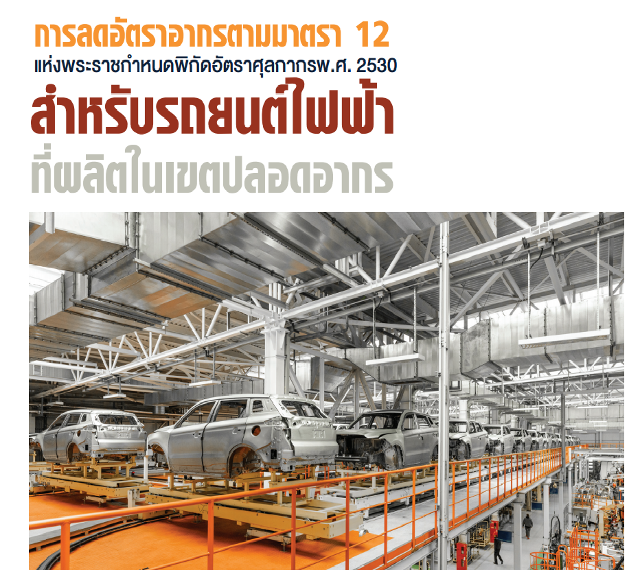

## [บทความวิชาการ] การลดอัตราอากรตามมาตรา 12 แห่งพระราชกำหนดพิกัดอัตราศุลกากร พ.ศ. 2530 สำหรับรถยนต์ไฟฟ้าที่ผลิตในเขตปลอดอากร

จากวิกฤตการณ์น้ำมันที่มีราคาสูงขึ้นเป็นลำดับทำให้ผู้ขับขี่รถยนต์ต้องแบกรับภาระค่าใช้จ่ายที่สูงขึ้นประกอบกับ แนวคิดที่มนุษย์เริ่มหันมาใส่ใจสิ่งแวดล้อม โดยมีความก้าวหน้าทางเทคโนโลยีเป็นตัวขับเคลื่อน จึงเป็นที่มาของการคิดค้น รถยนต์ที่ใช้พลังงานไฟฟ้าเพื่อมาทดแทนการใช้น้ำมัน เพราะนอกจากเป็นการประหยัดค่าใช้จ่ายแล้วยังเป็นการลดมลพิษ อันเกิดจากเขม่าควันซึ่งก่อให้เกิดภาวะโลกร้อนอีกด้วย รถยนต์ที่ใช้พลังงานไฟฟ้าหรือรถยนต์ไฟฟ้าในที่นี้หมายถึงรถยนต์ที่ใช้พลังงานไฟฟ้าจากแบตเตอรี่แต่เพียงอย่างเดียว ไม่มีเครื่องยนต์สันดาปภายใน จึงไม่มีการปล่อยไอเสีย และไม่สร้างมลพิษซึ่งสามารถชาร์จไฟได้เมื่อแบตเตอรี่หมด ผ่านทางที่ชาร์จภายในบ้านหรือสถานีชาร์จไฟ

ดังนั้นด้วยเหตุผลของการลดภาระค่าใช้จ่าย และความต้องการพลังงานสะอาดเพื่อรักษาสิ่งแวดล้อม จึงมีการพัฒนาสมรรถนะของรถยนต์ไฟฟ้ามาเป็นลำดับ ในระยะแรก ๆ รถยนต์ไฟฟ้ายังเป็นนวัตกรรมยานยนต์ที่ผลิตขึ้นในต่างประเทศ การนําเข้ารถไฟฟ้าทำให้ผู้ขับขี่ต้องแบกรับภาระภาษีจึงทำให้รถยนต์ไฟฟ้ามีราคาสูง แต่ในปัจจุบันจากนโยบายส่งเสริมสิทธิประโยชน์ทางภาษีอากรของรัฐบาลที่ มีการจัดตั้งเขตปลอดอากรเพื่อการอุตสาหกรรมและพาณิชยกรรมทำให้คนไทย ได้มีโอกาสใช้รถไฟฟ้าที่ผลิตขึ้นในประเทศไทยที่ปลอดจากภาระอากรเนื่องจากการลดอัตราอากรตามมาตรา 12 ตามพระราชกำหนดพิกัดอัตราศุลกากร พ.ศ.2530

โดยที่ประกาศกระทรวงการคลัง เรื่อง การลดอัตราอากรและยกเว้นอากรศุลกากรตามมาตรา 12 แห่ง พระราชกำหนดพิกัดอัตราศุลกากร พ.ศ.2530 ลงวันที่ 28 ธันวาคม พ.ศ. 2564 ข้อ 2 (13) ประกอบกับประกาศกรมศุลกากร ที่ 246/2564 เรื่องหลักเกณฑ์และพิธีการสำหรับการลดอัตราอากรและยกเว้นอากรศุลกากรตามมาตรา 12 แห่งพระราชกำหนด พิกัดอัตราศุลกากร พ.ศ. 2530 ลงวันที่ 30 ธันวาคม พ.ศ. 2530 ข้อ 16 ระบุว่า *“ของที่ได้จากการนําวัตถุดิบเข้ามาผลิต ผสม ประกอบ บรรจุ หรือดำเนินการอื่นใดในลักษณะอุตสาหกรรมในเขตปลอดอากร ตามกฎหมายว่าด้วยศุลกากร หรือในเขตประกอบการเสรี ตามกฎหมายว่าด้วยการนิคมอุตสาหกรรมแห่งประเทศไทย ซึ่งนํามาจําหน่ายหรือบริโภคภายในประเทศ ให้ลดอัตราอากรศุลกากร ลงเหลือในอัตราร้อยละ 0”* ผู้ประกอบกิจการในเขตปลอดอากร ผู้ผลิตรถยนต์ไฟฟ้า ที่ประสงค์ขอใช้สิทธิลดอัตราอากร จะต้องยื่นคําร้องขอใช้สิทธิลดอัตราอากรตามมาตรา 12 (รายละเอียดตามเอกสารแนบ)

## บทสรุป 



ทั้งนี้ เพื่อความเข้าใจในรายละเอียดยิ่งขึ้น ผู้ประกอบการสามารถศึกษาเงื่อนไข หลักเกณฑ์ต่างๆ เพื่อประกอบการ ปฏิบัติพิธีการศุลกากรได้จากประกาศกรมศุลกากรที่ 246/2564 เรื่องหลักเกณฑ์และพิธีการสำหรับการลดอัตราอากรและยกเว้นอากรศุลกากรตามมาตรา 12 แห่งพระราชกำหนดพิกัดอัตราศุลกากร พ.ศ. 2530 ลงวันที่ 30 ธันวาคม พ.ศ. 2530 ข้อ 16 ประกอบประกาศสำนักงานเศรษฐกิจอุตสาหกรรมเรื่อง กระบวนการผลิตที่เป็นสาระสำคัญของของในเขตปลอดอากรหรือ เขตประกอบการเสรีตามกฎหมายว่าด้วยการนิคมอุตสาหกรรมแห่งประเทศไทย ลงวันที่ 4 กุมภาพันธ์ พ.ศ. 2565 ([ดาวน์โหลด](https://www.customs.go.th/cont_strc_download_with_docno_date.php?lang=th&top_menu=menu_homepage&current_id=142329324146505f46464b4d464b4a))







 

 

<a class="badge badge-danger" href="./docs.pdf" target="_blank" id="download_files_new">Download</a>

 



> **บทความโดย** **:** นางสาวณฐินี สุรกาญจน์กุล ผู้อำนวยการส่วนบริการศุลกากรสมุทรปราการ สำนักงานศุลกากรกรุงเทพ 
> **ที่มาบทความ** **:** [กรมศุลกากร](https://www.customs.go.th/cont_strc_simple_with_date.php?current_id=142329324149505f4b464a4f464b4c)  