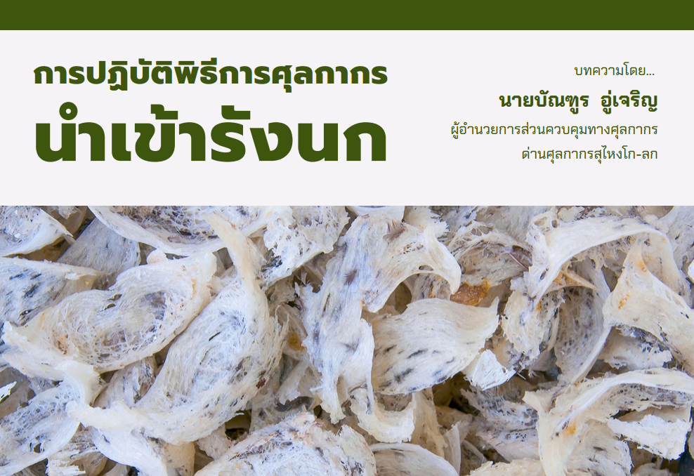

## รังนก  

เป็นของตามประเภทพิกัด 0410.90.10 อัตราอากรร้อยละ 60 จัดเป็นหนึ่งในสินค้าเศรษฐกิจของไทย ซึ่งมีการวัดคุณภาพหลายวิธี
โดยวิธีที่นิยมใช้คือการจัดเกรดจากรูปร่างลักษณะของรังนก ความสะอาด ขนาด และน้ําหนัก โดยแบ่งออกเป็น 3 เกรด ได้แก่
1. รังนกเกรดดีมาก (AAA) มีลักษณะเป็นรูปเปลหรือถ้วยค่อนข้าง สมบูรณ์ ขนาดกว้าง 6 – 8 เซนติเมตร
2. รังนกเกรดดี (AA) ลักษณะค่อนข้างสมบูรณ์ ขนาดกว้าง ประมาณ 5 – 6 เซนติเมตร เรียกว่ารังกะเทย
3. รังนกเกรดปานกลาง (A) ลักษณะเป็นรังมุม มีขนาดกว้างประมาณ 4 – 5 เซนติเมตร ซึ่งราคาของรังนกขึ้นอยู่กับเกรด ยิ่งเกรดดีมาก ราคาก็ยิ่งสูงมากและจะสูงยิ่งขึ้นไป หากรังนกนั้นเป็นรังนกที่ได้จากแหล่งธรรมชาติ แต่เนื่องจากรังนกธรรมชาติซึ่งเป็นที่นิยมและมีความต้องการ ในท้องตลาดสูงนั้นมีแหล่งทรัพยากรในประเทศอยู่อย่างจํากัด ผู้ค้ารังนกส่วนหนึ่งจึงพยายามหาแหล่งรังนกจากต่างประเทศเพื่อนําเข้ามาจําหน่ายให้เพียงพอต่อ ความต้องการ บทความนี้จึงจะแนะนําการปฏิบัติพิธีการศุลกากรในการนําเข้ารังนกให้ถูกต้อง

## การปฏิบัติพิธีการศุลกากร  

ผู้ที่ประสงค์นําเข้ารังนก จะต้องขึ้นทะเบียนเป็นผู้ปฏิบัติพิธีการศุลกากรเสียก่อน โดยสามารถติดต่อ สอบถามรายละเอียดเอกสารที่จําเป็นและขอขึ้นทะเบียนได้ที่ ส่วนทะเบียนและสิทธิพิเศษ กองมาตรฐานพิธีการ และราคาศุลกากร ชั้น 1 อาคาร 120 ปี กรมศุลกากร คลองเตย กรุงเทพมหานคร หรือด่านศุลกากรที่ท่านสะดวก แล้วจึงดําเนินการ ดังนี้
1.	ขอรับใบอนุญาตนําเข้ารังนก จากสํานักงานคณะกรรมการอาหารและยา
2.	นําส่งข้อมูลเข้าสู่ระบบ E-IMPORT เพื่อจัดทําใบขนสินค้าขาเข้าและประเมิน ค่าภาษีอากรที่ต้องชําระ
3.	ติดต่อชําระค่าภาษีอากรและ ขอรับของไปจากอารักขาของศุลกากร ณ สํานักงานหรือ ด่านศุลกากรที่นําของเข้า
4.	เมื่อดําเนินการครบถ้วนถูกต้อง ทุกขั้นตอนแล้วสามารถรับของ ไปจากอารักขาศุลกากรได้ทันที

## มาตรการควบคุมทางศุลกากร
จากหน่วยงานที่เกี่ยวข้องก่อนการนําเข้า และแม้จะได้รับอนุญาตให้สินค้าประเภทรังนกเป็นของต้องกํากัดที่ต้องได้รับอนุญาต
นําเข้ารังนกได้ ผู้นําเข้ายังคงต้องพบกับอัตราอากรขาเข้าร้อยละ 60 เนื่องจากมาตรการดังกล่าวเป็นการควบคุมและจํากัดการนําเข้ารังนกจากแหล่งอื่นเพื่อปกป้องการทําธุรกิจภายในประเทศและสงวนมูลค่าทางเศรษฐกิจไว้ให้กับรังนกที่ได้จากแหล่งภายในประเทศนั่นเอง

เมื่อการเปิดโอกาสในการนําเข้ารังนกสวนทางกับความต้องการบริโภครังนกภายในประเทศที่สูงขึ้นอย่างต่อเนื่อง ผู้ค้ารังนกหลายรายจึงใช้วิธีการลักลอบนําเข้ารังนก โดยไม่ผ่านพิธีการศุลกากร เพราะนอกจากจะสามารถนําเข้าได้โดยไม่ต้องขออนุญาตแล้วยังสามารถลดต้นทุนที่มาจากอัตราอากรที่สูงได้อีกด้วย รวมทั้งสินค้าประเภทรังนกมีมูลค่าทางการตลาดสูงมาก เป็นที่ต้องการของตลาดผู้บริโภคในประเทศ การลักลอบนําเข้ารังนกนอกจากจะทําให้ประเทศสูญเสียรายได้มหาศาลแล้ว ยังส่งผลกระทบต่อตลาดรังนกภายในประเทศโดยตรง และ รังนกที่นําเข้าโดยมิได้ผ่านการตรวจสอบอาจเป็นการนําพาโรคระบาดเข้าสู่คนและสัตว์ในประเทศได้อีกด้วย

กรมศุลกากรจึงพยายามกวดขันปราบปรามการลักลอบนําเข้ารังนกอย่างเข้มงวดและต่อเนื่อง เพื่อเป็นการปกป้องสังคมให้ปลอดภัย สอดคล้องกับ วิสัยทัศน์ พันธกิจ และยุทธศาสตร์ของกรมศุลกากรการปฏิบัติพิธีการนําเข้ารังนก






 

 

<a class="badge badge-danger" href="./docs.pdf" target="_blank" id="download_files_new">Download</a>

 



> **บทความโดย** **:** : บัณฑูร อู่เจริญ ผู้อํานวยการส่วนควบคุมทางศุลกากร ด่านศุลกากรสุไหงโก-ลก  
> **ที่มาบทความ** **:** [กรมศุลกากร](https://www.customs.go.th/cont_strc_simple_with_date.php?current_id=142329324149505f4b464b46464a4f)  