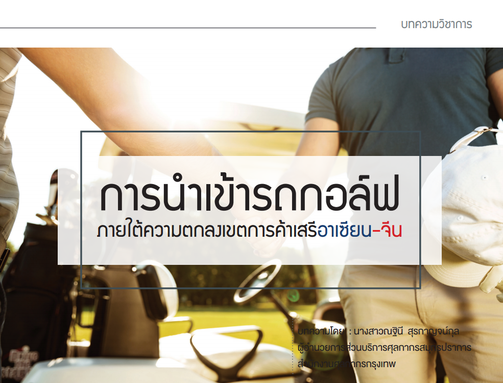

รถกอล์ฟเป็นยานพาหนะสำหรับวิ่งในสนามกอล์ฟเพื่ออํานวยความสะดวกในการนําพาผู้เล่นไปยังจุดต่าง ๆ ในสนาม เนื่องจากสนามมีขนาดใหญ่และยังใช้เพื่อขนของหรือสัมภาระต่างๆ ที่มีน้ำหนักมากเพื่อให้ผู้เล่นสนุกสนานกับการเล่นกอล์ฟได้อย่างเต็มที่ รถกอล์ฟมีทั้งแบบเป็นรถกอล์ฟไฟฟ้าและแบบใช้น้ำมัน แต่ด้วยเหตุผลของมาตรการประหยัดพลังงาน และต้องการลดมลพิษในอากาศผู้ประกอบการรถกอล์ฟจึงหันมาสนใจพัฒนารถกอล์ฟไฟฟ้าอย่างจริงจัง เป็นที่ทราบกันดีว่ารถพลังงานไฟฟ้าไม่ใช้เครื่องยนต์ เพราะสามารถขับเคลื่อนด้วยพลังงานไฟฟ้าในแบตเตอรี่ มันเป็นเหตุผลที่ทำให้รถมอเตอร์ไฟฟ้าไร้เสียงรบกวน และการสั่นสะเทือนของเครื่องยนต์และอัตราเร่งก็เป็นไปอย่างที่ต้องการ นอกจากนี้ยังปรับใช้ได้ในหลายโอกาส เช่น ตามโครงการหมู่บ้านหรือในโรงงานอุตสาหกรรมขนาดใหญ่

## การนําเข้ารถกอล์ฟมีข้อที่ต้องพิจารณา ดังนี้
1.	**พิกัดอัตราศุลกากรที่เกี่ยวข้อง** การพิจารณาพิกัดสินค้าว่าจะเข้าหมวดใดต้องพิจารณาหมายเหตุของหมวดของตอนเป็นสำคัญ ซึ่งรถกอล์ฟถือเป็น ยานพาหนะทางบกจึงจัดเข้าพิกัดในหมวด 17 ว่าด้วยยานอากาศ ยานบก ยานน้ำ และอุปกรณ์การขนส่งที่เกี่ยวข้อง และอยู่ในตอนที่ 87 ยานบกนอกจากรถที่เดินบนรางรถไฟหรือรางรถราง ส่วนประกอบและอุปกรณ์ประกอบ ทั้งนี้จะจัดเข้าพิกัดย่อยใดก็ขึ้นกับลักษณะเฉพาะ และประโยชน์การใช้งานซึ่งจะต้องพิจารณาข้อเท็จจริงต่อไป
2.	**การขอรับสิทธิประโยชน์ทางการค้า** ในการนําเข้าผู้ประกอบการควรพิจารณาเรื่องสิทธิประโยชน์ทางการค้า เป็นสำคัญเพราะเป็นเครื่องมือลดต้นทุนทางการค้า ช่วยเพิ่มความสามารถในการแข่งขัน สำหรับการเลือกใช้สิทธิประโยชน์ขึ้นอยู่กับประเทศที่ผู้ประกอบการต้องการนําเข้า
3.	**การดำเนินการใช้สิทธิประโยชน์** ผู้ประกอบการไทยจะต้องดำเนินการขอหนังสือรับรองถิ่นกำเนิด อาทิ ต้องการนําเข้ารถกอล์ฟจากจีน จะต้องศึกษาเงื่อนไขหลักเกณฑ์ภายใต้ความตกลงเขตการค้าเสรีอาเซียน-จีน (ACFTA) ซึ่งกำหนดให้ใช้ Form E ประกอบการนําเข้า

## ข้อควรระวังในการระบุถิ่นกำเนิดใน Form E มีประเด็นหลัก ดังนี้ 
1.	สินค้าที่ได้มาทั้งหมดหรือมีการผลิตขึ้นโดยใช้วัตถุดิบในประเทศภาคีผู้ส่งออกทั้งหมด (Wholly Obtained Producted) ถ้าสินค้าที่นําเข้าใช้วัตถุดิบในประเทศทั้งหมดก็ให้ระบุในช่อง origin of goods ใน Form E ว่า *“WO”*
2.	สินค้าที่ผลิตขึ้นหรือได้จากในประเทศภาคีผู้ส่งออกโดยมิได้ใช้วัตถุดิบของประเทศนั้นทั้งหมด ก็ให้ระบุในช่อง origin of goods ใน Form E ว่า *“.......%”*
3.	ของนั้นเป็นไปตามกฏเฉพาะรายสินค้าก็ให้ระบุในช่อง origin of goods ใน Form E ว่า *“PSR”*

นอกจากนี้ยังมีรายละเอียดอื่นที่ผู้ประกอบการจึงต้องศึกษาให้เข้าใจเพื่อการปฏิบัติพิธีการที่ถูกต้องก่อนการนําเข้าสินค้า เนื่องจากประเด็นถิ่นกำเนิดสินค้าเป็นประเด็นที่เจ้าหน้าที่ศุลกากรมักตรวจพบความผิดอยู่เสมอ จึงขอยกตัวอย่างกรณีการนําเข้ารถกอล์ฟที่ไม่ได้สิทธิลดอัตราอากรภายใต้ความตกลงเนื่องจากความเข้าใจคลาดเคลื่อนในประเด็นการระบุถิ่นกำเนิด ได้แก่ การนําเข้ารถกอล์ฟที่มีรายละเอียด ดังนี้

สินค้าเป็นรถที่ใช้ในสนามกอล์ฟชนิด 4 ที่นั่ง มอเตอร์ 4 แรงม้า 48 โวลต์ คอนโทลเลอร์ยี่ห้อเคอร์ติส ระบบดรัมเบรก แบตเตอรี่แบบเติมน้ำกลั่น (Deep Cycle Battery) ลูกละ 8 โวลต์ ใช้ 6 ลูก รัศมีวงเลี้ยวแคบสุด 4.5 เมตร การรองรับน้ำหนัก 480 กิโลกรัม ขนาดของตัวรถ กว้าง 1.18 เมตร ยาว 3.11 เมตร สูง 1.89 เมตร นําเข้าโดยสำแดงพิกัด 8703.90.13 อัตรายกเว้นอากร โดยขอใช้สิทธิลดอัตราอากรสำหรับของที่มีถิ่นกำเนิดสินค้าจากประเทศสาธารณรัฐประชาชนจีน (ACFTA) โดยแนบหนังสือรับรองถิ่นกำเนิด (Form E) ระบุถิ่นกำเนิด “WO” แต่เจ้าหน้าที่ตรวจสอบเอกสาร Form E ระบุในช่อง 8 ซึ่งเป็นช่องรับรองถิ่นกำเนิด พบว่าไม่สอดคล้องกับสินค้าที่นําเข้าจริงเนื่องจากพบว่าแบตเตอรี่ระบุถิ่นกำเนิด Made in USA จึงไม่ตรงตามเงื่อนไขที่ว่าสินค้าที่ได้มาทั้งหมดหรือมีการผลิตขึ้นโดยใช้วัตถุดิบในประเทศภาคีผู้ส่งออกทั้งหมด (Wholly Obtained Producted: WO) จึงต้องจัดเข้าพิกัด 8703.10.10 อัตรา 40% บริษัทได้อุทธรณ์การประเมิน ทั้งนี้ ในระหว่างขั้นตอนการพิจารณาเจ้าหน้าที่ได้สอบถามไปยังหน่วยงานที่มีอำนาจออกหนังสือรับรองถิ่นกำเนิดสินค้าของประเทศจีนถึง 3 ครั้ง จนกระทั่งครบกำหนดระยะเวลาตามเงื่อนไขความตกลงที่ว่าหากไม่ได้รับคําตอบภายใน 3 เดือนให้มีหนังสือเตือน และหลังจากมีหนังสือเตือนครบ 2 เดือนยังไม่ได้รับคําตอบให้ถือว่าสินค้านั้นไม่ได้รับสิทธิ ในการนี้คณะกรรมการได้พิจารณา เอกสารหลักฐานประกอบกับข้อเท็จจริงที่วัตถุดิบไม่ได้มีถิ่นกำเนิดในประเทศภาคีผู้ส่งออกทั้งหมด (WO) จึงมติให้รถกอล์ฟ รุ่นที่นําเข้าจัดเข้าพิกัด 8703.10.10 อัตรา 40%

กรณีดังกล่าวเป็นเพียงประเด็นตัวอย่างในเรื่องการระบุถิ่นกำเนิดที่ความคลาดเคลื่อนจนเป็นเหตุให้เสียสิทธิการลดอัตราอากร ทั้งนี้ ภายใต้ความตกลงเขตการค้าเสรีอาเซียน-จีน ยังคงมีประเด็นปลีกย่อยอื่นที่ควรระมัดระวังก่อนการนําเข้าสินค้า ผู้ประกอบการจึงจึงต้องศึกษารายละเอียดความตกลงทางการค้าของประเทศที่สนใจจะนําเข้าสินค้าจากประกาศต่างๆ ทางหน้าเว็บไซต์หรือการเข้าหารือ ณ หน่วยงานที่เกี่ยวข้อง




 

 

<a class="badge badge-danger" href="./docs.pdf" target="_blank" id="download_files_new">Download</a>

 



> **บทความโดย** **:** : นางสาวณฐินี สุรกาญจน์กุล ผู้อํานวยการส่วนบริการศุลกากรสมุทรปราการ สำนักงานศุลกากรกรุงเทพ    
> **ที่มาบทความ** **:** [กรมศุลกากร](https://www.customs.go.th/cont_strc_simple_with_date.php?current_id=142329324149505f4b464b46464b4b)  