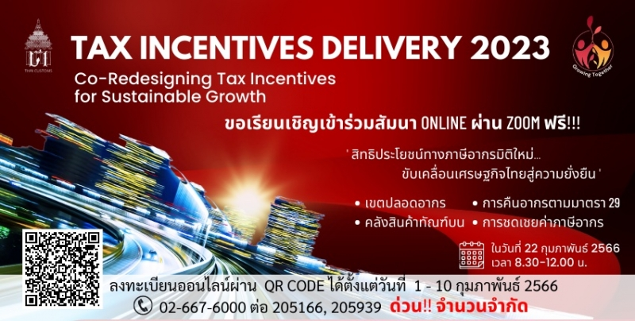

ตามที่กองสิทธิประโยชน์ทางภาษีอากร (กสอ.) กรมศุลกากร ได้จัดงานสัมมนา โครงการสิทธิประโยชน์ Delivery 2023 เมื่อวันพุธที่ 22 กุมภาพันธ์ 2566 เวลา 08:30 – 12:00 น. ผ่านช่องทาง Online โดยโครงการดังกล่าวจัดขึ้นเพื่อสร้างความเข้าใจเกี่ยวกับการใช้สิทธิประโยชน์ทางภาษีอากรมิติใหม่เพื่อขับเคลื่อนเศรษฐกิจไทยสู่ความยั่งยืน ทั้งในมิติเกี่ยวกับเขตปลอดอากร, การคืนอากรตามมาตรา 29, คลังสินค้าทัณฑ์บน, การชดเชยค่าภาษีอากร ฯลฯ ขณะนี้ได้มีการเผยแพร่เอกสารในการสัมมนาดังกล่าวซึ่งมีรายละเอียดตามเอกสารแนบ




 

 

<a class="badge badge-danger" href="./docs.pdf" target="_blank" id="download_files_new">Download</a>

 


> ที่มา : กรมศุลกากร
