กรมศุลกากรได้เผยแพร่เอกสาร  รหัสสิทธิพิเศษการลดอัตราอากรและยกเว้นอากรศุลกากร ตามมาตรา 12 แห่งพระราชกำหนดพิกัดอัตราศุลกากร พ.ศ. 2530  มีรายละเอียดดังนี้

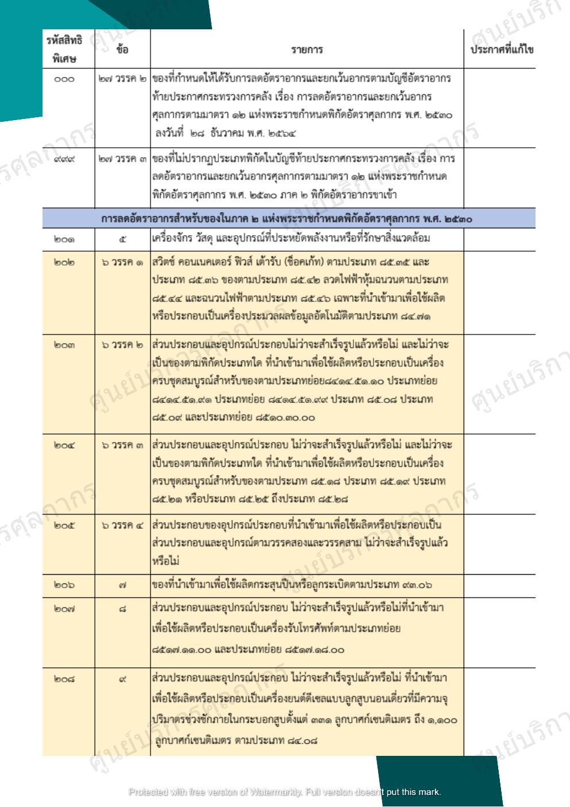

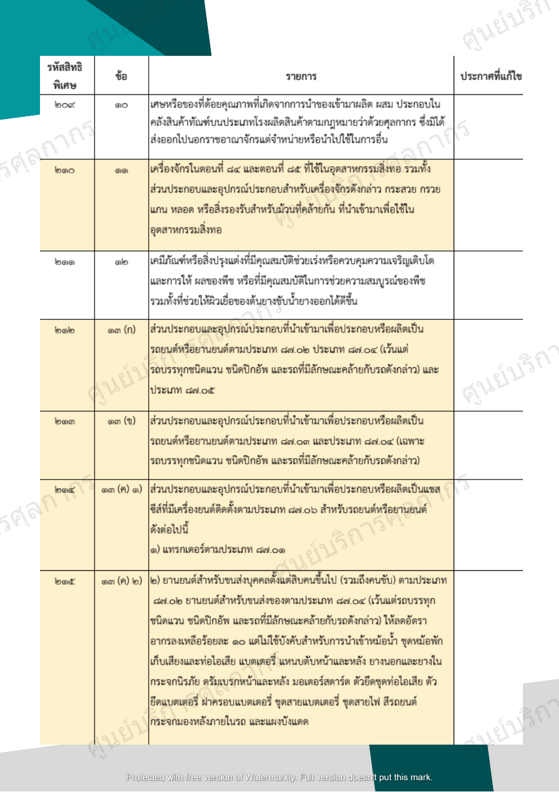

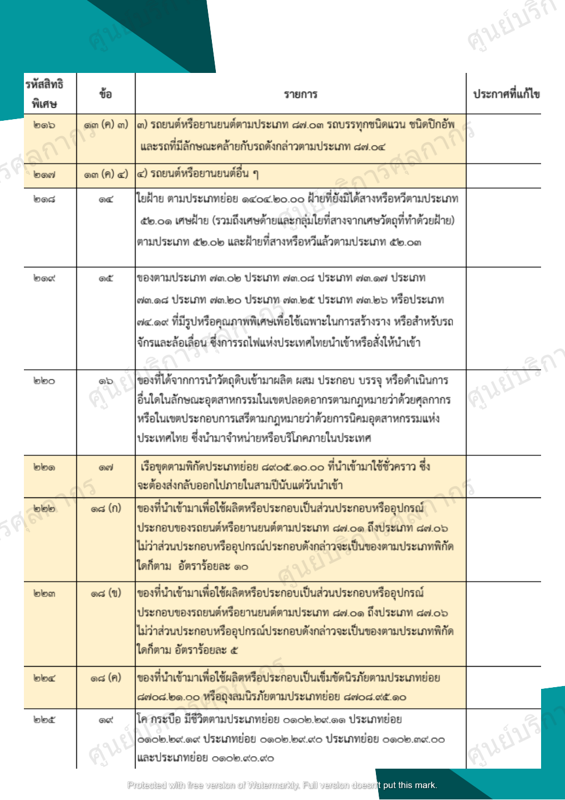

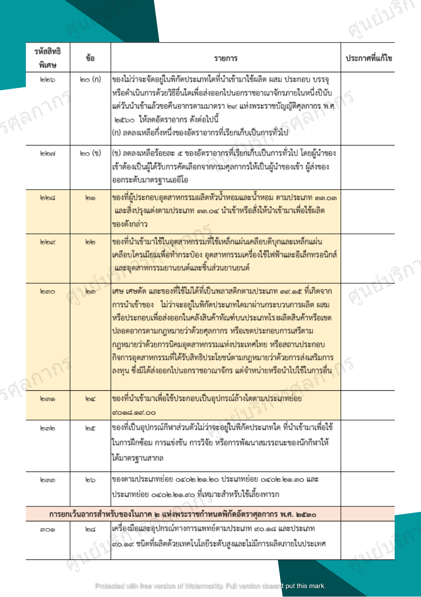

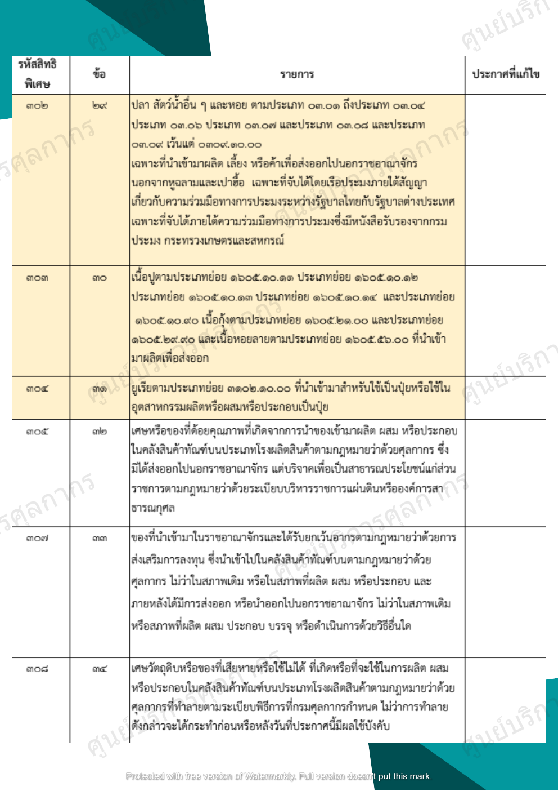

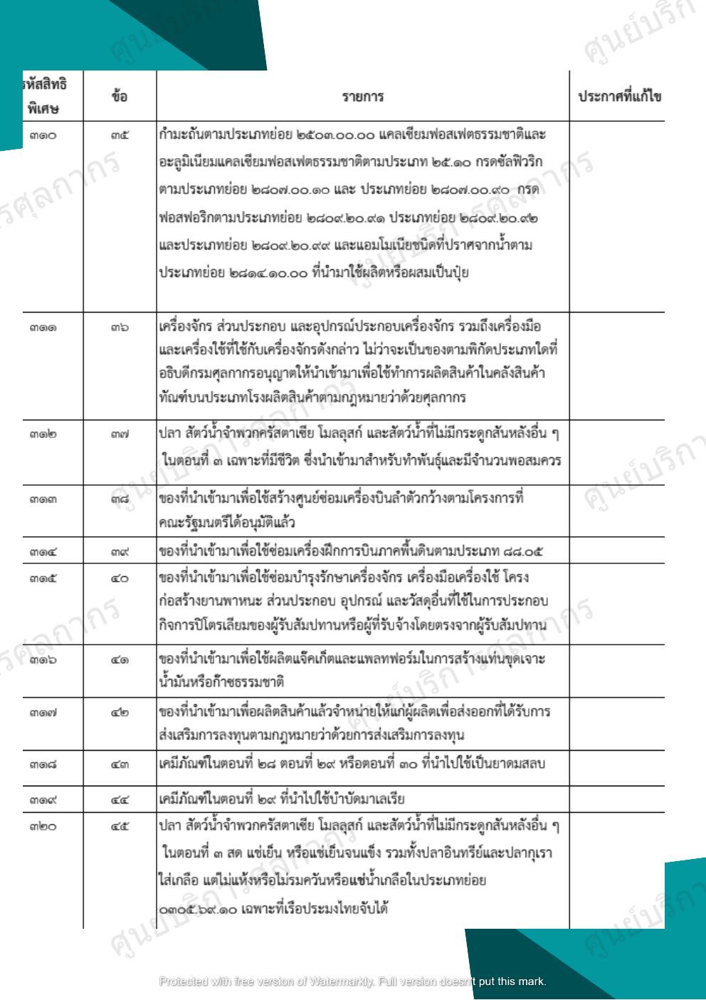

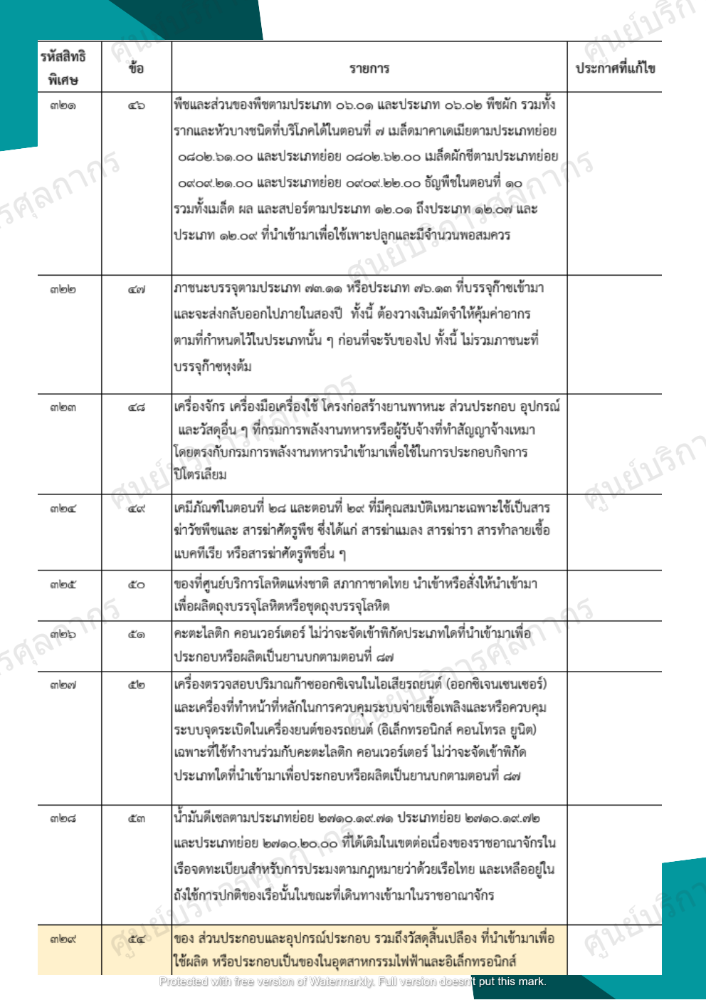

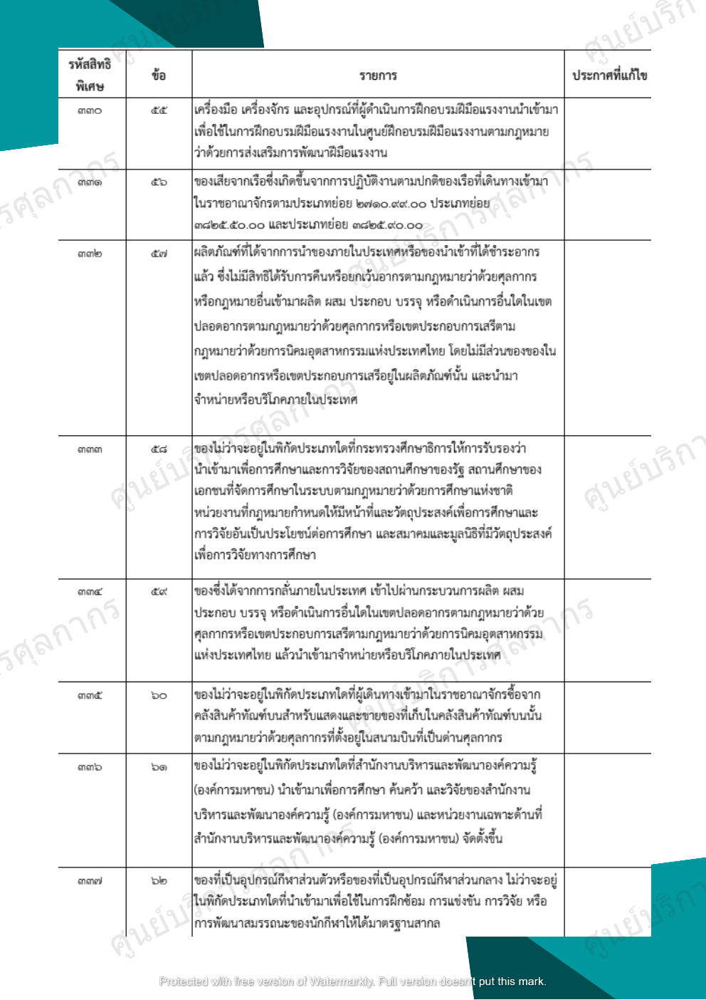

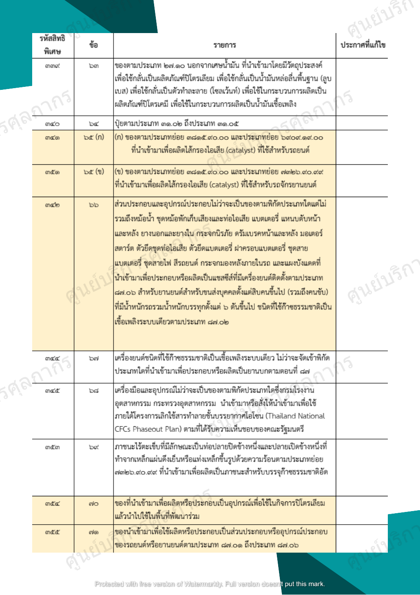

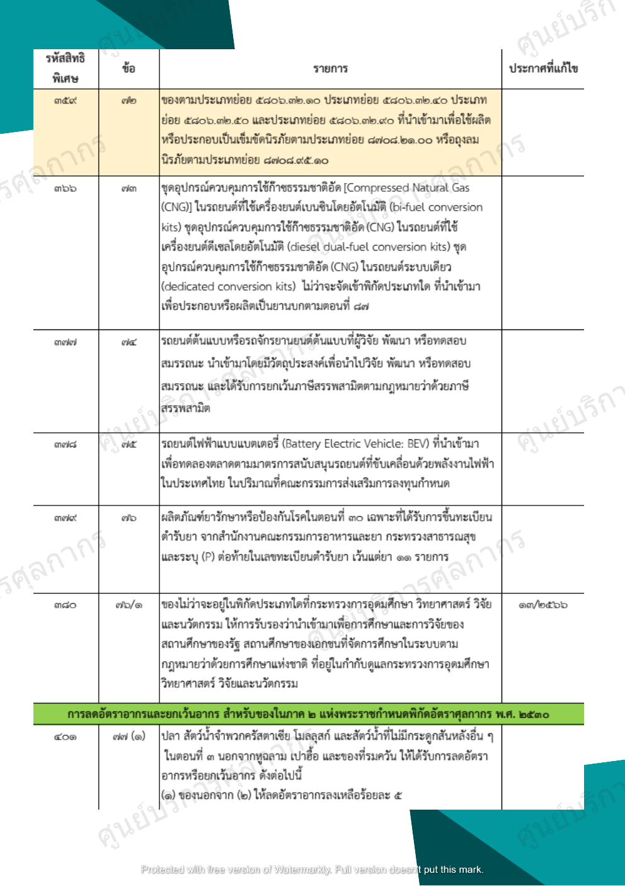

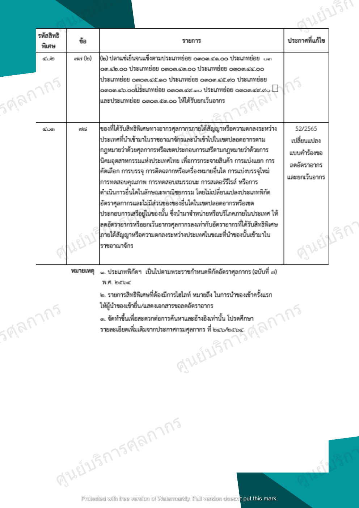

## หมายเหตุ
1.	ประเภทพิกัดฯ เป็นไปตามพระราชกําหนดพิกัดอัตราศุลกากร (ฉบับที่ 2) พ.ศ. 2564
2.	*รายการสิทธิพิเศษที่ต้องมีการไฮไลท์* หมายถึง *ในการนําของเข้าครั้งแรก ให้ผู้นําของเข้ายื่นแสดงเอกสารขอลดอัตราอากร*
3.	จัดทําขึ้นเพื่อสะดวกต่อการค้นหาและอ้างอิงเท่านั้น *โปรดศึกษารายละเอียดเพิ่มเติมจากประกาศกรมศุลกากร ที่ 246/2564*

- ประกาศกรมศุลกากร ที่ 246/2564 เรื่อง หลักเกณฑ์และพิธีการสำหรับการลดอัตราอากรและยกเว้นอากรศุลกากร ตามมาตรา 12 แห่งพระราชกำหนดพิกัดอัตราศุลกากร พ.ศ. 2530 [(ดาวน์โหลดประกาศ)](../../../law/customs/2564/246/)

Download

> ที่มา : [กรมศุลกากร](http://ccc.customs.go.th/data_files/e798ead19581dc065f35a1a61e935358.pdf)
