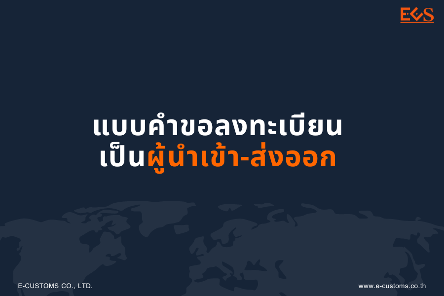
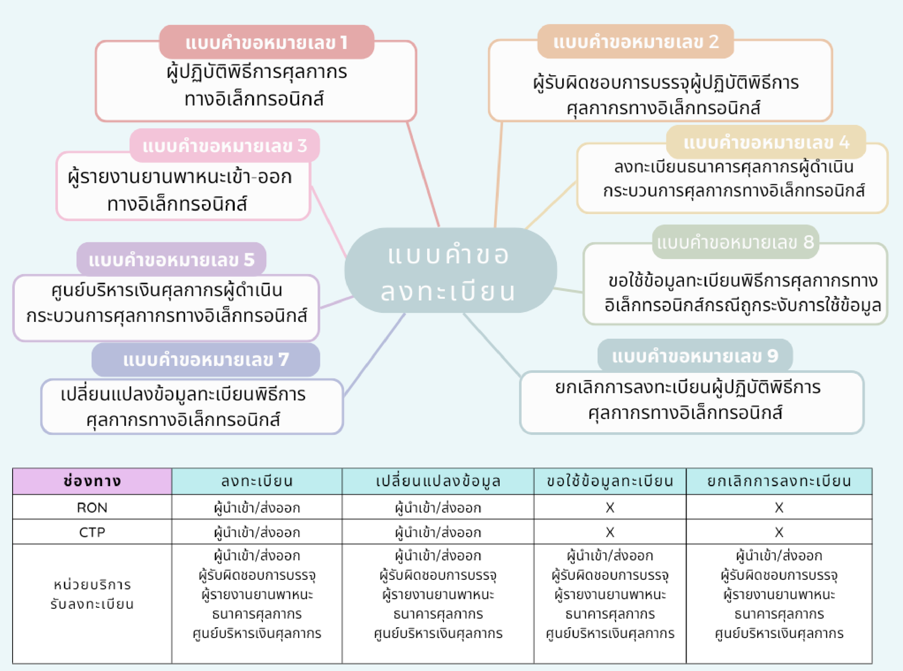
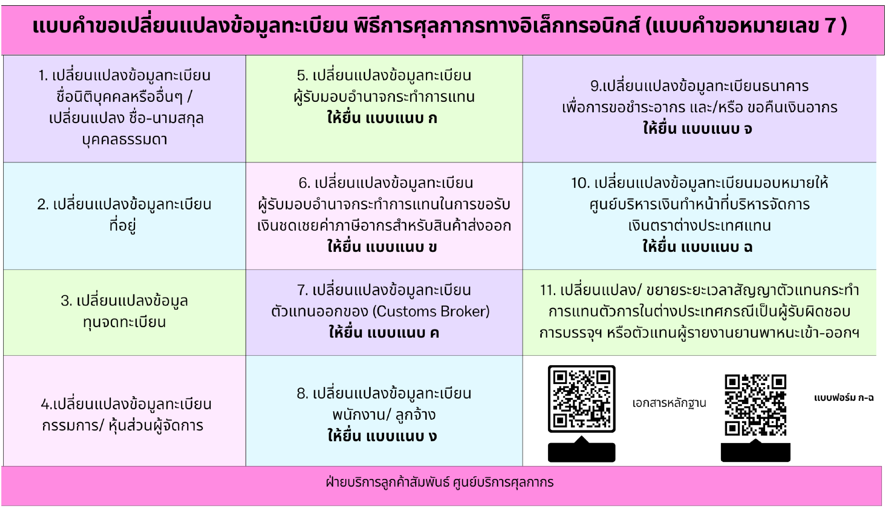

 ## การลงทะเบียนเป็นผู้นำเข้า-ส่งออกกับกรมศุลกากร

ผู้ประกอบการที่ประสงค์จะปฏิบัติพิธีการศุลกากรหรือดำเนินการในกระบวนการทางศุลกากรทางอิเล็กทรอนิกส์ จำเป็นต้องมาลงทะเบียนกับกรมศุลกากรโดยสามารถดำเนินการได้ 3 ช่องทาง ดังนี้

1. [ลงทะเบียนผ่านระบบลงทะเบียนผู้มาติดต่อออนไลน์ทางเว็บไซต์กรมศุลกากร (Online Customs Registration)](http://registeronline.customs.go.th/RON/)
2. [ลงทะเบียนผ่านระบบลงทะเบียนผู้มาติดต่อออนไลน์ทาง Customs Trader Portal](https://www.customstraderportal.com/auth/login) 
   - บุคคลธรรมดาสัญชาติไทยที่ยังไม่เคยลงทะเบียนกับกรมศุลกากร (**บุคคลธรรมดาสัญชาติไทยที่เคยลงทะเบียนกับกรมศุลกากรไว้แล้วจะสามารถใช้ระบบได้	ตั้งแต่วันที่ 19 เมษายน 2566 เป็นต้นไป**)
	- นิติบุคคลที่มีกรรมการทั้งหมดมีสัญชาติไทยที่ยังไม่เคยลงทะเบียนกับกรมศุลกากร

3. ลงทะเบียน ณ หน่วยบริการรับลงทะเบียนของกรมศุลกากร
	
ท่านสามารถตรวจสอบข้อมูลทะเบียน สถานะการลงทะเบียน และติดตามสถานการณ์ปฏิบัติพิธีการศุลกากรได้ โดยสมัครใช้งาน [ระบบติดตามสถานะการผ่านพิธีการศุลกากร (e-Tracking)](https://e-tracking.customs.go.th/ETS/index.jsp) ทั้งนี้ ให้เป็นไปตามหลักเกณฑ์ที่กำหนดไว้ ดังนี้

1. [ประกาศกรมศุลกากรที่ 94/2564 เรื่อง การลงทะเบียนผู้ปฏิบัติพิธีการศุลกากรหรือดำเนินการในกระบวนการทางศุลกากร](https://www.customs.go.th/data_files/9a851d18c9bfe32af7ee1f91a0eb71b3.pdf)
2. [ประกาศกรมศุลกากรที่ 94/2565 เรื่อง การลงทะเบียนผู้ปฏิบัติพิธีการศุลกากรหรือดำเนินการในกระบวนการทางศุลกากร (ฉบับที่ 2)](https://www.customs.go.th/data_files/920e48fff468c02803c6acee574cfc8b.pdf) 

## แบบคำขอลงทะเบียนเป็นผู้นำเข้า/ส่งออก

  

  

> **วันที่ปรับปรุงล่าสุด :** 4 เมษายน 2566   
> **สอบถามข้อมูลเพิ่มเติมได้ที่ :** ศูนย์บริการศุลกากร โทรศัพท์ : 1164  อีเมล์ : 1164@customs.go.th  

> ที่มา : [กรมศุลกากร](http://ccc.customs.go.th/cont_strc_faq.php?current_id=14232b324148505f49&left_menu=interesting_article)
