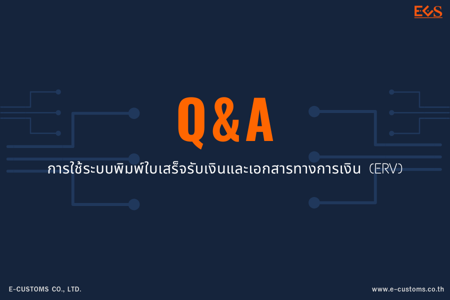
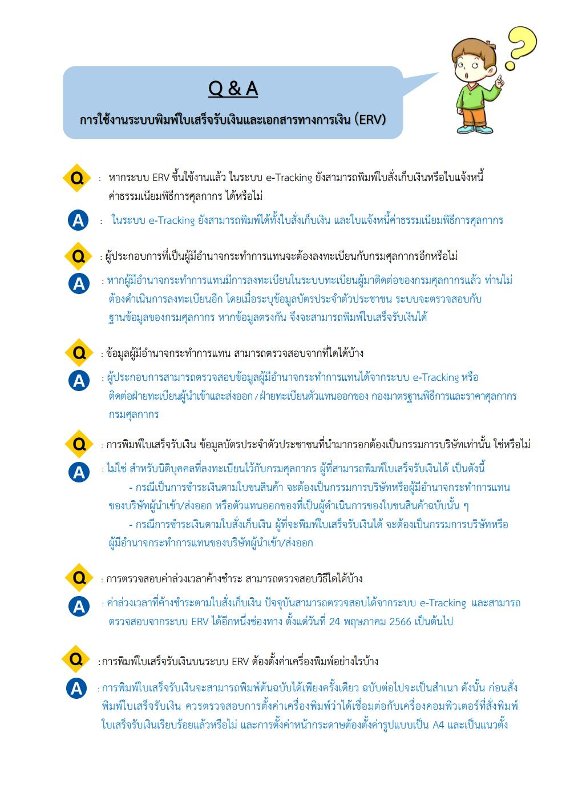
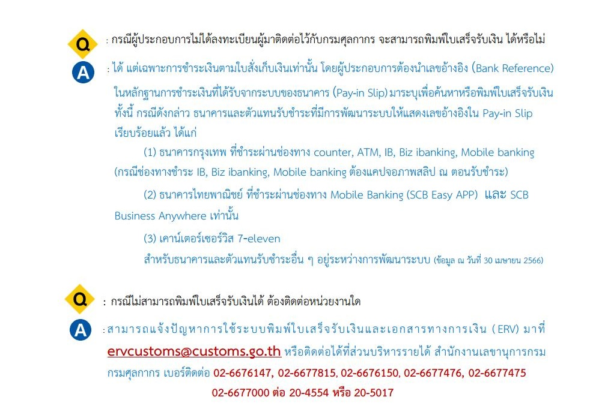

กรมศุลกากรเผยแพร่ เอกสาร Q & A ถามตอบในงานการบรรยายเพื่อซักซ้อมความเข้าใจการใช้งาน ระบบพิมพ์ใบเสร็จรับเงินและเอกสารทางการเงิน (ERV) เมื่อวันพุธที่ 10 พฤษภาคม 2566 ที่ผ่านมา มีรายละเอียดดังนี้


 

 

<a class="badge badge-danger" href="./docs.pdf" target="_blank" id="download_files_new">Download</a>

 


> **กรณีพบปัญหา** เกี่ยวกับการใช้ระบบพิมพ์ใบเสร็จรับเงินและเอกสารทางการเงิน โปรดแจ้งอีเมล์มาที่ ervsupport@customs.go.th หรือติดต่อส่วนบริหารรายได้ สำนักงานเลขานุการกรม 02-6676147, 02-6677815, 02-6676150, 02-6677476, 02-6677475
  02-6677000 ต่อ 20-4554 หรือ 20-5017

> ที่มา : [กรมศุลกากร](https://www.customs.go.th/data_files/fc89e96b224230834bcfd107576ffa6b.pdf)
