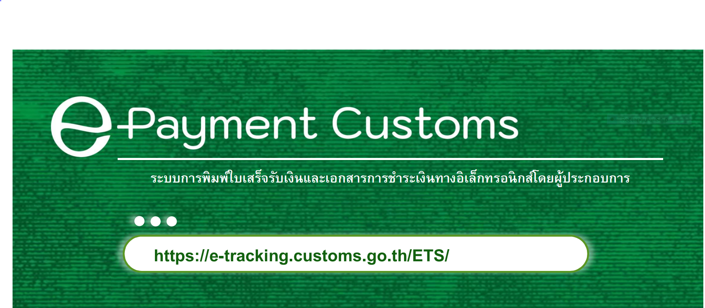

กรมศุลกากรเผยแพร่เอกสาร **คู่มือการใช้ระบบพิมพ์ใบเสร็จรับเงินและเอกสารทางการเงิน (ERV)** (รายละเอียดตามเอกสารแนบ)  เป็นไปตาม ประกาศกรมศุลกากรที่  69/2566 เรื่อง การชำระค่าภาษีอากร ค่าธรรมเนียมศุลกากร รายได้อื่น และเงินประกัน ผ่านช่องทางการให้บริการของธนาคารหรือตัวแทนรับชำระ (Bill Payment) และ การพิมพ์ใบเสร็จรับเงิน กศก. 123 ที่ชำระผ่านระบบอิเล็กทรอนิกส์ ลงวันที่  11 เมษายน  2566 *มีผลใช้บังคับตั้งแต่วันที่  24 พฤษภาคม  2566 เป็นต้นไป* ([ดาวน์โหลดประกาศ](https://ecs-support.github.io/KM/customs/post/law/customs/2566/69/))




 

 

<a class="badge badge-danger" href="./docs.pdf" target="_blank" id="download_files_new">Download</a>

 


> **กรณีพบปัญหา** เกี่ยวกับการใช้ระบบพิมพ์ใบเสร็จรับเงินและเอกสารทางการเงิน โปรดแจ้งอีเมล์มาที่ ervsupport@customs.go.th 
> หรือติดต่อส่วนบริหารรายได้ สำนักงานเลขานุการกรม 02-6677000 ต่อ 6147, 7815, 6150, 20-4554, 20-5017

> ที่มา : [กรมศุลกากร](https://www.customs.go.th/cont_strc_download.php?lang=th&top_menu=menu_homepage&current_id=14232932414b505e4f464b4b464b46)
