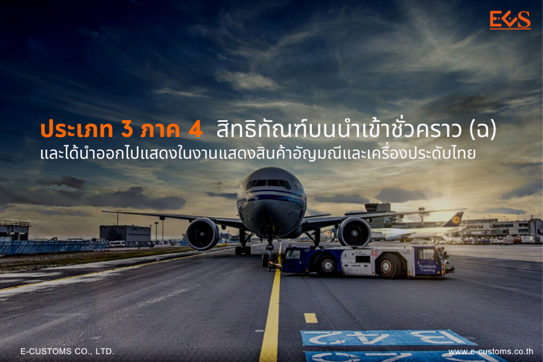
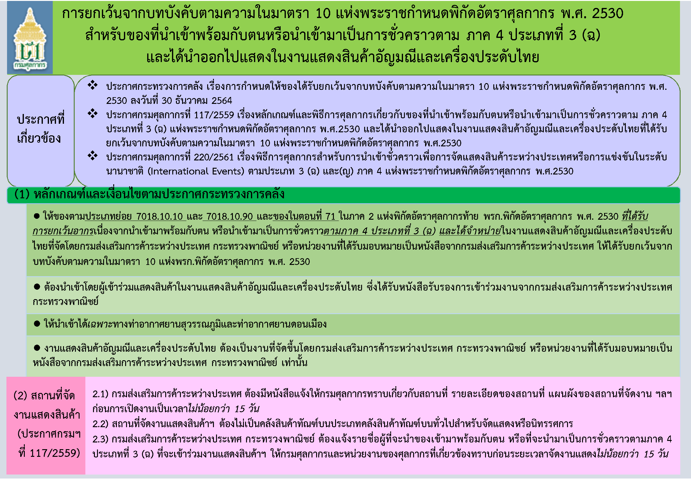
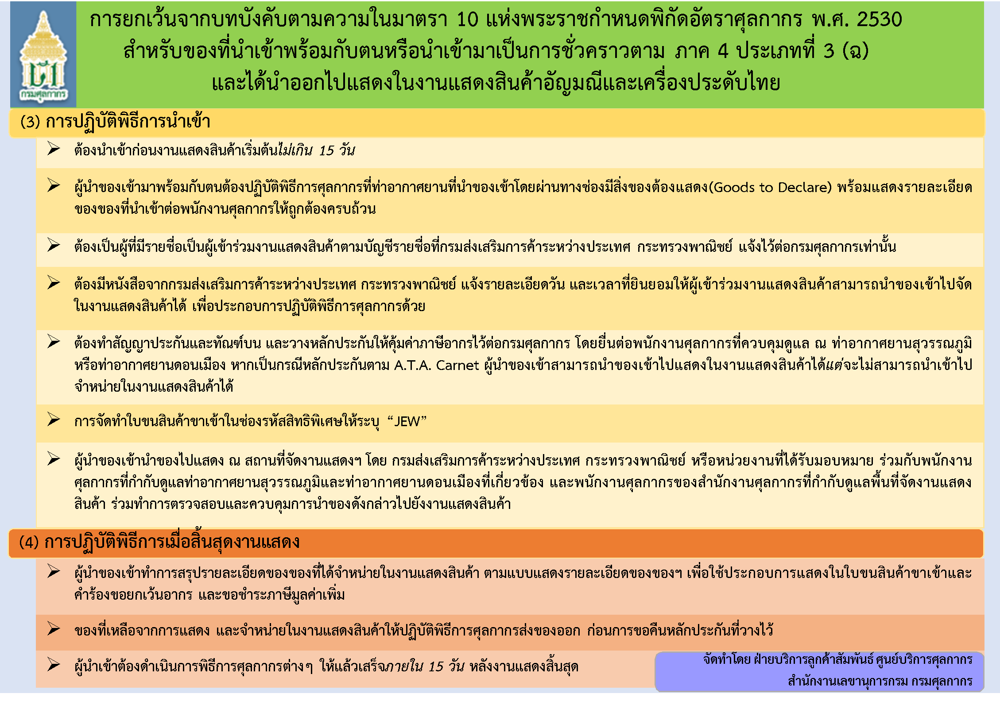



กรมศุลกากรเผยแพร่เอกสาร การยกเว้นจากบทบังคับตามความในมาตรา 10 แห่งพระราชกำหนดพิกัดอัตราศุลกากร พ.ศ. 2530 สำหรับของที่นำเข้ามาพร้อมกับตนหรือนำเข้ามาเป็นการชั่วคราวตาม *ภาค 4 ประเภทที่ 3 (ฉ) และได้นำออกไปแสดงในงานแสดงสินค้าอัญมณีและเครื่องประดับไทย*  มีรายละเอียดดังนี้





ดาวน์โหลดเอกสาร


**สอบถามข้อมูลเพิ่มเติมได้ที่ :** ศูนย์บริการศุลกากร อาคารเฉลิมพระเกียรติ 7 รอบพระชนมพรรษา ชั้น 1
**หมายเลขโทรศัพท์ :** 1164
**อีเมล์ :** 1164@customs.go.th



> ที่มา : [กรมศุลกากร](http://ccc.customs.go.th/cont_strc_faq.php?lang=th&top_menu=menu_homepage&left_menu=interesting_article&ini_menu=&current_id=14232b32414c505e4e)  
> วันที่ปรับปรุงล่าสุด : 29 มิถุนายน 2566
