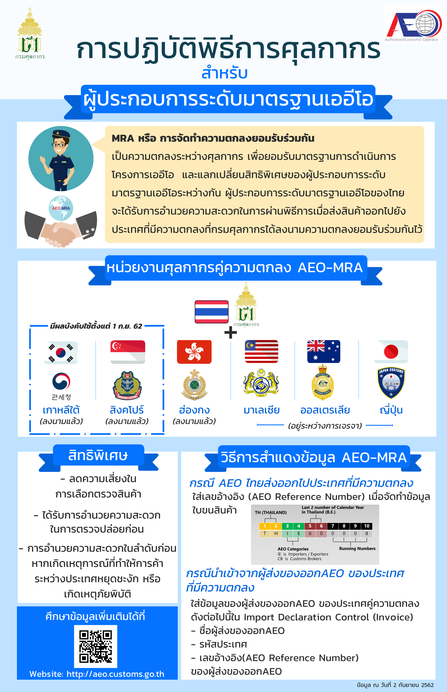






สอบถามข้อมูลเพิ่มเติมได้ที่ : ส่วนมาตรฐานเออีโอ กองมาตรฐานพิธีการและราคาศุลกากร   
หมายเลขโทรศัพท์ : 02-667-7168, 02-667-7902, 02-667-6520  
อีเมล์ : aeodiv2014@gmail.com, aeothai.customs@gmail.com


> ที่มา : [กรมศุลกากร](https://aeo.customs.go.th/cont_strc_simple_with_date.php?lang=th&top_menu=menu_homepage&ini_menu=&left_menu=&current_id=14232b324147505e4f)  
> วันที่ปรับปรุงล่าสุด : 2 ตุลาคม 2562
