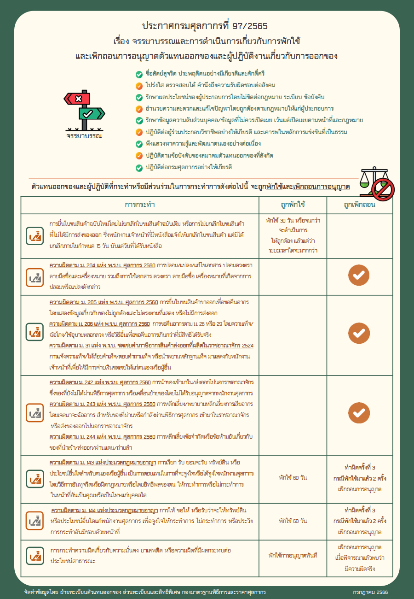
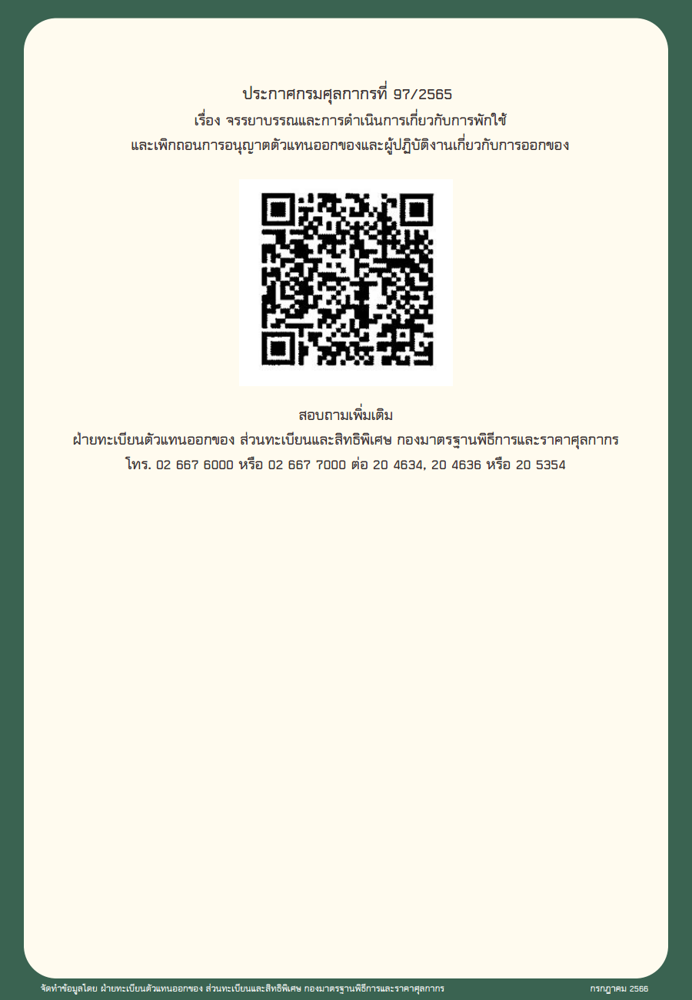

## จรรยาบรรณและการดำเนินการเกี่ยวกับการพักใช้ และเพิกถอนการอนุญาตตัวแทนออกของและผู้ปฏิบัติงานเกี่ยวกับการออกของ


ดาวน์โหลดเอกสาร



*เอกสารอ้างอิง* : ประกาศกรมศุลกากรที่ 97/2565 เรื่อง **จรรยาบรรณและการดำเนินการเกี่ยวกับการพักใช้ และเพิกถอนการอนุญาตตัวแทนออกของและผู้ปฏิบัติงานเกี่ยวกับการออกของ** [(ดาวน์โหลดประกาศ)](/../post/law/customs/2565/2565-97/)



> **ที่มา :** ฝ่ายทะเบียนตัวแทนออกของ ส่วนทะเบียนและสิทธิพิเศษ    
> **ปรับปรุงล่าสุด :** กรกฎาคม 2566
