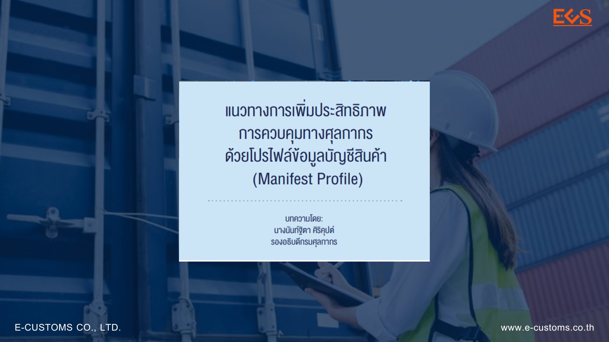



**บทความวิชาการ - แนวทางการเพิ่มประสิทธิภาพการควบคุมทางศุลกากรด้วยโปรไฟล์ข้อมูลบัญชีสินค้า (Manifest Profile)**







ดาวน์โหลดเอกสาร

> ที่มา : [กรมศุลกากร](https://www.customs.go.th/cont_strc_simple_with_date.php?current_id=14232932414c505e4e464b48464b47)  
> วันที่ปรับปรุงล่าสุด : 17 สิงหาคม 2566 
