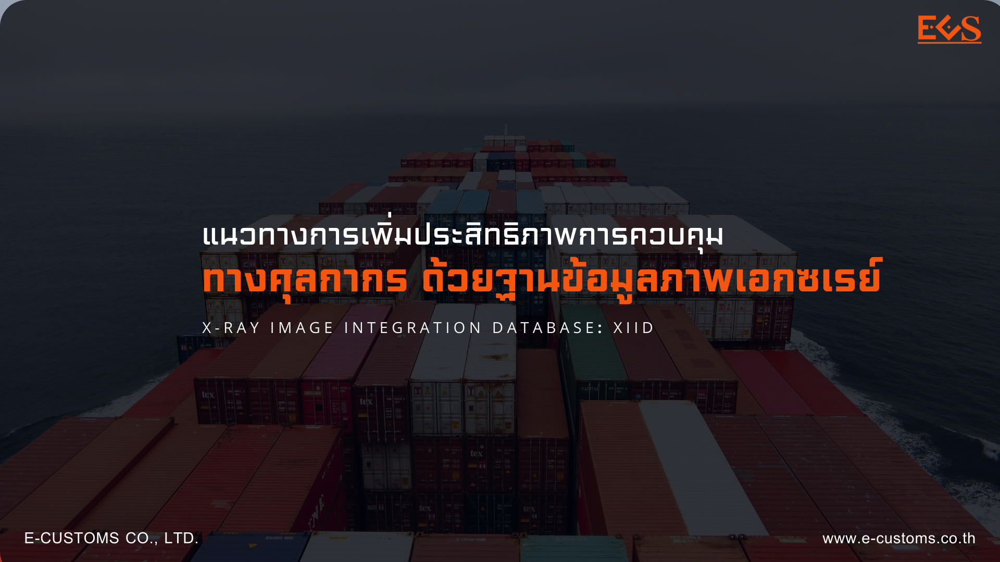



**บทความวิชาการ - แนวทางการเพิ่มประสิทธิภาพการควบคุมทางศุลกากรด้วยฐานข้อมูลภาพเอกซเรย์ (X-Ray Image Integration Database- XIID)**







ดาวน์โหลดเอกสาร

> ที่มา : [กรมศุลกากร](https://www.customs.go.th/cont_strc_simple_with_date.php?current_id=14232932414c505e4f464a4f464b4b)  
> วันที่ปรับปรุงล่าสุด : 24 สิงหาคม 2566 
