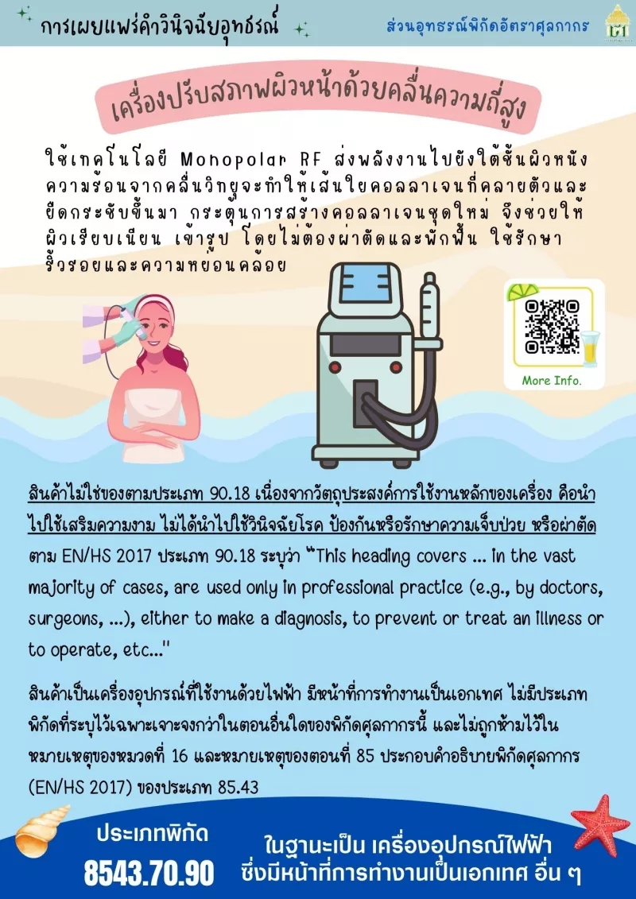

กรมศุลกากรเผยแพร่เอกสาร คำวินิจฉัยอุทธรณ์ - *เครื่องปรับสภาพผิวหน้าด้วยคลื่นความถี่สูง*  มีรายละเอียดดังนี้





ดาวน์โหลดเอกสาร


สอบถามข้อมูลเพิ่มเติมได้ที่ : ส่วนอุทธรณ์พิกัดอัตราศุลกากร (สอพ.) กองพิกัดอัตราศุลกากร (กพก.)  
หมายเลขโทรศัพท์ : 0-2667-7000 ต่อ 20-4628  
อีเมล์ : 80170000@customs.go.th



> ที่มา : [กรมศุลกากร](https://www.customs.go.th/cont_strc_simple_with_date.php?current_id=14232932414b505f47464b4d464b47)  
> วันที่ปรับปรุงล่าสุด : 8 กันยายน 2566
