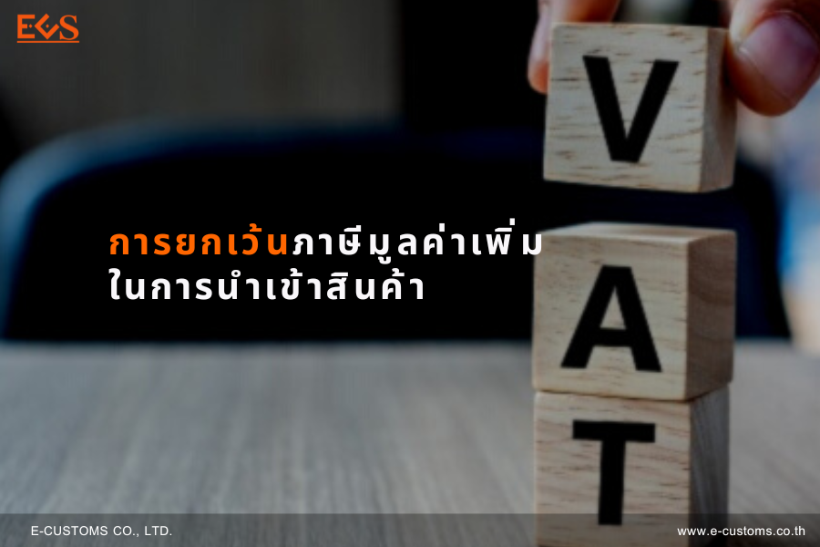

ปกติแล้วการนำเข้าสินค้าจากต่างประเทศ ผู้นำเข้ามีหน้าที่ต้องชำระภาษีอากรและภาษีมูลค่าเพิ่ม แต่จะมีสินค้าบางประเภทที่จะได้รับการยกเว้นภาษีมูลค่าเพิ่ม (VAT) การยกเว้นภาษีมูลค่าเพิ่มในการนำเข้ามีดังกรณีต่อไปนี้

1. **การนำเข้าสินค้าดังต่อไปนี้**
    1. พืชผลทางการเกษตร ไม่ว่าจะเป็นลำต้น กิ่ง ใบ เปลือก หน่อ เหง้า ดอก หัว ผัก เมล็ด หรือส่วนอื่นๆ ของพืช และวัตถุพลอยได้จากพืช ทั้งนี้ที่อยู่ในสภาพสดหรือรักษาสภาพไว้เพื่อมิให้เสียเป็นการชั่วคราวในระหว่างขนส่งด้วยการแช่เย็น แช่เย็นจนแข็ง หรือด้วยการจัดทำหรือปรุงแต่งโดยวิธีการอื่น หรือรักษาสภาพไว้เพื่อมิให้เสียเพื่อการขายปลีกหรือขายส่งด้วยวิธีการแช่เย็น แช่เย็นจนแข็ง ทำให้แห้ง บด ทำให้เป็นชิ้นหรือด้วยวิธีอื่น ข้าวสาร หรือผลิตภัณฑ์ที่ได้จากการสีข้าวแต่ไม่รวมถึงไม้ซุง ฟืน หรือผลิตภัณฑ์ที่ได้จากการเลื่อยไม้ หรือผลิตภัณฑ์อาหารที่บรรจุกระป๋องภาชนะหรือหีบห่อที่ทำเป็นอุตสาหกรรม ตามลักษณะและเงื่อนไขที่อธิบดีกำหนด
    2. สัตว์ ไม่ว่าจะมีชีวิต หรือไม่มีชีวิต และในกรณีสัตว์ไม่มีชีวิตไม่ว่าจะเป็นเนื้อส่วนต่างๆ ของสัตว์ ไข่ น้ำนมและวัตถุพลอยได้จากสัตว์ ทั้งนี้ที่อยู่ในสภาพสดหรือรักษาสภาพไว้เพื่อมิให้เสียเป็นการชั่วคราวในระหว่างขนส่งด้วยการแช่เย็น แช่เย็นจนแข็ง หรือด้วยการจัดทำหรือปรุงแต่งโดยวิธีการอื่น หรือรักษาสภาพไว้เพื่อมิให้เสียเพื่อการขายปลีกหรือขายส่งด้วยวิธีการแช่เย็น แช่เย็นจนแข็ง ทำให้แห้ง บด ทำให้เป็นชิ้น หรือด้วยวิธีอื่น แต่ไม่รวมถึงผลิตภัณฑ์อาหารที่บรรจุกระป๋องภาชนะ หรือ หีบห่อที่ทำเป็นอุตสาหกรรม ตามลักษณะและเงื่อนไขที่อธิบดีกำหนด
    3. ปุ๋ย
    4. ปลาป่น อาหารสัตว์
    5. ยาหรือเคมีภัณฑ์ที่ใช้สำหรับพืชหรือสัตว์ เพื่อบำรุง รักษา ป้องกันทำลาย หรือกำจัดศัตรูหรือโรคของพืชและสัตว์
    6. หนังสือพิมพ์ นิตยสาร หรือตำราเรียน
2. **สินค้าจากต่างประเทศที่นำเข้าไปในเขตอุตสาหกรรมส่งออก** ทั้งนี้ เฉพาะสินค้าที่ได้รับยกเว้นอากรขาเข้าตามกฎหมายว่าด้วยการนิคมอุตสาหกรรมแห่งประเทศไทย
3. สินค้าที่จำแนกประเภทไว้ในภาคว่าด้วยของที่ได้รับยกเว้นอากรตามกฎหมายว่าด้วยพิกัดอัตราศุลกากร
4. **สินค้าซึ่งนำเข้าและอยู่ในอารักขาของศุลกากรแล้วได้ส่งกลับออกไปต่างประเทศ** โดยได้คืนอากรขาเข้าตามกฎหมายว่าด้วยศุลกากร

> **ที่มา :** [กรมศุลกากร](https://ccc.customs.go.th/cont_strc_simple_with_date.php?lang=th&top_menu=menu_homepage&ini_menu=import_procedure&left_menu=import_procedure_161208_07&current_id=14232932404f505f4a)  

