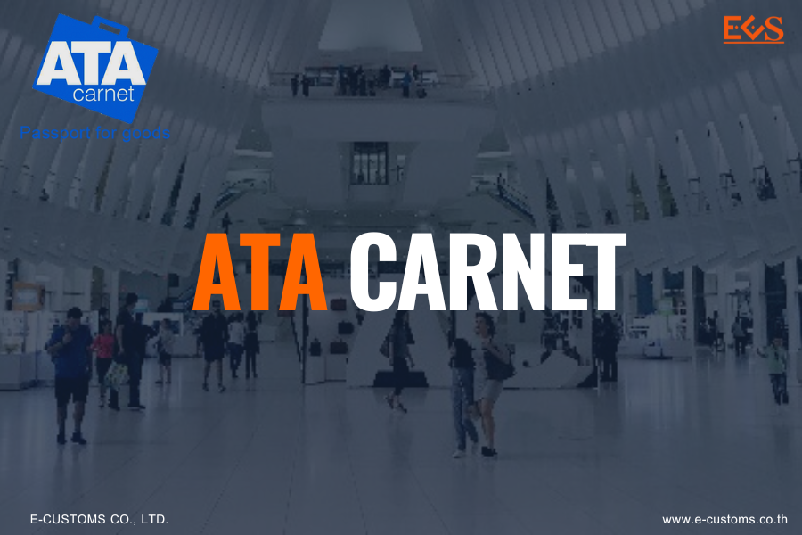
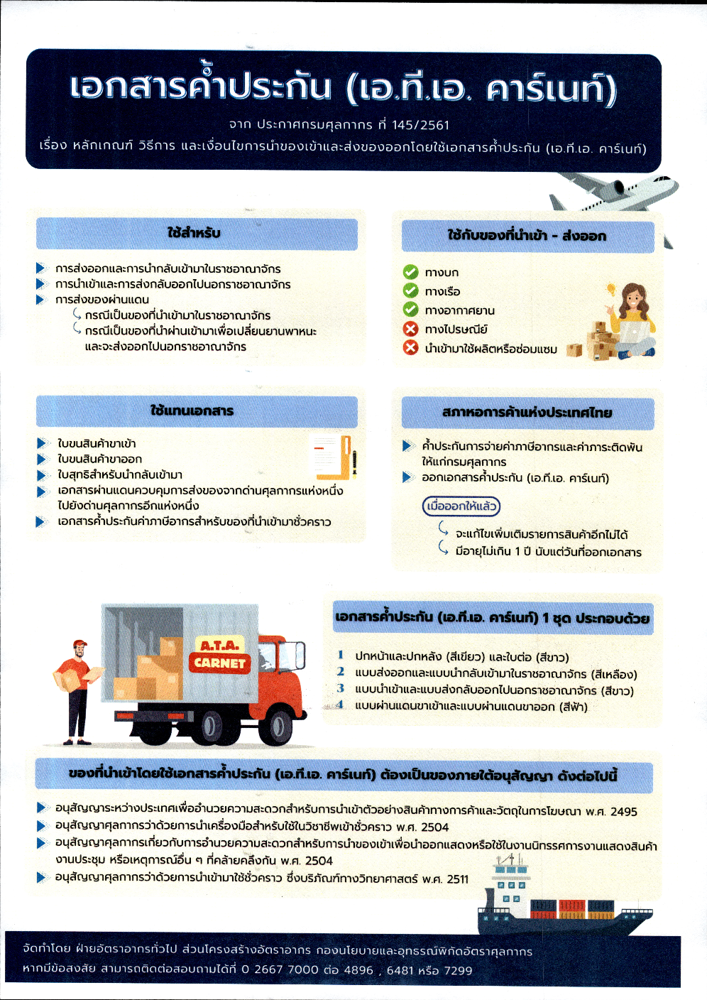
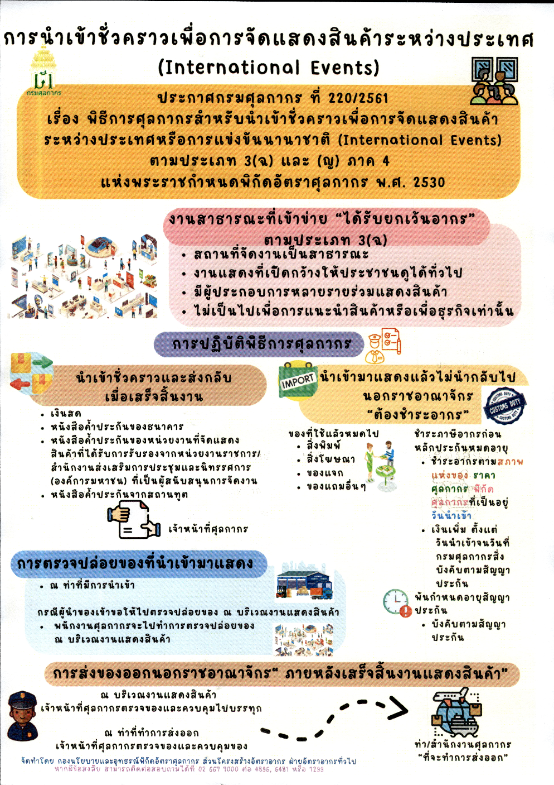



เอกสารค้ำประกันเอ.ที.เอ คาร์เนท์ (ATA CARNET) หมายถึงเอกสารศุลกากรระหว่างประเทศ ที่ใช้ใน การผ่านพิธีการศุลกากรแทนใบขนสินค้าขาเข้า ใบขนสินค้าขาออก ใบสุทธิสำหรับนำกลับเข้ามา เอกสารผ่านแดนควบคุมการส่งของจากด่านศุลกากรแห่งหนึ่งไปยังด่านศุลกากรอีกแห่งหนึ่งภายในประเทศ และเป็นเอกสารค้ำประกันค่าภาษีอากรสำหรับของที่นำเข้ามาชั่วคราวโดยได้รับการยกเว้นอากรภายใต้อนุสัญญาเอ.ที.เอ คาร์เนท์

## เอกสารค้ำประกัน (ATA CARNET) 
1 ชุด ประกอบด้วย 4 ส่วน คือ

- ปกหน้าและปกหลัง (สีเขียว) และใบต่อ (สีขาว)
- แบบส่งออกและแบบนำกลับเข้ามาในราชอาณาจักร (สีเหลือง)
- แบบนำเข้าและแบบส่งกลับออกไปนอกราชอาณาจักร (สีขาว) และ
- แบบผ่านแดนขาเข้าและแบบผ่านแดนขาออก (สีฟ้า)





ดาวน์โหลดเอกสาร

> **ที่มา :** [กรมศุลกากร](https://www.customs.go.th/cont_strc_simple_with_date.php?current_id=14232932414d505f46464a4f464a4f)  

