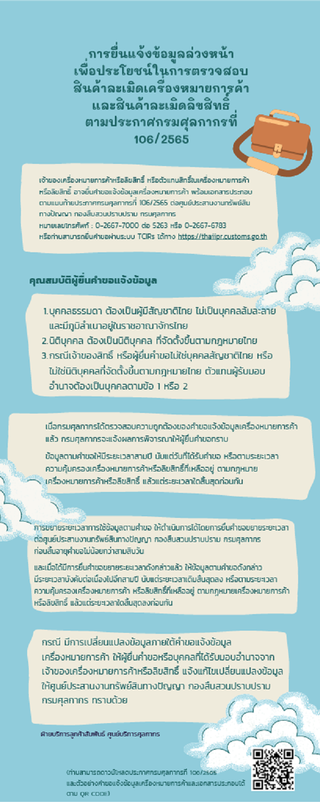



กรมศุลกากรเผยแพร่เอกสาร *การยื่นแจ้งข้อมูลล่วงหน้า เพื่อประโยชน์ในการตรวจสอบสินค้าละเมิดเครื่องหมายการค้าและสินค้าละเมิดลิขสิทธิ์* ตาม ประกาศกรมศุลกากรที่ 106/2565 เรื่อง การควบคุมการส่งออก การนำเข้า และการนำผ่านซึ่งสินค้าละเมิดเครื่องหมายการค้าและสินค้าละเมิดลิขสิทธิ์ ([**ดาวน์โหลดประกาศ**](../../../../post/law/customs/2565/2565-106/)) มีรายละเอียดดังนี้

> **ที่มา :** [กรมศุลกากร](https://ccc.customs.go.th/cont_strc_faq.php?current_id=14232d324146505e4f&left_menu=interesting_article)

