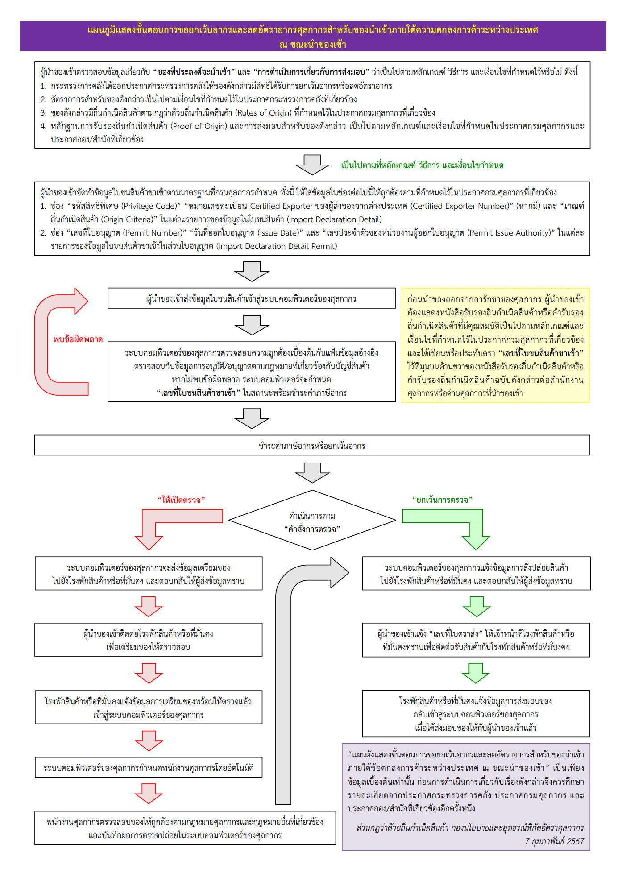
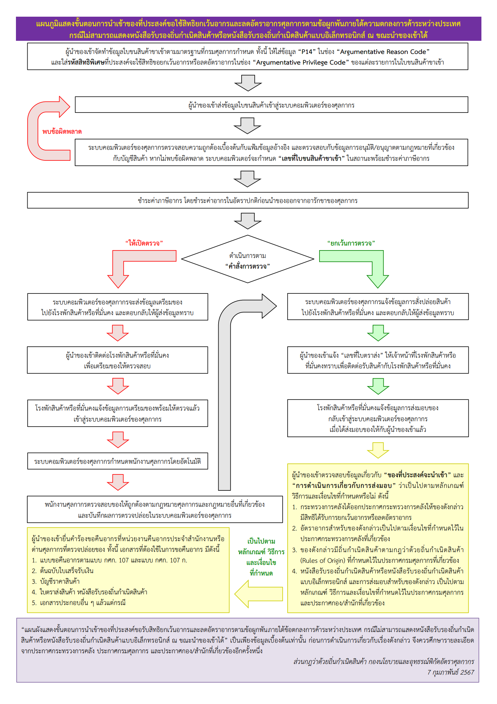
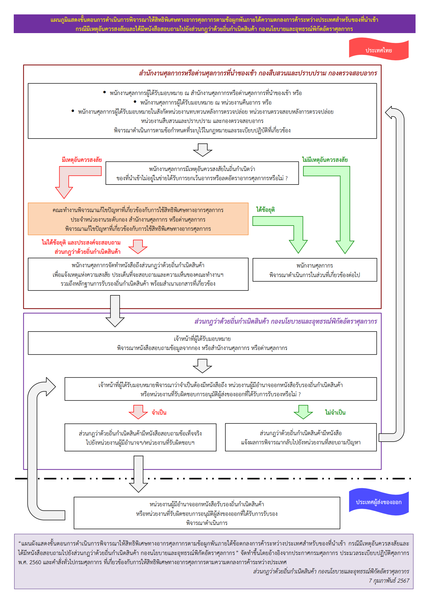



กรมศุลกากรเผยแพร่เอกสาร แผนภูมิแสดงขั้นตอนการดำเนินการเกี่ยวกับการให้สิทธิพิเศษทางอากรศุลกากร ภายใต้ความตกลงการค้าระหว่างประเทศ มีรายละเอียดดังนี้

1.	กรณีใช้สิทธิ ณ ขณะนำของเข้า
2.	กรณีไม่สามารถแสดงหนังสือรับรองถิ่นกำเนิดสินค้าหรือหนังสือรับรองถิ่นกำเนิดสินค้าแบบอิเล็กทรอนิกส์ ณ ขณะนำของเข้าได้
3.	กรณีมีเหตุอันควรสงสัยและได้มีหนังสือสอบถามไปยังส่วนกฎว่าด้วยถิ่นกำเนิดสินค้า กองนโยบายและอุทรณ์พิกัดอัตราศุลกากร


## กรณีใช้สิทธิ ณ ขณะนำของเข้า

--------


## กรณีไม่สามารถแสดงหนังสือรับรองถิ่นกำเนิดสินค้าหรือหนังสือรับรองถิ่นกำเนิดสินค้าแบบอิเล็กทรอนิกส์ ณ ขณะนำของเข้าได้

--------


## กรณีมีเหตุอันควรสงสัยและได้มีหนังสือสอบถามไปยังส่วนกฎว่าด้วยถิ่นกำเนิดสินค้า กองนโยบายและอุทรณ์พิกัดอัตราศุลกากร

ดาวน์โหลดเอกสาร


**สอบถามข้อมูลเพิ่มเติมได้ที่** : กองนโยบายและอุทธรณ์พิกัดอัตราศุลกากร (กนอ.)  
**หมายเลขโทรศัพท์** : 0-2667-5453  
**วันที่ปรับปรุงล่าสุด** : 21 กุมภาพันธ์ 2567  


> **ที่มา :** [กรมศุลกากร](https://www.customs.go.th/cont_strc_simple_with_date.php?current_id=14232a32404e505f4d464b48464b49)

