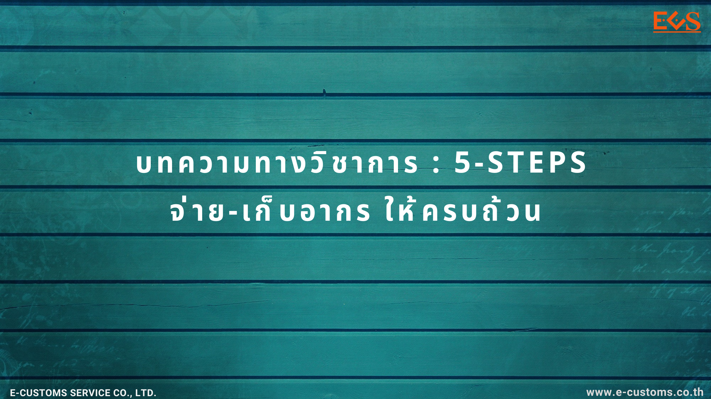

กรมศุลกากรเผยแพร่เอกสาร บทความวิชาการ - *สิทธิประโยชน์และสิทธิพิเศษทางศุลกากร ภายใต้ความตกลงยอมรับร่วมกัน สำหรับผู้ประกอบการระดับมาตรฐานเออีโอ (AEO-MRA)*  มีรายละเอียดดังนี้

กรมศุลกากรเผยแพร่ บทความวิชาการ เรื่อง  5-STEPS จ่าย-เก็บอากรให้ครบถ้วน มีรายละเอึียดเบื้องต้นดังนี้ การชำระหรือจัดเก็บอากรขาเข้าให้ถูกต้องครบถ้วนนั้น ขึ้นอยู่กับปัจจัยและเงื่อนไขหลายประการ นอกจากจะต้องสำแดงพิกัดอัตราศุลกากรให้ถูกต้องแล้ว หากมีการใช้สิทธิลดอัตราอากรหรือยกเว้นอากรศุลกากร ตามมาตรา  12 และมาตรา  14 แห่งพระราชกำหนดพิกัดศุลกากร พ.ศ. 2530 ผู้นำของเข้ายังต้องทราบรหัสสิทธิพิเศษ พร้อมเงื่อนไขในการได้รับสิทธิ และในบางประเภทพิกัดยังมีการกำหนดรหัสย่อย เพื่อกำหนดอัตราอากรที่แตกต่างกันในประเภทย่อยระดับ  8 หลักเดียวกัน ตามเงื่อนไขของโครงสร้างอัตราอากรอีกด้วย ดังนั้นจึงขอสรุปขั้นตอนการสำแดงหรือตรวจสอบ    การสำแดงข้อมูลในใบขนสินค้าขาเข้าเพื่อชำระหรือจัดเก็บอากรให้ถูกต้องครบถ้วน 







ดาวน์โหลดเอกสาร


**บทความโดย :** นางนริศรา ชาติวาณิช นักวิชาการศุลกากรชำนาญการพิเศษ ส่วนอุทธรณ์พิกัดอัตราศุลกากร กองนโยบายและอุทธรณ์พิกัดอัตราศุลกากร



> ที่มา : [กรมศุลกากร](https://www.customs.go.th/cont_strc_simple_with_date.php?current_id=14232a32404f505f4a464b4c464b4a)  
> วันที่ปรับปรุงล่าสุด : 19 เมษายน 2567
