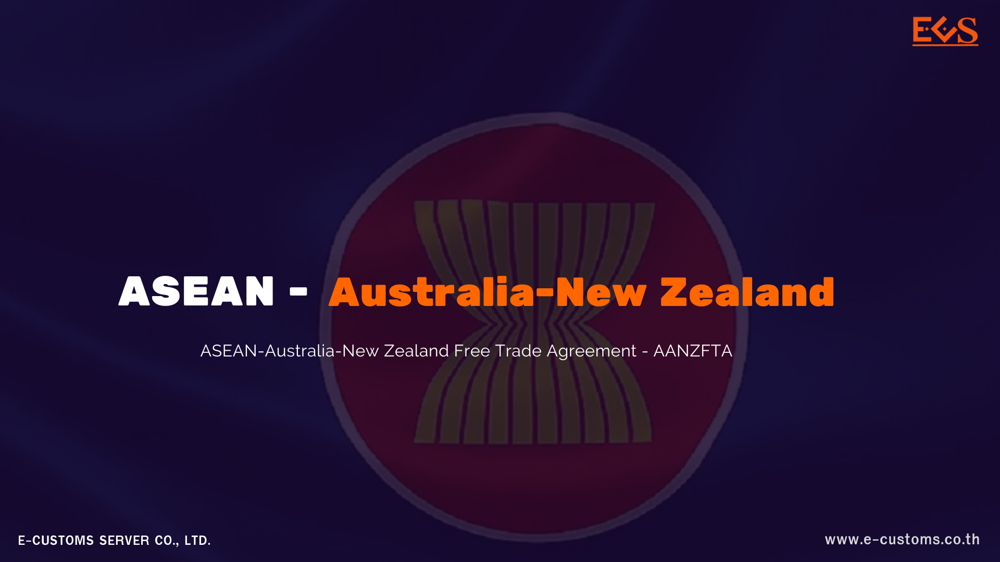

กรมศุลกากรเผยแพร่เอกสาร เรื่อง *พัฒนาการของพิธีการศุลกากรและการอำนวยความสะดวกทางการค้าผ่านมุมมองของการปรับปรุงความตกลงการค้าเสรี : ความตกลงเพื่อจัดตั้งเขตการค้าเสรีอาเซียน-ออสเตรเลีย-นิวซีแลนด์*

      ความตกลงเพื่อจัดตั้งเขตการค้าเสรีอาเซียน - ออสเตรเลีย-นิวซีแลนด์ หรือ Agreement Establishing the ASEAN - Australia - New Zealand Free Trade Area (AANZFTA) เป็นหนึ่งในความตกลงการค้าเสรี (Free Trade Agreement: FTA) จำนวน 14 ฉบับที่ประเทศไทยได้เข้าเป็นภาคี มีสมาชิกร่วมกัน 12 ประเทศ คือ อาเซียน 10 ประเทศ ออสเตรเลีย และนิวซีแลนด์ AANZFTA มีผลใช้บังคับตั้งแต่วันที่ 12 มีนาคม 2553 มีวัตถุประสงค์ เพื่อเปิดเสรีและอำนวยความสะดวกในการค้าสินค้าระหว่างประเทศ มุ่งเน้นการลดอุปสรรคทางการค้าให้เหลือน้อยที่สุด ลดค่าใช้จ่ายทางธุรกิจเพิ่มการค้าและการลงทุน







ดาวน์โหลดเอกสาร


**บทความโดย :** นายวราสิทธิ์ เมืองคุ้ม ผู้อำนวยการส่วนบริการศุลกากรกรุงเทพและปริมณฑล สำนักงานศุลกากรกรุงเทพ



> ที่มา : [กรมศุลกากร](https://www.customs.go.th/cont_strc_simple_with_date.php?current_id=14232a32404f505f4a464b4c464b46)  
> วันที่ปรับปรุงล่าสุด : 23 เมษายน 2567
