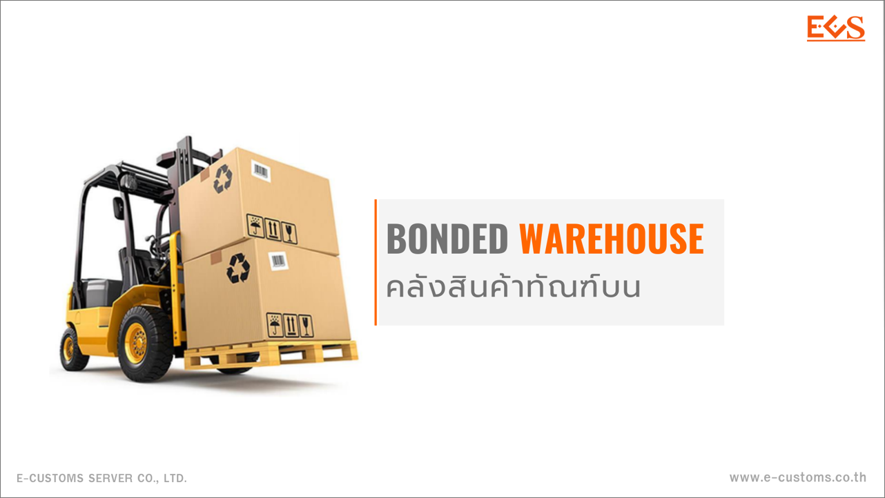

ตามประกาศกรมศุลกากรที่ 122/2561 เรื่อง หลักเกณฑ์ วิธีการ และเงื่อนไขเกี่ยวกับ คลังสินค้าทัณฑ์บนทั่วไป ลงวันที่ 8 พฤษภาคม 2561 ได้กำหนดไว้ว่า การเก็บของในคลังสินค้าทัณฑ์บน สามารถเก็บได้*ไม่เกินสองปีนับแต่วันนำเข้า* ในกรณีที่มีเหตุผลความจำเป็น ผู้นำของเข้า อาจขอขยายเวลาเก็บของในคลังสินค้าทัณฑ์บน ออกไปอีกไม่เกินหนึ่งปีนับแต่วันครบกำหนด โดยจะต้องยื่นคำร้องขอขยายเวลาพร้อม หนังสือยินยอมจากผู้ได้รับใบอนุญาต ต่อพนักงานศุลกากร ที่กำกับคลังสินค้าทัณฑ์บนก่อนครบกำหนด*ไม่น้อยกว่าสิบห้าวัน*

หากเกินกำหนดตามวรรคแรกกรมศุลกากรมีอำนาจสั่งให้ผู้นำของเข้า หรือผู้ได้รับใบอนุญาตส่งของออกไปนอกราชอาณาจักร ให้เสร็จสิ้น*ภายในหกเดือน*หรือดำเนินการชำระค่าภาษีอากรเป็นของภายในประเทศให้แล้วเสร็จภายในสิบห้าวันนับแต่วันที่ได้รับแจ้งเป็นหนังสือหรือดำเนินการอย่างอื่นได้ตามที่เห็นสมควร

กรณีมิได้ปฏิบัติภายในระยะเวลาที่กำหนด กรมศุลกากรจะมีหนังสือแจ้งเตือนให้ดำเนินการดังกล่าว *ภายในสามสิบวัน*นับแต่วันที่ได้รับหนังสือแจ้งเตือน หากผู้นำของเข้าหรือผู้ได้รับใบอนุญาต ไม่ดำเนินการภายในระยะเวลาที่กำหนด จะต้องได้รับโทษตามที่กฎหมายบัญญัติ หรือกรมศุลกากรจะพิจารณาพักใช้ใบอนุญาต ของผู้ได้รับใบอนุญาตต่อไป

การรับของที่โอนจากคลังสินค้าทัณฑ์บนทั่วไปอีกแห่งหนึ่งหรือคลังสินค้าทัณฑ์บนอื่น การนับระยะเวลาการเก็บรักษาในคลังสินค้าทัณฑ์บนทั่วไปที่รับโอน

1. รับโอนวัตถุดิบหรือสินค้าจากคลังสินค้าทัณฑ์บนอื่น *ให้นับระยะเวลาการเก็บรักษา ต่อเนื่องจากวันที่นำของเข้าครั้งแรก*
1. รับโอนวัตถุดิบ ผลิตภัณฑ์กึ่งสำเร็จรูปหรือผลิตภัณฑ์สำเร็จรูป จากคลังสินค้าทัณฑ์บนประเภทโรงผลิตสินค้า *ให้เก็บรักษาได้ไม่เกิน 1 ปี นับแต่วันที่รับโอน*

**การรับของที่โอนจากเขตปลอดอากร และเขตประกอบการเสรี**  การนับระยะเวลาการเก็บรักษาวัตถุดิบ หรือสินค้า ให้นับระยะเวลาการเก็บรักษาในคลังสินค้าทัณฑ์บนทั่วไปที่รับโอน เสมือนได้นำของนั้นเข้ามาจากต่างประเทศ เพื่อนำเข้าเก็บในคลังสินค้าทัณฑ์บน

- หากเกินกำหนดตามวรรคแรก กรมศุลกากรมีอำนาจสั่งให้ผู้นำของเข้าหรือผู้ได้รับใบอนุญาต ส่งของออกไปนอกราชอาณาจักรให้เสร็จสิ้น*ภายในหกเดือน*หรือ ดำเนินการชำระค่าภาษีอากรเป็นของภายในประเทศ ให้แล้วเสร็จภายในสิบห้าวันนับแต่วันที่ได้รับแจ้งเป็นหนังสือหรือดำเนินการอย่างอื่นได้ตามที่เห็นสมควร
      
- กรณีมิได้ปฏิบัติภายในระยะเวลาที่กำหนด กรมศุลกากรจะมีหนังสือแจ้งเตือน ให้ดำเนินการดังกล่าว*ภายในสามสิบวัน* นับแต่วันที่ได้รับหนังสือแจ้งเตือน หากผู้นำของเข้าหรือผู้ได้รับใบอนุญาตไม่ดำเนินการภายในระยะเวลาที่กำหนด จะต้องได้รับโทษตามที่กฎหมายบัญญัติ หรือกรมศุลกากรจะพิจารณาพักใช้ใบอนุญาตของผู้ได้รับใบอนุญาตต่อไป







ดาวน์โหลดเอกสาร


**บทความโดย :** นายชวัฒน์ ชัยศิริ นักวิชาการศุลกากรชํานาญการพิเศษ ด่านศุลกากรอรัญประเทศ 



> ที่มา : [กรมศุลกากร](https://www.customs.go.th/cont_strc_simple_with_date.php?current_id=14232a32404f505f4c464b48464b4d)  
> วันที่ปรับปรุงล่าสุด : 2 พฤษภาคม 2567
