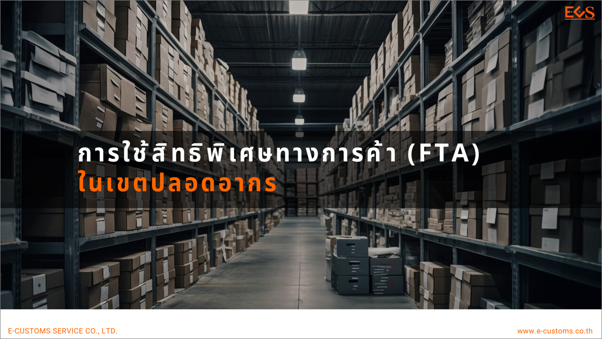
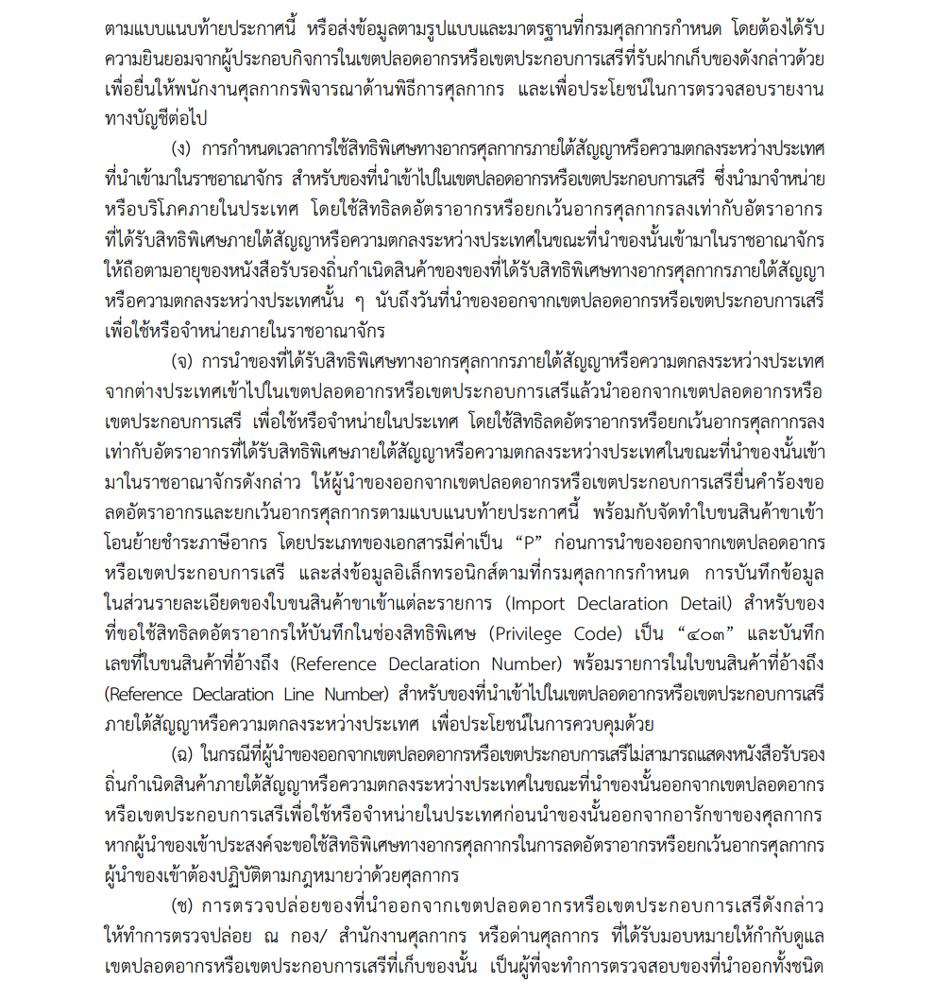
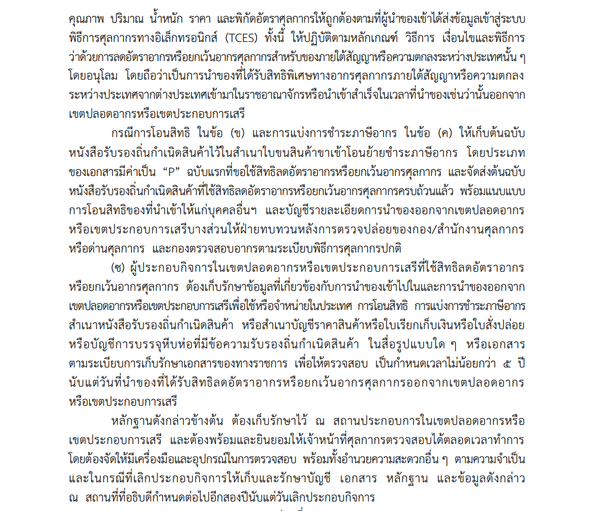

เนื่องจากในปัจจุบันพบว่ามีผู้ใช้งานจำนวนมาก สอบถามการจัดทำใบขนสินค้า ในกรณีเป็นการโอนย้ายของออกจากเขตปลอดอากร หรือเขตประกอบการเสรี เพื่อชำระค่าภาษีอากรบริโภคภายในประเทศ สำหรับของที่ได้รับสิทธิพิเศษทางภาษีศุลกากรภายใต้ความตกลงระหว่างประเทศ (FTA) ตามประกาศกรมศุลกากรที่ *246/2564* เรื่อง *หลักเกณฑ์และพิธีการสำหรับการลดอัตราอากรและยกเว้นอากรศุลกากร ตามมาตรา 12 แห่งพระราชกำหนดพิกัดอัตราศุลกากร พ.ศ.2530* มีผลบังคับ*ตั้งแต่วันที่ 1 มกราคม พ.ศ. 2565 เป็นต้นมา* มีรายละเอียดดังนี้


 
"ของที่ได้รับสิทธิพิเศษทางภาษีศุลกากรภายใต้สัญญา หรือความตกลงระหว่างประเทศที่นำเข้ามาในราชอาณาจักร และนำเข้าไปในเขตปลอดอากรตามกฎหมายว่าด้วยศุลกากรหรือเขตประกอบการเสรี ตามกฎหมายว่าด้วยการนิคมอุตสาหกรรมแห่งประเทศไทย เพื่อการกระจายสินค้า การแบ่งแยก การคัดเลือก การบรรจุ การติดฉลาก หรือเครื่องหมายอื่นใด การแบ่งบรรจุใหม่ การทดสอบคุณภาพ การทดสอบสมรรถนะ การสเตอร์รีไรส์ หรือการดำเนินการอื่นใดในลักษณะพาณิชยกรรม *โดยไม่เปลี่ยนแปลงประเภทพิกัดอัตราศุลกากร* และไม่มีส่วนของของอื่นใดในเขตปลอดอากรหรือเขตประกอบการเสรีอยู่ในของนั้น *ซึ่งนำมาจำหน่ายหรือบริโภคภายในประเทศ* ให้ลดอัตราอากรหรือยกเว้นอากรศุลกากรลงเท่ากับ *อัตราอากรที่ได้รับสิทธิพิเศษภายใต้สัญญาหรือความตกลงระหว่างประเทศในขณะที่นำของนั้นเข้ามาในราชอาณาจักร*  

*โดยต้องสำแดงเลขที่หนังสือรับรองถิ่นกำเนิดสินค้า*ภายใต้สัญญาหรือความตกลงระหว่างประเทศที่ได้รับสิทธิพิเศษทางภาษีศุลกากร**ในส่วนรายละเอียดของใบขนสินค้าขาเข้าแต่ละรายการ (Import Declaration Detail)** สำหรับของที่ขอใช้สิทธิลดอัตราอากรหรือยกเว้นอากรศุลกากร ให้บันทึกรหัสสิทธิพิเศษ (Privilege Code) และในส่วนรายละเอียดใบอนุญาต (Import Declaration Detail (Permit)) ให้*บันทึกเลขที่หนังสือรับรองถิ่นกำเนิดสินค้า ในช่องเลขที่ใบอนุญาต/ใบรับรอง (Permit Number)* *บันทึกวันที่ออกหนังสือรับรองถิ่นกำเนิดสินค้า ในช่องวันที่ออกใบอนุญาต/ใบรับรอง (Issue Date)* และบันทึกเลขประจำตัวผู้เสียภาษีอากรของหน่วยงานผู้ออกหนังสือรับรองถิ่นกำเนิดสินค้า หรือชื่อย่อประเทศของผู้ออกหนังสือรับรองถิ่นกำเนิดสินค้า เช่น MY ในช่องเลขประจำตัวผู้เสียภาษีอากรของหน่วยงานผู้ออกใบอนุญาต/ ใบรับรอง (Permit Issue Authority) *พร้อมกับแนบสำเนาหนังสือรับรองถิ่นกำเนิดสินค้าดังกล่าว*"




**กรณีผู้นำเข้าไม่สำแดงการใช้สิทธิพิเศษทางภาษีศุลกากรภายใต้ความตกลงระหว่างประเทศ (FTA)  ไว้ขณะที่นำของเข้าเก็บ สิทธิย่อมสิ้นสุดลง จะนำมาใช้ในขณะที่นำของออกจากเขตปลอดอากรไม่ได้**






"*การกำหนดเวลาการใช้สิทธิ*พิเศษทางภาษีศุลกากรภายใต้สัญญา หรือความตกลงระหว่างประเทศที่นำเข้ามาในราชอาณาจักร สำหรับของที่นำเข้าไปในเขตปลอดอากรหรือเขตประกอบการเสรี ซึ่งนำมาจำหน่ายหรือบริโภคภายในประเทศ โดยใช้สิทธิลดอัตราอากรหรือยกเว้นอากรศุลกากรลงเท่ากับอัตราอากรที่ได้รับสิทธิพิเศษภายใต้สัญญาหรือความตกลงระหว่างประเทศในขณะที่นำของนั้นเข้ามาในราชอาณาจักร *ให้ถือตามอายุของหนังสือรับรองถิ่นกำเนิดสินค้าของ ของที่ได้รับสิทธิพิเศษทางภาษีศุลกากร ภายใต้สัญญาหรือความตกลงระหว่างประเทศนั้น ๆ* นับถึงวันที่นำของออกจากเขตปลอดอากรหรือเขตประกอบการเสรี เพื่อใช้หรือจำหน่ายภายในราชอาณาจักร"



**ต้องนำสินค้าออกมาไม่เกินระยะเวลาของหนังสือรับรองถิ่นกำเนิดสินค้า  ซึ่งโดยปกติอายุของ CO ต่างๆ จะมีอายุประมาณ 12 เดือนหรือ 1 ปี มีเพียงความตกลงไทย-ออสเตรเลียเท่านั้นที่มีอายุ 18 เดือน และนิวซีแลนด์ที่่ไม่กำหนด (สินค้าปกติสามารถเก็บของในเขตปลอดอากรได้ไม่เกิน 2 ปี)**
 


 
 
 "การนําของที่ได้รับสิทธิพิเศษทางภาษีศุลกากรภายใต้สัญญาหรือความตกลงระหว่างประเทศจากต่างประเทศเข้าไปในเขตปลอดอากรหรือเขตประกอบการเสรี แล้วนําออกจากเขตปลอดอากรหรือเขตประกอบการเสรี เพื่อใช้หรือจําหน่ายในประเทศ โดยใช้สิทธิลดอัตราอากรหรือยกเว้นอากรศุลกากรลงเท่ากับอัตราอากรที่ได้รับสิทธิพิเศษภายใต้สัญญาหรือความตกลงระหว่างประเทศในขณะที่นําของนั้นเข้ามาในราชอาณาจักรดังกล่าว *ให้ผู้นำของออกจากเขตปลอดอากรหรือเขตประกอบการเสรี ยื่นคำร้องขอลดอัตราอากรและยกเว้นอากรศุลกากร*ตามแบบแนบท้ายประกาศนี้ พร้อมกับจัดทำใบขนสินค้าขาเข้าโอนย้ายชำระภาษีอากร โดย*ประเภทของเอกสาร*มีค่าเป็น *“P”* *ก่อนการนำของออกจากเขตปลอดอากรหรือเขตประกอบการเสรี* และ ส่งข้อมูลอิเล็กทรอนิกส์ตามที่กรมศุลกากรกำหนด การบันทึกข้อมูลในส่วนรายละเอียดของใบขนสินค้าขาเข้าแต่ละรายการ (Import Declaration Detail) *สำหรับของที่ขอใช้สิทธิลดอัตราอากรให้บันทึกในช่องสิทธิพิเศษ (Privilege Code)* เป็น *“403”* และบันทึกเลขที่ใบขนสินค้าที่อ้างถึง (Reference Declaration Number) พร้อมลำดับรายการในใบขนสินค้าที่อ้างถึง (Reference Declaration Line Number)   สำหรับของที่นำเข้าไปในเขตปลอดอากรหรือเขตประกอบการเสรีภายใต้สัญญาหรือความตกลงระหว่างประเทศ เพื่อประโยชน์ในการควบคุมด้วย"
 


**การใช้สิทธิพิเศษทางภาษีศุลกากรภายใต้สัญญาหรือความตกลงระหว่างประเทศ  ผู้นำเข้าต้องทำการยื่นขออนุมัติหลักการยกเว้นอากรก่อนการนำของออกจากเขตปลอดอากร ตามประกาศกรมศุลกากรที่ 246/2564 ข้อที่ 78 และจัดทำใบขนประเภท P ที่เป็นใบขนสินค้าขาเข้าโอนย้ายชำระค่าภาษีอากร ต้องระบุสิทธิพิเศษเป็น *“403”*  ไม่ใช่ระบุสิทธิเป็น ACN หรือ ATG หรือ AJ1 ฯลฯ  ที่สำแดงไว้ในขณะที่นำของเข้าเก็บที่เขตปลอดอากร**
 
 


 รหัสสิทธิพิเศษ **“4XX”** ชื่อสิทธิพิเศษ **“การลดอัตราอากรยกเว้นอากรขาเข้าแบบมีเงื่อนไขเฉพาะสถานที่นำเข้า”**
 


  *รหัสสิทธิพิเศษ “403”* ของที่ได้รับสิทธิพิเศษทางภาษีศุลกากรภายใต้สัญญาหรือความตกลงระหว่างประเทศที่นําเข้ามาในราชอาณาจักรและนําเข้าไปในเขตปลอดอากรตามกฎหมายว่าด้วยศุลกากรหรือเขตประกอบการเสรีตามกฎหมายว่าด้วยการนิคมอุตสาหกรรมแห่งประเทศไทย เพื่อการกระจายสินค้า การแบ่งแยก การคัดเลือก การบรรจุ การติดฉลากหรือเครื่องหมายอื่นใด การแบ่งบรรจุใหม่ การทดสอบคุณภาพ การทดสอบสมรรถนะ การสเตอร์รีไรส์ หรือการดําเนินการอื่นใดในลักษณะพาณิชยกรรม *โดยไม่เปลี่ยนแปลงประเภทพิกัดอัตราศุลกากร* และไม่มีส่วนของของอื่นใดในเขตปลอดอากรหรือเขตประกอบการเสรีอยู่ในของนั้น ซึ่งนำมาจำหน่ายหรือบริโภคภายในประเทศ *ให้ลดอัตราอากรหรือยกเว้นอากรศุลกากรลงเท่ากับอัตราอากรที่ได้รับสิทธิพิเศษภายใต้สัญญาหรือความตกลงระหว่างประเทศในขณะที่นำของนั้นเข้ามาในราชอาณาจักร* การโอนสิทธิ การแบ่งการชําระภาษีอากร การกําหนดเวลาการใช้สิทธิ และการปฏิบัติพิธีการให้เป็นไปตามระเบียบพิธีการศุลกากรที่กรมศุลกากรกําหนด
 

## ประกาศกรมศุลกากรที่ 246/2564 ข้อที่ 78


- ประกาศกรมศุลกากร ที่ 246/2564 เรื่อง หลักเกณฑ์และพิธีการสำหรับการลดอัตราอากรและยกเว้นอากรศุลกากร ตามมาตรา 12 แห่งพระราชกำหนดพิกัดอัตราศุลกากร พ.ศ.2530 ([ดาวน์โหลดประกาศ](https://ecs-support.github.io/post/law/customs/2564/2564-246/))  
- วันที่ปรับปรุงล่าสุด : 29 พฤษภาคม 2567
 