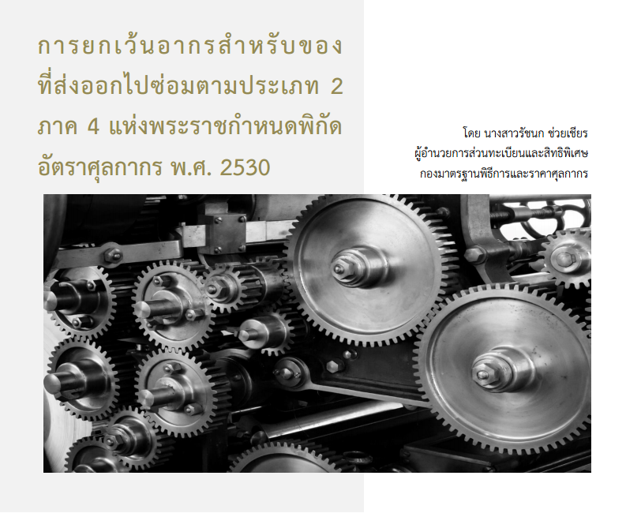

กฎหมายหลักของศุลกากรประกอบด้วย พระราชบัญญัติศุลกากร พ.ศ.2560 และ พระราชกําหนดพิกัดอัตราศุลกากร พ.ศ.2530 ซึ่งมีความสําคัญต่อระเบียบปฏิบัติที่เป็นแนวทาง เพื่อการจัดเก็บอากร รวมถึงส่งเสริมและอํานวยความสะดวกในทางการค้าตลอดจนเพิ่มประสิทธิภาพ เพื่อสร้างความสามารถในการแข่งขันทางการค้าทั้งในระดับภูมิภาคและระดับโลก ดังนั้น ประเทศไทยในฐานะภาคี สมาชิกขององค์การศุลกากรโลก (World Customs Organization: WCO) และเป็นภาคีอนุสัญญาระหว่าง ประเทศว่าด้วยระบบฮาร์โมไนซ์เพื่อการจําแนกประเภทและการกําหนดรหัสสินค้า จึงได้มีการอนุวัติการ กฎหมายระหว่างประเทศและตราขึ้นเป็นพระราชกําหนดพิกัดอัตราศุลกากร พ.ศ.2530 ประกอบด้วย 4 ภาค ดังนี้

-	ภาค 1 หลักเกณฑ์การตีความ มีจํานวน 6 ข้อ
-	ภาค 2 พิกัดอัตราอากรขาเข้า มีจํานวน 97 ตอน 
-	ภาค 3 พิกัดอัตราอากรขาออก มีจํานวน 9 ประเภท · 
-	ภาค 4 ของที่ได้รับยกเว้นอากร มีจํานวน 19 ประเภท


ยกตัวอย่างความในภาค 4 แห่งพระราชกําหนดพิกัดอัตราศุลกากร พ.ศ.2530 เช่น ของนําเข้าที่ได้รับยกเว้นอากร ไม่ว่าจะเป็นของที่นําเข้ามาติดตัวผู้โดยสาร มีราคาไม่เกินที่อธิบดีกรมศุลกากรประกาศ กําหนดด้วยความเห็นชอบของรัฐมนตรีว่าการกระทรวงการคลัง (ของนําเข้าซึ่งแต่ละรายการมีราคา CIF ไม่เกิน 1,500 บาท) ของใช้ในบ้านเรือนที่ใช้แล้วมีจํานวนพอสมควรนํากลับมาในประเทศ ของนําเข้ามา ชั่วคราวเพื่อจัดแสดงในนิทรรศการ ของที่นําเข้ามาเป็นเพียงตัวอย่าง ไม่มีมูลค่าทางการค้า และอื่น อีกหลายประเภท โดยกรมศุลกากรในฐานะผู้บังคับใช้กฎหมายเพื่อการจัดเก็บอากรตลอดจนอํานวย ความสะดวกทางการค้าและมุ่งเน้นพัฒนาระเบียบเพื่อรองรับการพัฒนาโครงสร้างพื้นฐานเพื่อต่อยอด สู่การพัฒนาเศรษฐกิจของประเทศนั้น บทความนี้จึงขอกล่าวถึงของตามประเภท 2 ภาค 4 เฉพาะส่วนแรก คือ ของที่ส่งออกไปซ่อม ณ ต่างประเทศและนํากลับเข้ามาในราชอาณาจักรภายในกําหนดระยะเวลา
 

หลักการของของในประเภท 2 ภาค 4 คือ ของที่นําเข้ามาในประเทศไทยซึ่งได้เสียอากร ไว้ครบถ้วนแล้ว และภายหลังส่งกลับออกไปซ่อม ณ ต่างประเทศ หากนํากลับเข้ามาภายในหนึ่งปี หลังจากได้รับใบสุทธินํากลับเข้ามาซึ่งได้ออกให้ขณะที่ส่งออก โดยของที่ได้รับยกเว้นอากรตามประเภทนี้ จะได้รับยกเว้นเพียงเท่าราคาหรือปริมาณแห่งของเดิมที่ส่งออกไปเท่านั้น โดยการคํานวณเงินอากรสําหรับของที่ส่งออกไปซ่อม ให้ถือตามพิกัดอัตราอากรของของเดิมที่ส่งออกไป โดยคํานวณจากราคาหรือปริมาณที่เพิ่มขึ้น ทั้งนี้ไม่รวมค่าใช้จ่ายในการขนส่ง (Freight) และการประกันภัย (Insurance) โดยการใช้สิทธิตามประเภท 2 ภาค 4 นั้นจะต้องปฏิบัติพิธีการศุลกากรให้ครบถ้วน ได้แก่ การยื่นคําร้องเพื่อจัดทําใบสุทธินํากลับขณะที่ส่งของออกไป ซึ่งของนั้นจะต้องนําจะกลับเข้ามาภายในหนึ่งปี โดยผู้ส่งของออกต้องยื่นคําร้องต่อพนักงานศุลกากร ณ ท่าที่ส่งของออก เพื่อแจ้งว่าจะขอส่งสินค้าออกไปซ่อมและจะนํากลับเข้ามาภายหลัง โดยใบสุทธินํากลับมีอายุหนึ่งปีนับแต่วันที่ส่งออก หากไม่สามารถนํากลับได้ภายในหนึ่งปี ผู้ส่งออกอาจยื่นขอขยายกําหนดเวลา โดยอธิบดีกรมศุลกากรมีอํานาจที่จะสั่งให้ได้รับการยกเว้นจากบทบัญญัติที่ว่าด้วยใบสุทธิ สําหรับนํากลับเข้ามาหรืออาจอนุญาตให้ขยายกําหนดเวลาออกไปได้ตามความจําเป็นทั้งนี้ขึ้นอยู่กับข้อเท็จจริงซึ่งต้องพิจารณาเป็นคราวๆ ไป โดยกรณีไม่มีใบสุทธิสําหรับนํากลับ สามารถยื่นคําร้องต่อหน่วยงานพิธีการนําเข้า ณ ท่า หรือที่ที่นําเข้าเพื่อขอผ่อนผันและ/หรือขยายกําหนดเวลา

ปัจจุบันมีการใช้สิทธิยกเว้นอากรตามประเภท 2 ภาค 4 ในสินค้าประเภทเครื่องจักร หรือ อุปกรณ์ที่เกี่ยวข้องกับการผลิตในอุตสาหกรรมเป็นจํานวนมาก เนื่องจากผู้ประกอบการมีการสั่งซื้อเครื่องจักรจากต่างประเทศและภายหลังส่งเครื่องจักรออกไปซ่อมและนํากลับเข้ามา โดยเครื่องจักรดังกล่าว ได้ชําระอากรไว้ครบถ้วนแล้ว เพื่อเป็นการสร้างความเป็นธรรมในการจัดเก็บภาษีอากร ซึ่งเป็นไปตามพันธกิจ หลักของกรมศุลกากร ผู้ประกอบการใดที่ปฏิบัติพิธีการศุลกากรครบถ้วนสําหรับของส่งออกไปซ่อม ณ ต่างประเทศสามารถได้รับประโยชน์จากตัวบทกฎหมายที่บัญญัติไว้ในภาค 4 แห่งพระราชกําหนดพิกัด อัตราศุลกากร พ.ศ.2530 นี้ เนื่องจากเมื่อมีการนําเครื่องจักรที่ผ่านการซ่อมแซมแล้วกลับมาใน ราชอาณาจักร พนักงานศุลกากรจะประเมินอากรโดยใช้พิกัดอัตราเดิมของของที่ส่งออกไป ในราคาศุลกากร จากราคาค่าซ่อมที่ได้ชําระจริงหรือจะต้องชําระตามหลักฐานบัญชีราคาสินค้า (Invoice) และเอกสารอื่นประกอบการชําระค่าซ่อมเท่านั้น จะไม่นําราคาเครื่องจักรที่เคยชําระอากรไว้แล้วในการนําเข้าครั้งแรกมารวมไว้ในราคาศุลกากร


ยกตัวอย่างเช่น ใบขนสินค้าขาเข้า A สําแดงของเป็นเครื่องจักรสําหรับอัดรีดเม็ดพลาสติก พิกัด B อัตราอากร 5% และได้ชําระค่าภาษีอากรไว้ครบถ้วนแล้ว ภายหลังมีการส่งเครื่องจักรดังกล่าวออกไปซ่อม
ที่ต่างประเทศและผู้ส่งของออกได้ยื่นคําร้องเพื่อขอใบสุทธินํากลับและจัดทําใบขนสินค้าขาออกโดยระบุรหัส
สิทธิพิเศษ 2PART4 ประกอบกับอ้างอิงเลขที่ใบขนสินค้าขาเข้า A ที่นําเข้ามาในครั้งแรกในรายการของ เดียวกัน เพราะฉะนั้นเมื่อมีการนํากลับเข้ามาซึ่งอยู่ภายในระยะเวลาหนึ่งปี เครื่องจักรดังกล่าวจะถูกประเมิน อากรบนฐานของราคาค่าซ่อมเพียงเท่านั้น กล่าวคือ หากบัญชีราคาสินค้าระบุค่าซ่อม ราคา 10,000 บาท มีค่าขนส่ง 17,700 บาท และค่าประกันภัย 1,000 บาท การจัดทําใบขนสินค้าขาเข้าจะนําราคา 10,000 บาท มาใช้ในการพิจารณาประเมินอากรโดยไม่นําค่าขนส่งและค่าประกันภัยมารวมคํานวณ ดังนั้น จึงใช้ราคาเฉพาะ FOB ค่าซ่อมเป็นราคาศุลกากรสําหรับของนําเข้าเพื่อประเมินอากรสําหรับของที่ส่งไปซ่อมบนฐาน พิกัด B (พิกัดของเดิมที่ส่งออกไป) นั่นเอง


สําหรับแนวทางการประเมินราคาค่าซ่อมตามภาค 4 ประเภท 2 แห่งพระราชกําหนดพิกัดอัตรา ศุลกากร พ.ศ. 2530 ได้นําเข้าหารือในการประชุมคณะทํางานร่วมภาครัฐและภาคเอกชนเพื่ออํานวยความ สะดวกในการนําเข้าส่งออก (ครอ.) เมื่อวันพฤหัสบดีที่ 22 กุมภาพันธ์ 2567 โดยสรุปใจความสําคัญได้ว่า 
การประเมิน ราคาเป็นไปตามความตกลงในการนํามาตรา 7 ของความตกลง ทั่วไปว่าด้วยภาษีศุลกากรและการค้า 1997 มาถือปฏิบัติ (ระบบราคาแกตต์) ซึ่งสอดคล้องกับบทอธิบายเบื้องต้นทั่วไปที่มีหลักการสําคัญประการหนึ่งว่า **“ประเทศสมาชิกยอมรับถึงความจําเป็นที่จะต้องมีระบบการประเมินราคา สินค้าตามความมุ่งหมายของศุลกากรที่มีความเป็นธรรม มีความเป็นรูปแบบเดียวกันและมีความเป็นกลาง ซึ่งจะ เป็นการป้องกันไม่ให้ใช้ราคาศุลกากรที่กําหนดขึ้นตามอําเภอใจหรือที่สมมติขึ้นมา”** โดยการคํานวณเงินอากร สําหรับของที่ส่งออกไปซ่อมตามภาค 4 ประเภท 2 แห่งพระราชกําหนดพิกัดอัตราศุลกากร พ.ศ. 2530 พนักงานศุลกากร จะพิจารณาจากเอกสารหลักฐาน ตามนัยของกฎกระทรวง การกําหนดและการใช้ราคาศุลกากร พ.ศ.2560 และหาก
พนักงานศุลกากรมีเหตุอันควรสงสัยในข้อเท็จจริงหรือความถูกต้องของราคาที่สําแดง ผู้นําของเข้าหรือบุคคลที่
เกี่ยวข้องกับการนําของเข้ามีหน้าที่จัดหาคําอธิบายเพิ่มเติมรวมทั้งเอกสารหรือหลักฐานอย่างอื่นเพื่อพิสูจน์ข้อเท็จจริงหรือความถูกต้องสมบูรณ์ของข้อความหรือเอกสารในการสําแดงดังกล่าวนั้น ตามนัยยะ ข้อ 6 ของกฎกระทรวงฯ 


ดังนั้นกรณีนําสินค้าไปซ่อมและนํากลับเข้ามา ซึ่งสินค้าอยู่ในระยะเวลาและเงื่อนไขภายใต้การรับประกัน (warranty) หรือเป็นไปตามข้อตกลงการซื้อขาย พนักงานศุลกากรจะแจ้งให้ผู้นําของเข้าจัดหาเอกสารเกี่ยวกับการรับประกันสินค้าที่เกิดจาก การซ่อมเพื่อประกอบการพิจารณาประเมินอากรต่อไป








ดาวน์โหลดบทความ  


- ที่มา : [กรมศุลกากร](https://www.customs.go.th/data_files/a0dc47b82d56f2e99f7cb87b1a8e1da6.pdf)

 