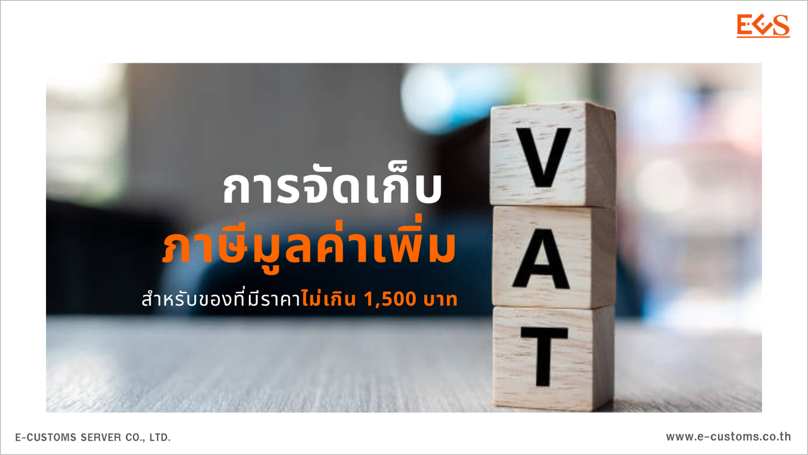

ตามที่รัฐบาลได้มีนโยบายให้กระทรวงการคลังแก้ปัญหาความไม่เป็นธรรมในการเก็บภาษีมูลค่าเพิ่ม ระหว่างผู้ขายในต่างประเทศซึ่งไม่ต้องเสียภาษีมูลค่าเพิ่มกับผู้ขายในประเทศไทย ซึ่งต้องเสียภาษี มูลค่าเพิ่มโดยในระหว่างที่กรมสรรพากรอยู่ระหว่างเสนอแก้ไขประมวลรัษฎากร เพื่อเรียกเก็บ ภาษีมูลค่าเพิ่มจากการขายสินค้าที่มีมูลค่าไม่เกิน 1,500 บาท ผ่าน Platform ผู้ขายในต่างประเทศ และนำส่งให้แก่กรมสรรพากรเป็นรายเดือน อย่างไรก็ตาม กระบวนการแก้ไขกฎหมายระดับ พ.ร.บ. หรือประมวลรัษฎากรนั้น ต้องใช้ระยะเวลาเพื่อบรรเทาความเดือดร้อนให้กับผู้ประกอบการ ภายในประเทศที่ได้รับผลกระทบจากธุรกิจพาณิชย์อิเล็กทรอนิกส์ที่ขยายตัวอย่างรวดเร็ว กระทรวงการคลังจึงออกมาตรการเพื่อให้สามารถจัดเก็บภาษีมูลค่าเพิ่มสำหรับของดังกล่าว เป็นการชั่วคราวผ่านกรมศุลกากร โดยออกประกาศดังนี้

1. ประกาศกรมศุลกากรที่ 116/2567 **กำหนดราคาขั้นต่ำของของที่จะได้รับการยกเว้นอากรศุลกากร ภาษีสรรพสามิต ภาษีมูลค่าเพิ่ม** มี**ราคาไม่เกิน 1 บาท** ซึ่งจะมีผลทำให้**ของที่นำเข้าที่มีมูลค่าตั้งแต่ 1 บาทขึ้นไปต้องชำระอากรศุลกากร ภาษีสรรพสามิต และภาษีมูลค่าเพิ่ม**
 
 
2. ประกาศกระทรวงการคลัง เรื่อง **การยกเว้นอากรศุลกากรสำหรับของที่มีมูลค่า ไม่เกิน 1,500 บาท** เพื่อ**ยกเว้นเฉพาะอากร**ศุลกากร**สำหรับของที่มีราคาไม่เกิน 1,500 บาท** เพื่อคงพันธกรณีที่ให้ไว้กับนานาประเทศในการกำหนดหลักการ de minimis threshold 
 

## ผลของประกาศ 2 ฉบับ ดังกล่าว ทำให้

- ของที่มี**มูลค่า 0 - 1 บาท** ได้รับ**ยกเว้นอากรศุลกากร ภาษีสรรพสามิต**
- ของที่มูลค่า**ตั้งแต่ 1 - 1,500 บาท** จะได้รับ**ยกเว้นอากรศุลกากรเพียงอย่างเดียว** **ผู้นำเข้ามีหน้าที่ต้องชำระภาษีสรรพสามิต และภาษีมูลค่าเพิ่ม**

 
ระยะเวลาใช้บังคับ **ตั้งแต่วันที่ 5 กรกฎาคม - 31 ธันวาคม พ.ศ. 2567**
 

การบังคับใช้ประกาศกรมศุลกากร และประกาศกระทรวงการคลัง
ควบคู่กันดังกล่าวจะทำให้เกิดความเท่าเทียมกันระหว่างของที่นำเข้ามา จากต่างประเทศ และของในประเทศ ที่จะต้องเสียภาษีสรรพสามิต และ ภาษีมูลค่าเพิ่มเช่นเดียวกัน
รายละเอียดตามประกาศกรมศุลกากร และประกาศกระทรวงการคลัง

## เอกสารที่เกี่ยวข้อง

- ประกาศกระทรวงการคลัง เรื่อง การยกเว้นอากรศุลกากรสำหรับของที่มีมูลค่าไม่เกิน 1,500 บาท [(ดาวน์โหลด)](/post/law/ministry/2567/06-21/)
- ประกาศกรมศุลกากร ที่ 116/2567 เรื่อง กำหนดราคาของที่นำเข้า ซึ่งได้รับยกเว้นอากรตาม ประเภท 12 ภาค 4 แห่งพระราชกำหนดพิกัดอัตราศุลกากร พ.ศ. 2530 [(ดาวน์โหลด)](/post/law/customs/2567/2567-116/)

> **ที่มา :** [กรมศุลกากร](https://www.customs.go.th/cont_strc_simple_with_date.php?current_id=14232a324146505f4b464b49464b4d)  
> **วันที่ปรับปรุงล่าสุด :** 21 มิถุนายน 2567

