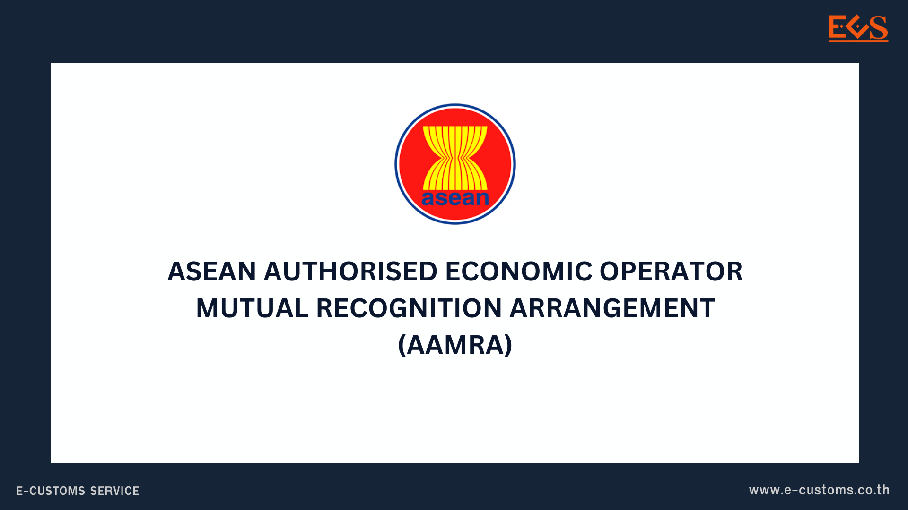

## คำแนะนำสำหรับผู้ประกอบการที่ประสงค์ใช้สิทธิพิเศษตามความตกลงยอมรับร่วมกัน เกี่ยวกับโครงการผู้ประกอบการระดับมาตรฐานเออีโอของอาเซียน (ASEAN AEO MRA: AAMRA) ฉบับเพิ่มเติม ประเทศอินโดนีเซีย
 
ตามที่กรมศุลกากรได้ออกประกาศกรมศุลกากร ที่ 188/2567 เรื่อง หน่วยงานศุลกากรคู่ความตกลงตาม ความตกลงยอมรับร่วมกันสำหรับโครงการผู้ประกอบการระดับมาตรฐานเออีโอ (ฉบับที่ 7) [**(ดาวน์โหลดประกาศ)**](./188-2567.pdf) โดยมีผลบังคับใช้ตั้งแต่วันที่ 17 ตุลาคม 2567 เป็นต้นไป นั้น ผู้ประกอบการไทยที่มีการนำเข้าสินค้า จากผู้ประกอบการเออีโอของประเทศอินโดนีเซีย สามารถรับสิทธิพิเศษในด้านการอำนวยความสะดวก ในการปฏิบัติพิธีการศุลกากร

เพื่อเป็นการอำนวยความสะดวกแก่ผู้ประกอบการที่มีความประสงค์ที่จะใช้สิทธิพิเศษตามความตกลงฯ ดังกล่าว ส่วนมาตรฐานเออีโอ กองมาตรฐานพิธีการและราคาศุลกากร กรมศุลกากร จึงได้จัดทำ คำแนะนำในการยื่น ใบขนสินค้าสำหรับผู้ประกอบการที่ประสงค์ใช้สิทธิพิเศษตามความตกลงยอมรับร่วมกันเกี่ยวกับโครงการ ผู้ประกอบการระดับมาตรฐานเออีโอของอาเซียน (ASEAN AEO MRA: AAMRA) โดยผู้ประกอบการไทยสามารถ ศึกษาข้อมูลการกรอกใบขนสินค้าขาเข้าได้ตามคำแนะนำ

อนึ่ง ผู้ประกอบการที่มีข้อสงสัยเกี่ยวโครงการผู้ประกอบการระดับมาตรฐานเออีโอ (Authorized Economic Operator: AEO) และความตกลงยอมรับร่วมกัน (Mutual Recognition Arrangement) สามารถศึกษาข้อมูลเพิ่มเติมได้ที่ : https://aeo.customs.go.th/
  
คำแนะนำสำหรับผู้ประกอบการไทยในการใช้สิทธิพิเศษตามความตกลงความตกลงยอมรับร่วมกันเกี่ยวกับโครงการผู้ประกอบการระดับมาตรฐานเออีโอของอาเซียน (ASEAN AEO MRA: AAMRA) ผู้ประกอบการไทยที่สนใจ สามารถใช้สิทธิพิเศษตามความตกลงฯ ได้ ผ่านการยื่นใบขนสินค้าขาเข้าใน ระบบศุลกากรอิเล็กทรอนิกส์ (Thai Customs Electronic System: TCES) โดยผู้นำเข้าจำเป็นต้องกรอก ข้อมูลดังต่อไปนี้  

1. ชื่อบริษัทของผู้ประกอบการระดับมาตรฐานเออีโอในประเทศอินโดนีเซีย
2. รหัสประเทศ ID อินโดนีเซีย
3. AEO MRA Reference Number ผู้นำเข้าจำเป็นต้องกรอกข้อมูลรหัสตามรูปแบบ ดังนี้

| ASEAN Member State | AEO Code Format |
|---------------|---------------------|
| Indonesia | 1. AEOXXXXXXXXXXXXID (17 หลัก)|
|            |2. AEOIDXXXXXXXXX (14 หลัก) |


**หมายเหตุ :** ผู้นำเข้าโปรดสอบถามข้อมูล AEO MRA Reference Number จากผู้ประกอบการ
เออีโอในประเทศที่ทำการนำเข้า



**สอบถามข้อมูลเพิ่มเติมได้ที่ :** ส่วนมาตรฐานเออีโอ กองมาตรฐานพิธีการและราคาศุลกากร อาคาร 120 ปี ชั้น 2  
หมายเลขโทรศัพท์ : 02-667-7168, 02-667-7902, 02-667-6520  
อีเมล์ : aeodiv2014@gmail.com, aeothai.customs@gmail.com


ดาวน์โหลดเอกสาร  

> ที่มา : [กรมศุลกากร](https://www.customs.go.th/cont_strc_simple_with_date.php?current_id=14232a324148505f47464b48464b47)
